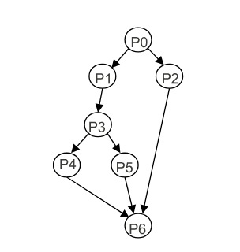
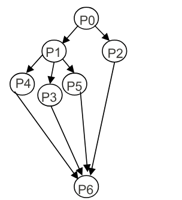
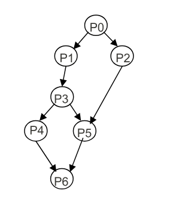

# Autor
Ismael  Sallami Moreno

# Asignatura
Sistemas Concurrentes y Distribuidos

# Grado: Ingeniería Informática + ADE

# Año
Tercer Año

# Tema
Tema 1: Relación de Ejercicios : Exclusión Mutua

## Ejercicio 1

1. Considerar el siguiente fragmento de programa para 2 procesos P1 y P2  
   Los dos procesos pueden ejecutarse a cualquier velocidad. ¿Cuáles son los posibles valores resultantes para la variable `x`? Suponer que `x` debe ser cargada en un registro para incrementarse y que cada proceso usa un registro diferente para realizar el incremento.

   ```text
   { variables compartidas }

   var x : integer := 0 ;
   Process P1;                     Process P2;
       var i: integer;                     var j: integer;
   begin                           begin
       for i:= 1 to 2 do begin             for i:= 1 to 2 do begin
           x:= x + 1;                              x:= x + 1;
       end                                 end
   end

### Los posibles valores de la variable son: x = 2, 3 y 4

- Cada uno de los dos procesos P1, P2 hace 2 lecturas: L11, L12, L21, L22 y 2 escrituras.
- Cada proceso incrementa (+1) x, 2 veces partiendo de 0: el valor final de x ≠ 2.
- Se hacen 4 incrementos de x: el valor final de x ≠ 4.

| x | P1  | P2  | x | P1  | P2  | x | P1  | P2  |
|---|-----|-----|---|-----|-----|---|-----|-----|
| 0 | L11 | -   | 0 | L11 | -   | 0 | L11 | -   |
| 0 | -   | L21 | 0 | -   | L21 | 1 | E11 | -   |
| 1 | E11 | -   | 1 | -   | L21 | 1 | -   | E21 |
| 1 | -   | E21 | 1 | -   | E21 | 2 | -   | E21 |
| 1 | L12 | -   | 1 | L12 | -   | 2 | L12 | -   |
| 1 | -   | L22 | 2 | E12 | -   | 3 | E12 | -   |
| 2 | E12 | -   | 2 | -   | L22 | 3 | -   | L22 |
| 2 | -   | E22 | 4 | -   | E22 | 4 | -   | E22 |

## Ejercicio 2 
¿Cómo se podría hacer la copia del fichero f en otro g, de forma concurrente, utilizando la instrucción concurrente cobegin-coend? 

Para ello, suponer que:

- Los archivos son una secuencia de ítems de un tipo arbitrario T, y se encuentran ya abiertos para lectura (f) y escritura (g). Para leer un ítem de f se usa la llamada a función `leer(f)` y para saber si se han leído todos los ítems de f, se puede usar la llamada `fin(f)` que devuelve verdadero si ha habido al menos un intento de leer cuando ya no quedan datos. Para escribir un dato x en g se puede usar la llamada a procedimiento `escribir(g,x)`.

- El orden de los ítems escritos en g debe coincidir con el de f.

- Dos accesos a dos archivos distintos pueden solaparse en el tiempo.

### Instrucciones y Código en Concurrente

- Los datos del primer archivo han de ser escritos en el segundo conservando el orden secuencial de aparición.
- La escritura de un elemento procedente del primer archivo puede solaparse en el tiempo con la lectura del siguiente.
- Hay que evitar una condición de carrera en el acceso a la variable compartida que contenga el último dato leído.

```pascal
process Correcto ;
var v_ant, v_sig : T ;
begin
    v_sig := leer(f) ;
    while not fin(f) do begin
        v_ant := v_sig ;
        cobegin 
            escribir(g, v_ant); 
            v_sig := leer(f) ; 
        coend
    end
end
```

# Ejercicio 3

 Construir, utilizando las instrucciones concurrentes cobegin-coend y fork-join, programas concurrentes que se correspondan con los grafos de precedencia que se muestran a continuación:

## a) Grafo de sincronización:

### Grafo



### Bloque de Pseudocódigo 1

```plaintext
begin
P0 ; fork P2 ;
P1 ; P3 ; fork P5 ; P4 ;
join P2 ; join P5 ;
P6 ;
end
```

### Bloque de Pseudocódigo 2

```plaintext
begin
P0 ;
cobegin
    begin
        P1 ; P3 ;
        cobegin P4 ; P5 ; coend
    end
    P2 ;
coend
P6 ;
end
```


## b) Grafo de sincronización:

### Grafo



### Bloque de Pseudocódigo 1

```plaintext
begin
P0 ; fork P2 ;
P1 ; fork P3 ; fork P5 ;
P4
join P2 ; join P3 ; join P5 ;
P6 ;
end
```

### Bloque de Pseudocódigo 2

```plaintext
begin
P0 ;
cobegin
    begin
        P1 ;
        cobegin P3 ; P4 ; P5 ; coend
    end
    P2 ;
coend
P6 ;
end
```


## c) Grafo de sincronización:

### Grafo



### Bloque de Pseudocódigo 1

```plaintext
begin
P0 ; fork P2 ;
P1 ;
P3 ; fork P4 ;
join P2 ;
P5;
join P4 ;
P6 ;
end
```

### Bloque de Pseudocódigo 2

```plaintext
begin
P0 ;
cobegin
    begin P1 ; P3 ; end
    P2 ;
coend
cobegin P4 ; P5 ; coend
P6 ;
end
```

### Bloque de Pseudocódigo 3

```plaintext
begin
P0 ;
cobegin
    cobegin
        begin
            P1 ; P3 ; P4 ;
        end
        P2 ;
    coend
    P5 ;
coend
P5 ; P6 ;
end
```


## Ejercicio 5. 

Suponer un sistema de tiempo real que dispone de un captador de impulsos conectado a un contador de energía eléctrica. La función del sistema consiste en contar el número de impulsos producidos en la hora (cada Kwh consumido se cuenta como un impulso) e imprimir este número en un dispositivo al final de la hora. Para ello se dispone de un programa concurrente con 2 procesos: un proceso acumulador (que cuenta el número de impulsos recibidos) y un proceso escritor (que los imprime en la impresora). En la variable común a los 2 procesos se lleva la cuenta de los impulsos. El proceso acumulador, después de ejecutar la función `Espera_impulso` para esperar a que se produzca un impulso, incrementa la variable. El proceso escritor, después de llamar a `Espera_fin_hora`, hace esperar a que termine una hora. El código de los procesos de este programa podría ser el siguiente:

```plaintext
var contador: compartida;
var n: integer; { contabliliza impulsos }
begin
  while true do begin
    Espera_impulso();
    < n := n+1 >; { (1) }
  end
end

process Escritor;
begin
  while true do begin
    Espera_fin_hora();
    write(n); { (2) }
    < n := 0 >; { (3) }
  end
end
```

En el programa se usan sentencias de acceso a la variable n encerradas entre los símbolos `<` y `>`. Esto significa que cada una de esas sentencias se ejecuta en exclusión mutua entre los dos procesos, es decir, esas sentencias se ejecutan de principio a fin sin entremezclarse entre ellas. Supongamos que en un instante dado el acumulador está esperando un impulso, el escritor está esperando el fin de la hora y la variable n vale `k`. Después se produce un impulso y el escritor se despierta al fin del período de una hora.

Describir lo que puede ocurrir con la intercalación de las instrucciones (1), (2), y (3) a partir de ese momento, indicando cuáles de ellas son correctas y cuáles incorrectas (las incorrectas son aquellas en las que el valor de n no se contabiliza).


### Resolución

- Suponemos una variable ficticia `OUT` que se crea como resultado de la instrucción `write(n)` (2) que contiene el valor impreso (éste pasa así a formar parte del estado).
- En el estado inicial se cumple `n == k`.
- Solo serán correctos los entrelazamientos de instrucciones atómicas del programa que sean compatibles con el estado final: `OUT + n == k + 1`.
- Los posibles entrelazamientos son: (a) 1,2,3, (b) 2,1,3 y (c) 2,3,1.

|       | (a)       |       | (b)       |       | (c)       |       |
|-------|-----------|-------|-----------|-------|-----------|-------|
| inst. | n         | OUT   | inst.     | n     | OUT       | inst. | n         | OUT   |
| -     | k         | -     | -         | k     | -         | -     | k         | -     |
| n:=n+1| k+1       | -     | write(n)  | k     | k         | write(n)| k       | k     |
| write(n)| k+1     | k+1   | n:=n+1    | k+1   | k         | n:=0  | 0         | k     |
| n:=0  | 0         | k+1   | n:=0      | 0     | k+1       | n:=n+1| 1         | k     |


