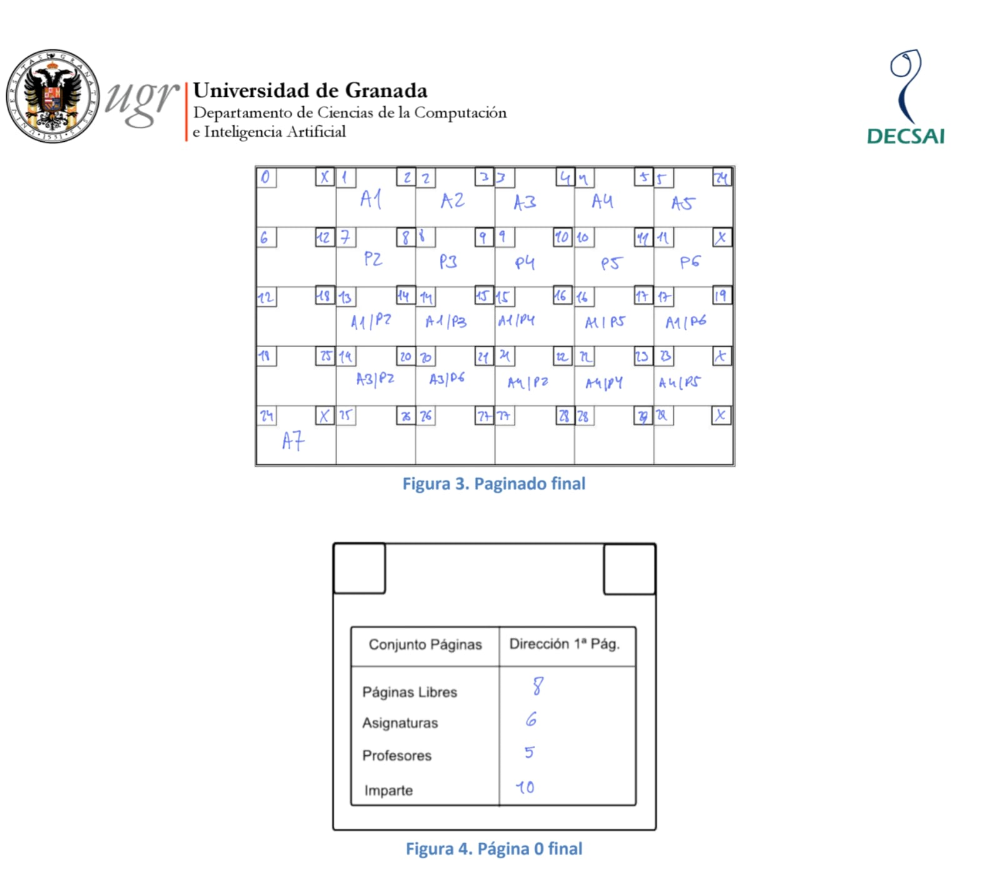
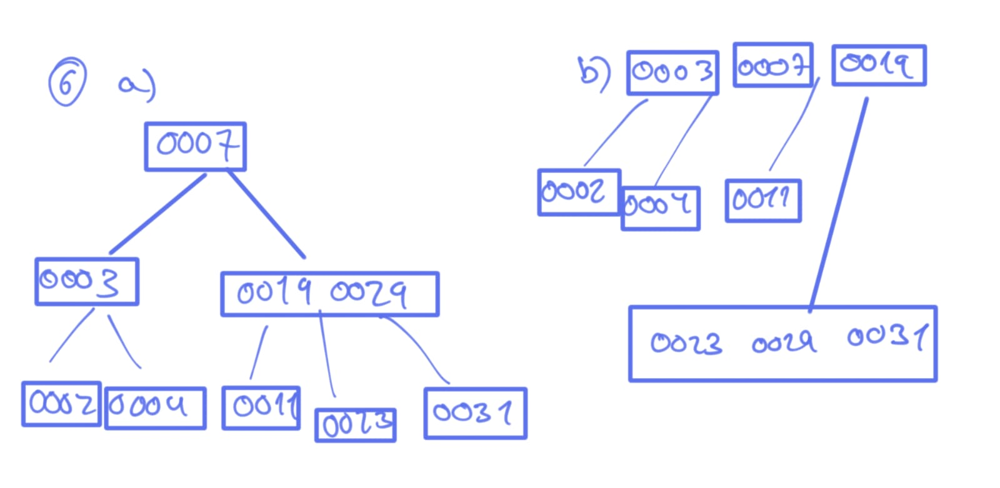
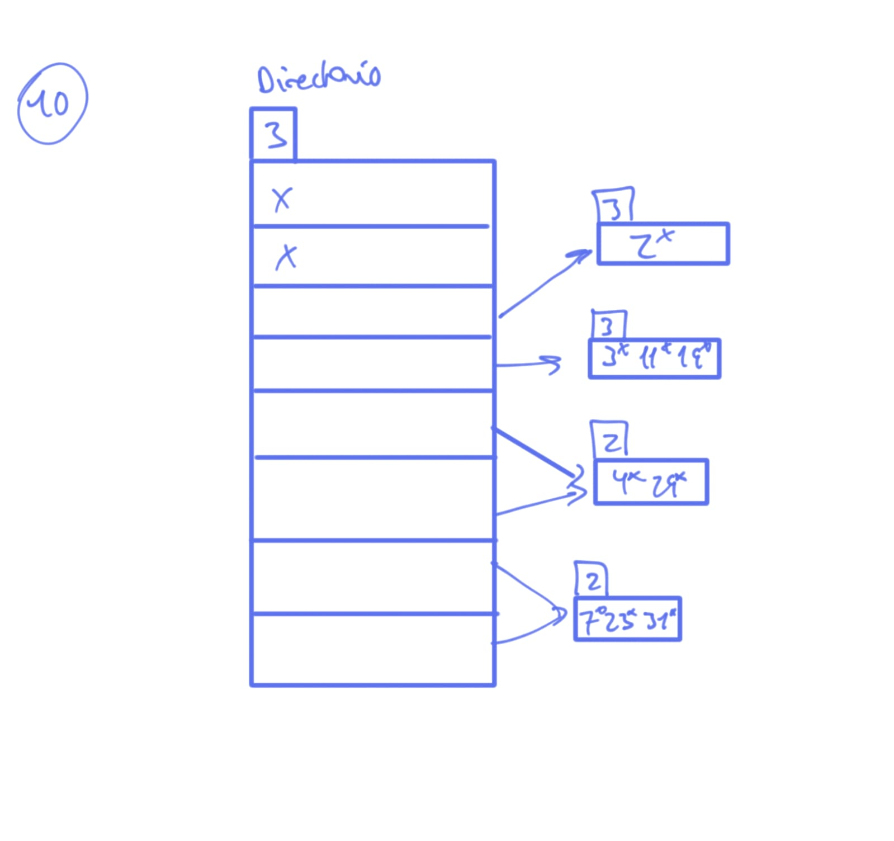

# Relación Ejercicios T4

## Ejercicio 1

Explica por qué la organización de los registros en bloques es un elemento importante dentro del rendimiento de una base de datos.

La organización de registros en bloques es crucial porque las operaciones de E/S a disco son las más lentas. Agrupar los registros en bloques permite:
- Minimizar el número de accesos a disco, ya que se lee/escribe una unidad de datos (bloque) a la vez.
- Mejorar la eficiencia de la caché, pues los datos relacionados frecuentemente se encuentran en el mismo bloque.
- Optimizar las operaciones del SGBD que actúan sobre estas unidades mínimas de almacenamiento.

## Ejercicio 2
Disponemos de una base de datos sobre profesores, asignaturas e impartición de las mismas,
almacenada como muestran la Figura 1 y la Figura 2, usando un registro por página. Completa
la Figura 3 y la Figura 4 después haber realizado la siguiente secuencia de actualizaciones: Se
inserta la asignatura A7, se suprime el profesor P1, se eliminan las imparticiones del profesor
P1.

{ width=17cm height=15cm }

## Ejercicio 3

Dado que los índices agilizan el procesamiento de las consultas. ¿Por qué no se mantiene un
índice para cada campo del fichero? Enumera tantas razones como se te ocurran

Algunas razones son:

- Para reducir el espacio ocupado por el fichero en memoria, ya que una organización eficiente permite almacenar más registros en menos espacio.
- Para disminuir el número de accesos a disco, accediendo directamente a la ubicación deseada sin necesidad de recorrer posiciones intermedias, lo que mejora el rendimiento.

## Ejercicio 4

Dado que los índices agilizan el procesamiento de las consultas. ¿Por qué no se mantiene un índice para cada campo del fichero? Enumera tantas razones como se te ocurran.

No se mantiene un índice para cada campo del fichero por las siguientes razones:

- Coste de almacenamiento adicional: Cada índice consume espacio en disco para sus propias estructuras de datos.

- Ralentización de las operaciones de actualización: Las operaciones de inserción, borrado y modificación de registros se vuelven más lentas porque cada índice afectado también debe actualizarse.

- Coste de mantenimiento del índice: Con el tiempo, los índices pueden necesitar reorganización para mantener su eficiencia, lo que consume recursos.

- Baja selectividad de algunos campos: Crear índices sobre campos con pocos valores distintos o que no se usan frecuentemente en condiciones de búsqueda ofrece poco beneficio y sí incurre en los costes mencionados.

## Ejercicio 5

¿Es posible tener dos índices primarios con diferentes claves sobre el mismo archivo almacenado? ¿Por qué no se utilizan índices no densos para todas las claves de búsqueda?

Porque en los no densos los registros est·n compuestos por la clave de b˙squeda y la direcciÛn
de comienzo del bloque donde podemos encontrar el registro, lo cual reduce el tamaÒo.

<!-- Falta el ejercicio 6 y 7-->

## Ejercicio 6

Construye un árbol B con el siguiente conjunto de valores de la clave:
{2, 3, 4, 7, 11, 19, 23, 29, 31}
Suponemos que el árbol esta inicialmente vacÌo y que se van insertando los datos por
orden creciente. Construye el árbol suponiendo que el orden del árbol es:

{ width=14cm height=12cm }

## Ejercicio 7

Para el árbol del ejercicio anterior muestra los pasos involucrados en las consultas siguientes:  
a) Encontrar los registros con un valor de la clave de 11.  
En el primer árbol empezamos en el nodo 7 y buscamos el que sea mayor a él, o sea la parte derecha del árbol (el 19) y después buscamos el que sea menor a 19 que da la casualidad que es el 11.  
Para el segundo árbol buscamos hasta que 11 sea menor que el de la derecha.  
b) Encontrar todos los registros con un valor de la clave entre 7 y 17.  
Pues se empieza en el nodo raíz buscando la raíz de cota inferior del intervalo dado y tratamos de buscar la cota superior. El siguiente valor a 7 es 19 entonces nos pasamos ahora a los hijos de la izquierda encontrando el 11. El resultado que nos da esto es que tenemos al propio 7 y 11 pasando por el 19.

**Solución:**

a) Para localizar el registro con clave 11 en el árbol B construido, se comienza en la raíz y se compara el valor buscado con las claves presentes. Si 11 es mayor que la clave actual, se sigue por el hijo derecho; si es menor, por el izquierdo. Este proceso se repite en los nodos hijos hasta encontrar el nodo hoja que contiene el 11.

b) Para encontrar todos los registros con clave entre 7 y 17, se inicia en la raíz y se busca el primer valor igual o superior a 7. Desde ahí, se recorren los nodos hoja en orden, recogiendo los valores que estén dentro del rango hasta llegar a un valor mayor que 17 o agotar los nodos. Así se obtienen los registros que cumplen la condición.

## Ejercicio 8

¿Por qué una organización basada en el acceso directo no es la mejor idea para aquellos ficheros que se consulten por rangos de valores de la clave física (entre c1 y c2)?

Una organización basada en acceso directo (hashing) no es adecuada para consultas por rangos porque los algoritmos de direccionamiento no suelen mantener el orden de la clave. Los registros con claves secuenciales no se almacenan necesariamente en posiciones contiguas. Para buscar un rango, se tendría que aplicar la función hash a cada valor individual del rango o realizar un barrido completo del fichero, lo cual es ineficiente.

## Ejercicio 9

Enumera las ventajas e inconvenientes que tienen, a tu juicio, la organización basada en índices y la que se basa en el acceso directo. Haz un análisis comparativo.

### Organización Basada en Índices (ej. Árboles B+):

**Ventajas:**
- Eficiente para búsquedas exactas y por rango.
- Soporta la recuperación ordenada de datos.
- Flexibilidad para múltiples criterios de búsqueda mediante índices secundarios.

**Inconvenientes:**
- Coste de almacenamiento para los índices.
- Sobrecarga en operaciones de inserción, borrado y actualización debido al mantenimiento de los índices.

### Organización Basada en Acceso Directo (Hashing):

**Ventajas:**
- Potencialmente el acceso más rápido para búsquedas exactas (O(1) ideal).

**Inconvenientes:**
- Muy ineficiente para consultas por rango y recuperación ordenada.
- Problema de colisiones (claves diferentes mapean a la misma dirección).
- Posible desperdicio de espacio (huecos).
- La eficiencia depende de una buena función hash y de la distribución de las claves.
- Reorganizaciones costosas si el fichero crece mucho o las colisiones son excesivas (en hashing estático).

**Análisis Comparativo:**  
Los índices son más versátiles y ofrecen buen rendimiento para diversos tipos de consulta, incluyendo rangos y ordenación. El acceso directo es superior para búsquedas exactas ultra-rápidas donde la clave se conoce, pero es inflexible para otros tipos de consulta. La elección depende de los patrones de acceso predominantes.

## Ejercicio 10

Supongamos que se desea diseñar una estructura de hashing dinámico para un archivo que contiene los valores de clave:  
{2, 3, 4, 7, 11, 19, 23, 29, 31}  
Muestra la organización que se obtiene si la función de direccionamiento es f(x)=x mod 8 y las páginas pueden contener hasta tres registros (por cubo).

- **Claves:** K = {2, 3, 4, 7, 11, 19, 23, 29, 31}
- **Función hash:** h(k) = k mod 8
- **Capacidad por cubo:** 3 registros

| Mod 8 (bin) | Claves almacenadas     | Prof. local | Cubo   |
|-------------|-----------------------|-------------|--------|
| 000         |                       |             |        |
| 001         | 2                     | 3           | X      |
| 010         |                       |             |        |
| 011         | 3, 11, 19             | 3           | b1     |
| 100         | 4, 29                 | 2           | C      |
| 101         |                       |             |        |
| 110         | 7, 23, 31             | 2           | D      |
| 111         |                       |             |        |

**Directorio:**

{ width=14cm height=12cm }

## Ejercicio 11

Muestra cómo cambia la estructura del ejercicio anterior como resultado de los siguientes pasos:  
a) Borrar el 11 y el 31  

Después de eliminar el 11 y el 31, la estructura queda así:

| Mod 8 (bin) | Claves almacenadas | Prof. local | Cubo   |
|-------------|-------------------|-------------|--------|
| 000         |                   |             |        |
| 001         | 2, 3, 19          | 1           | A      |
| 010         |                   |             |        |
| 011         |                   |             |        |
| 100         | 4, 29             | 2           | C      |
| 101         |                   |             |        |
| 110         | 7                 | 2           | D      |
| 111         |                   |             |        |

**Directorio:**

- 00x → Cubo A (2, 3, 19)
- 01x → Cubo A (2, 3, 19)
- 10x → Cubo C (4, 29)
- 11x → Cubo D (7)

Eliminando el 11 y el 31, los cubos A y D quedan con menos registros, y el directorio apunta a los cubos actualizados.

b) Insertar el 1, el 15, el 36, el 40, el 46, el 25.

Después de insertar los valores 1, 15, 36, 40, 46, 25, la estructura de hashing dinámico queda así:

| Mod 8 (bin) | Nº           | Prof. local | Puntero |
|-------------|--------------|-------------|---------|
| 000         |              |             |         |
| 001         | 1, 25, 40    | 2           | Cubo A  |
| 010         |              |             |         |
| 011         | 2, 3, 9      | 2           | Cubo B  |
| 100         | 4, 29, 36    | 2           | Cubo C  |
| 101         |              |             |         |
| 110         | 46           | 3           | Cubo D1 |
| 111         | 7, 15, 23    | 3           | Cubo D2 |

**Directorio:**

- 000 →  
- 001 → 1*, 25*, 40*
- 010 →  
- 011 → 2*, 3*, 9*
- 100 → 4*, 29*, 36*
- 101 →  
- 110 → 46*
- 111 → 7*, 15*, 23*

\*El asterisco indica los nuevos valores insertados.

La estructura muestra cómo se han repartido los nuevos registros en los cubos, incrementando la profundidad local donde ha sido necesario y creando nuevos cubos para acomodar los desbordamientos.

## Ejercicio 12

Supongamos que disponemos de una estructura de hashing dinámico que alberga hasta tres registros por página y que usa una función de dispersión f(x)=x mod 8.  
Dibuja la organización resultante después de:  
a) Insertar los registros con siguientes los valores para la clave:  
{12, 16, 19, 26, 29, 32, 35, 41, 44, 64}  
b) Eliminar de la anterior el registro con valor 32.  
c) Insertar sobre la estructura anterior los registros con siguientes los valores para la clave:  
{22, 39, 46, 55}
Solución Ejercicio 12

a) Inserción de los registros {12, 16, 19, 26, 29, 32, 35, 41, 44, 64}

- Función hash: f(x) = x mod 8
- Capacidad por cubo: 3 registros

| Mod 8 (bin) | Claves almacenadas     | Prof. local | Cubo   |
|-------------|-----------------------|-------------|--------|
| 000         | 16, 32, 64            | 3           | A      |
| 001         | 41                    | 1           | B      |
| 010         | 12, 44                | 2           | C      |
| 011         | 19, 35                | 2           | D      |
| 100         |                       |             |        |
| 101         | 29                    | 1           | E      |
| 110         | 26                    | 1           | F      |
| 111         |                       |             |        |

b) Eliminación del registro con valor 32

| Mod 8 (bin) | Claves almacenadas     | Prof. local | Cubo   |
|-------------|-----------------------|-------------|--------|
| 000         | 16, 64                | 3           | A      |
| 001         | 41                    | 1           | B      |
| 010         | 12, 44                | 2           | C      |
| 011         | 19, 35                | 2           | D      |
| 100         |                       |             |        |
| 101         | 29                    | 1           | E      |
| 110         | 26                    | 1           | F      |
| 111         |                       |             |        |

c) Inserción de los registros {22, 39, 46, 55}

- 22 mod 8 = 6 → cubo F (26). Ahora F: 26, 22
- 39 mod 8 = 7 → cubo nuevo G: 39
- 46 mod 8 = 6 → cubo F: 26, 22, 46 (lleno)
- 55 mod 8 = 7 → cubo G: 39, 55

| Mod 8 (bin) | Claves almacenadas     | Prof. local | Cubo   |
|-------------|-----------------------|-------------|--------|
| 000         | 16, 64                | 3           | A      |
| 001         | 41                    | 1           | B      |
| 010         | 12, 44                | 2           | C      |
| 011         | 19, 35                | 2           | D      |
| 100         |                       |             |        |
| 101         | 29                    | 1           | E      |
| 110         | 26, 22, 46            | 2           | F      |
| 111         | 39, 55                | 2           | G      |

- Se han insertado y eliminado los registros según las operaciones indicadas.
- Los cubos se han repartido de acuerdo a la función hash y la capacidad máxima de 3 registros por cubo.
- Se han creado nuevos cubos cuando ha sido necesario para evitar desbordamientos.

