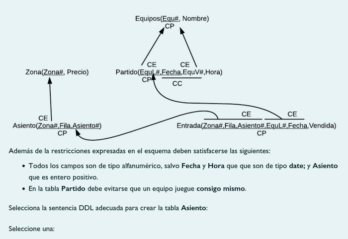
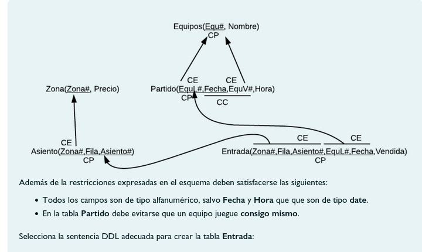
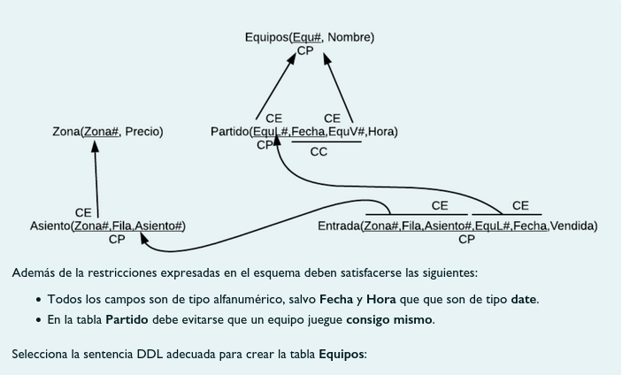
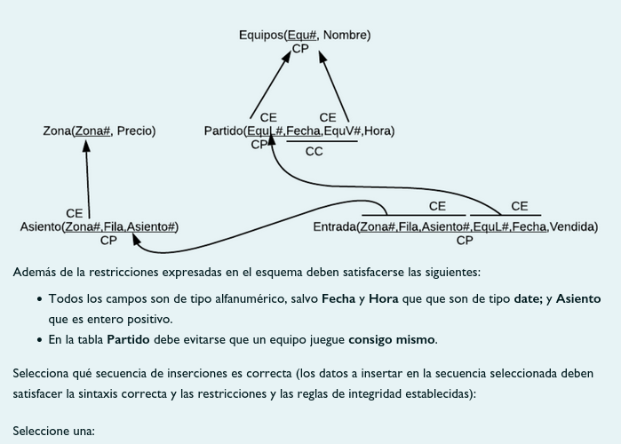
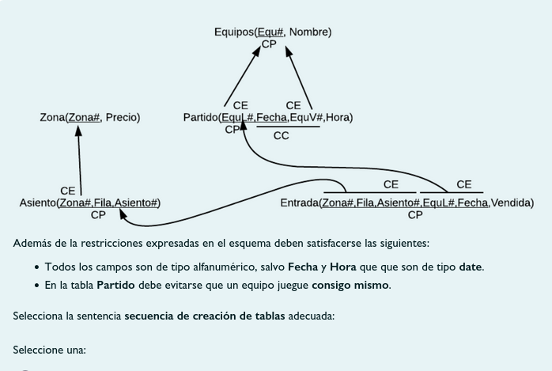
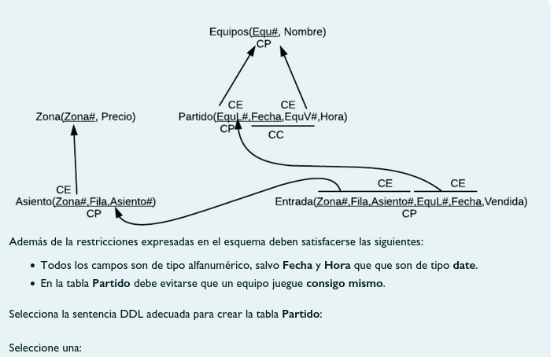
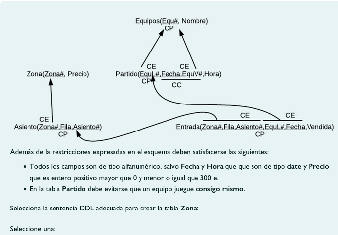

# Cuestionario DDL

## Pregunta 1



Seleccione una:

- [ ] ```sql
    CREATE TABLE Asiento (Zona# REFERENCES Zona(Zona#) PRIMARY KEY, Fila varchar2(1) PRIMARY KEY, Asiento# NUMBER(3) PRIMARY KEY CHECK(Asiento# >=0));
    ```
- [x] ```sql
    CREATE TABLE Asiento (Zona# REFERENCES Zona(Zona#), Fila varchar2(1), Asiento# NUMBER(3) CHECK(Asiento# >=0), PRIMARY KEY(Zona#,Fila,Asiento#));
    ```

- [ ] ```sql
    CREATE TABLE Asiento (Zona# REFERENCES Zona(Zona#), Fila varchar2(1), Asiento# NUMBER(3), PRIMARY KEY(Zona#,Fila,Asiento#),FOREIGN KEY (Zona#) REFERENCES Zona(Zona#), CHECK(Asiento# >=0));
    ```
- [ ] ```sql
    CREATE TABLE Asiento (Zona# PRIMARY KEY, Fila varchar2(1) PRIMARY KEY, Asiento# NUMBER(3) PRIMARY KEY CHECK(Asiento# >=0), REFERENCES Zona(Zona#));

## Pregunta 2



Seleccione una:

- [ ] ```sql
    CREATE TABLE Entrada( Zona#, Fila, Asiento#, EquL# REFERENCES Partido(EquL#), Fecha REFERENCES Partido(Fecha), Vendida VARCHAR2(1) DEFAULT 'N' CHECK(Vendida IN ('S','N')), PRIMARY KEY(Zona#,Fila,Asiento#,EquL#,Fecha), FOREIGN KEY (Zona#,Fila,Asiento#) REFERENCES Asiento(Zona#,Fila,Asiento#) );
    ```
- [ ] ```sql
    CREATE TABLE Entrada( Zona#, Fila, Asiento#, EquL#, Fecha, Vendida VARCHAR2(1) DEFAULT 'N' CHECK(Vendida IN ('S','N')), PRIMARY KEY(Zona#,Fila,Asiento#,EquL#,Fecha), FOREIGN KEY (EquL#,Fecha) REFERENCES Partido(EquL#,Fecha), FOREIGN KEY (Zona#,Fila,Asiento#) REFERENCES Asiento(Zona#,Fila,Asiento#) );
    ```
- [x] ```sql
    CREATE TABLE Entrada( Zona# VARCHAR2(10), Fila VARCHAR2(1), Asiento# NUMBER, EquL#, Fecha, Vendida VARCHAR2(1) DEFAULT 'N' CHECK(Vendida IN ('S','N')), PRIMARY KEY(Zona#,Fila,Asiento#,EquL#,Fecha), FOREIGN KEY (EquL#,Fecha) REFERENCES Partido(EquL#,Fecha), FOREIGN KEY (Zona#,Fila,Asiento#) REFERENCES Asiento(Zona#,Fila,Asiento#) );
    ```
- [ ] ```sql
    CREATE TABLE Entrada( Zona# VARCHAR2(10), Fila VARCHAR2(1), Asiento# NUMBER, EquL# VARCHAR2(10), Fecha DATE, Vendida VARCHAR2(2), PRIMARY KEY(Zona#,Fila,Asiento#,EquL#,Fecha), FOREIGN KEY (EquL#) REFERENCES Equipos(Equ#), FOREIGN KEY (Fecha) REFERENCES Partido(Fecha), FOREIGN KEY (Zona#,Fila,Asiento#) REFERENCES asiento(Zona#,Fila,Asiento#) );
    ```


## Pregunta 3



Seleccione una:

- [ ] ```sql
    CREATE TABLE Equipos (Equ# varchar2(10), Nombre varchar2(15));
    ```
- [ ] ```sql
    CREATE TABLE Equipos (Equ# varchar2(10) PRIMARY KEY, Nombre varchar2(15));
    ```
- [x] ```sql
    CREATE TABLE Equipos (Equ# varchar2(10), Nombre varchar2(15), PRIMARY KEY(Equ#));
    ```


## Ejercicio 4



Seleccione una:

- [ ] 
    1. INSERT INTO Equipos VALUES ('VAL','Valencia');
    2. INSERT INTO Equipos VALUES ('BCN','Barcelona FC');
    3. INSERT INTO Zona VALUES ('Z1',50);
    4. INSERT INTO Asiento VALUES ('Z1','A',4);
    5. INSERT INTO Partido VALUES ('BCN',TO_DATE('18/12/2019','DD/MM/YYYY'),'MAD',TO_DATE('20:00','HH24:MI'));
    6. INSERT INTO Entrada VALUES ('Z1','A',4,'BCN',TO_DATE('18/12/2019','DD/MM/YYYY'),'S');

- [ ] 
    1. INSERT INTO Partido VALUES ('BCN',TO_DATE('18/12/2019','DD/MM/YYYY'),'MAD',TO_DATE('20:00','HH24:MI'));
    2. INSERT INTO Equipos VALUES ('MAD','Real Madrid');
    3. INSERT INTO Equipos VALUES ('BCN','Barcelona FC');
    4. INSERT INTO Entrada VALUES ('Z1','A',4,'BCN',TO_DATE('18/12/2019','DD/MM/YYYY'),'S');
    5. INSERT INTO Zona VALUES ('Z1',50);
    6. INSERT INTO Asiento VALUES ('Z1','A',4);

- [ ] 
    1. INSERT INTO Equipos VALUES ('MAD','Real Madrid');
    2. INSERT INTO Equipos VALUES ('BCN','Barcelona FC');
    3. INSERT INTO Partido VALUES ('BCN','18/12/2019','MAD',20:00);
    4. INSERT INTO Zona VALUES ('Z1',50);
    5. INSERT INTO Asiento VALUES ('Z1','A',4);
    6. INSERT INTO Entrada VALUES ('Z1','A',4,'BCN','18/12/2019','S');

- [x] 
    1. INSERT INTO Equipos VALUES ('MAD','Real Madrid');
    2. INSERT INTO Equipos VALUES ('BCN','Barcelona FC');
    3. INSERT INTO Partido VALUES ('BCN',TO_DATE('18/12/2019','DD/MM/YYYY'),'MAD',TO_DATE('20:00','HH24:MI'));
    4. INSERT INTO Zona VALUES ('Z1',50);
    5. INSERT INTO Asiento VALUES ('Z1','A',4);
    6. INSERT INTO Entrada VALUES ('Z1','A',4,'BCN',TO_DATE('18/12/2019','DD/MM/YYYY'),'S');

- [ ] 
    1. INSERT INTO Equipos VALUES ('MAD','Real Madrid');
    2. INSERT INTO Equipos VALUES ('BCN','Barcelona FC');
    3. INSERT INTO Partido VALUES ('VAL',TO_DATE('18/12/2019','DD/MM/YYYY'),'MAD',TO_DATE('20:00','HH24:MI'));
    4. INSERT INTO Zona VALUES ('Z1',50);
    5. INSERT INTO Asiento VALUES ('Z1','A',4);
    6. INSERT INTO Entrada VALUES ('Z1','A',4,'VAL',TO_DATE('21/12/2019','DD/MM/YYYY'),'S');

## Ejercicio 5



Seleccione una:

- [x] Equipos->Zona->Partido->Entrada->Asiento
- [ ] Zona->Equipos->Asiento->Entrada->Partido
- [ ] Equipos->Zona->Partido->Asiento->Entrada
- [ ] Zona->Equipos->Asiento->Partido->Entrada

## Ejercicio 6



Seleccione una:

- [ ] ```sql
    CREATE TABLE Partido (EquL# , Fecha Date, EquV# , Hora Date, PRIMARY KEY(EquL#,Fecha), UNIQUE(EquV#,Fecha), CHECK(EquL#<>EquV#), FOREIGN KEY (EquL#,EquV#) REFERENCES Equipos(Equ#,Equ#));
    ```
- [x] ```sql
    CREATE TABLE Partido (EquL# REFERENCES Equipos(Equ#), Fecha Date, EquV# REFERENCES Equipos(Equ#), Hora Date, PRIMARY KEY(EquL#,Fecha), UNIQUE(EquV#,Fecha), CHECK(EquL#<>EquV#));
    ```
- [ ] ```sql
    CREATE TABLE Partido (EquL# REFERENCES Equipos(Equ#), Fecha Date, EquV# REFERENCES Equipos(Equ#) CHECK(EquL#<>EquV#), Hora Date, PRIMARY KEY(EquL#,Fecha), UNIQUE(EquV#,Fecha));
    ```
- [ ] ```sql
    CREATE TABLE Partido (EquL# varchar2(10) PRIMARY KEY REFERENCES Equipos(Equ#), Fecha Date PRIMARY KEY UNIQUE, EquV# REFERENCES Equipos(Equ#), Hora Date UNIQUE, PRIMARY KEY(EquL#,Fecha), CHECK(EquL#<>EquV#));
    ```

## Ejercicio 7



Seleccione una:

- [ ] ```sql
    CREATE TABLE Zona (Zona# varchar2(10) PRIMARY KEY, Precio NUMBER CHECK(Precio BETWEEN 0 AND 300));
    ```
- [ ] ```sql
    CREATE TABLE Zona (Zona# varchar2(10), Precio NUMBER);
    ```
- [x] ```sql
    CREATE TABLE Zona (Zona# varchar2(10) PRIMARY KEY, Precio NUMBER(3) CHECK(Precio >0 AND Precio <=300));
    ```

