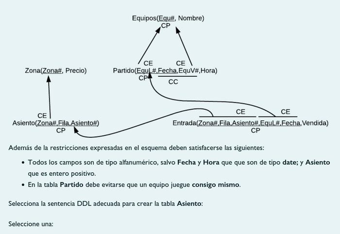
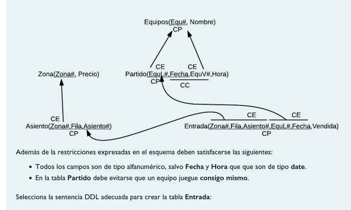
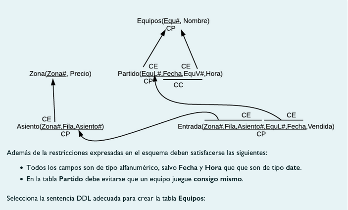
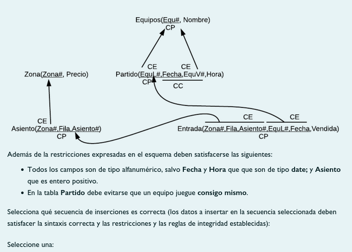
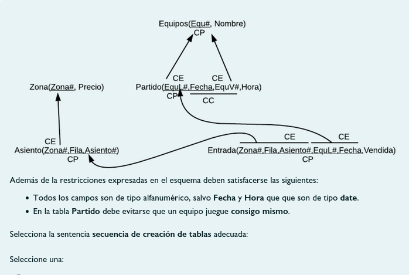
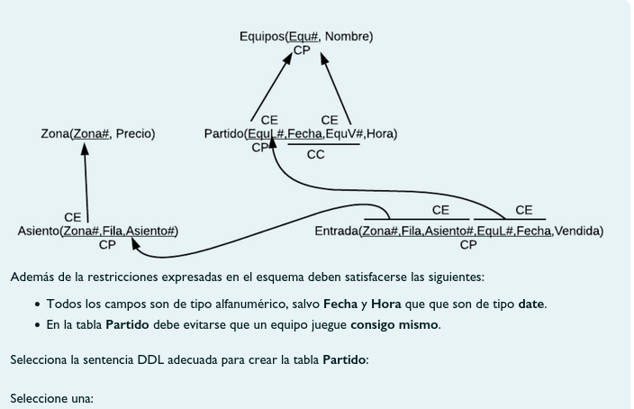
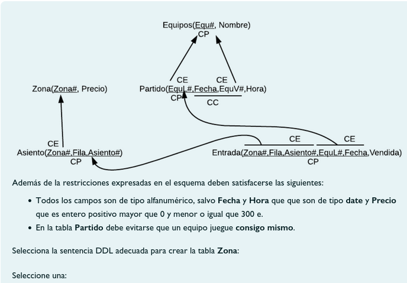

# Cuestionario DDL

* **Autor:** Ismael Sallami Moreno
* **Asignatura:** Fundamentos de Bases de Datos
* **Titulación:** Doble Grado en Ingeniería Informática y ADE

1. Pregunta 1 

    - ( ) CREATE TABLE Asiento (Zona# REFERENCES Zona(Zona#) PRIMARY KEY, Fila varchar2(1) PRIMARY KEY, Asiento# NUMBER(3) PRIMARY KEY CHECK(Asiento# &gt;=0));
    - (x) CREATE TABLE Asiento (Zona# REFERENCES Zona(Zona#), Fila varchar2(1), Asiento# NUMBER(3) CHECK(Asiento# &gt;=0), PRIMARY KEY(Zona#,Fila,Asiento#));
    - ( ) CREATE TABLE Asiento (Zona# REFERENCES Zona(Zona#), Fila varchar2(1), Asiento# NUMBER(3), PRIMARY KEY(Zona#,Fila,Asiento#),FOREIGN KEY (Zona#) REFERENCES Zona(Zona#), CHECK(Asiento# &gt;=0));
    - ( ) CREATE TABLE Asiento (Zona# PRIMARY KEY, Fila varchar2(1) PRIMARY KEY, Asiento# NUMBER(3) PRIMARY KEY CHECK(Asiento# &gt;=0), REFERENCES Zona(Zona#));

2. Pregunta 2 

    - ( ) CREATE TABLE Entrada( Zona#, Fila, Asiento#, EquL# REFERENCES Partido(EquL#), Fecha REFERENCES Partido(Fecha), Vendida VARCHAR2(1) DEFAULT 'N' CHECK(Vendida IN ('S','N')), PRIMARY KEY(Zona#,Fila,Asiento#,EquL#,Fecha), FOREIGN KEY (Zona#,Fila,Asiento#) REFERENCES Asiento(Zona#,Fila,Asiento#) );
    - ( ) CREATE TABLE Entrada( Zona#, Fila, Asiento#, EquL#, Fecha, Vendida VARCHAR2(1) DEFAULT 'N' CHECK(Vendida IN ('S','N')), PRIMARY KEY(Zona#,Fila,Asiento#,EquL#,Fecha), FOREIGN KEY (EquL#,Fecha) REFERENCES Partido(EquL#,Fecha), FOREIGN KEY (Zona#,Fila,Asiento#) REFERENCES Asiento(Zona#,Fila,Asiento#) );
    - (x) CREATE TABLE Entrada( Zona# VARCHAR2(10), Fila VARCHAR2(1), Asiento# NUMBER, EquL#, Fecha, Vendida VARCHAR2(1) DEFAULT 'N' CHECK(Vendida IN ('S','N')), PRIMARY KEY(Zona#,Fila,Asiento#,EquL#,Fecha), FOREIGN KEY (EquL#,Fecha) REFERENCES Partido(EquL#,Fecha), FOREIGN KEY (Zona#,Fila,Asiento#) REFERENCES Asiento(Zona#,Fila,Asiento#) );
    - ( ) CREATE TABLE Entrada( Zona# VARCHAR2(10), Fila VARCHAR2(1), Asiento# NUMBER, EquL# VARCHAR2(10), Fecha DATE, Vendida VARCHAR2(2), PRIMARY KEY(Zona#,Fila,Asiento#,EquL#,Fecha), FOREIGN KEY (EquL#) REFERENCES Equipos(Equ#), FOREIGN KEY (Fecha) REFERENCES Partido(Fecha), FOREIGN KEY (Zona#,Fila,Asiento#) REFERENCES asiento(Zona#,Fila,Asiento#) );

3. Pregunta 3 

    - ( ) CREATE TABLE Equipos (Equ# varchar2(10), Nombre varchar2(15));
    - ( ) CREATE TABLE Equipos (Equ# varchar2(10) PRIMARY KEY, Nombre varchar2(15));
    - (x) CREATE TABLE Equipos (Equ# varchar2(10), Nombre varchar2(15), PRIMARY KEY(Equ#));

4. Ejercicio 4 

    - ( ) <code>1. INSERT INTO Equipos VALUES ('VAL','Valencia'); 2. INSERT INTO Equipos VALUES ('BCN','Barcelona FC'); 3. INSERT INTO Zona VALUES ('Z1',50); 4. INSERT INTO Asiento VALUES ('Z1','A',4); 5. INSERT INTO Partido VALUES ('BCN',TO_DATE('18/12/2019','DD/MM/YYYY'),'MAD',TO_DATE('20:00','HH24:MI')); 6. INSERT INTO Entrada VALUES ('Z1','A',4,'BCN',TO_DATE('18/12/2019','DD/MM/YYYY'),'S');</code>
    - ( ) <code>1. INSERT INTO Partido VALUES ('BCN',TO_DATE('18/12/2019','DD/MM/YYYY'),'MAD',TO_DATE('20:00','HH24:MI')); 2. INSERT INTO Equipos VALUES ('MAD','Real Madrid'); 3. INSERT INTO Equipos VALUES ('BCN','Barcelona FC'); 4. INSERT INTO Entrada VALUES ('Z1','A',4,'BCN',TO_DATE('18/12/2019','DD/MM/YYYY'),'S'); 5. INSERT INTO Zona VALUES ('Z1',50); 6. INSERT INTO Asiento VALUES ('Z1','A',4);</code>
    - ( ) <code>1. INSERT INTO Equipos VALUES ('MAD','Real Madrid'); 2. INSERT INTO Equipos VALUES ('BCN','Barcelona FC'); 3. INSERT INTO Partido VALUES ('BCN','18/12/2019','MAD',20:00); 4. INSERT INTO Zona VALUES ('Z1',50); 5. INSERT INTO Asiento VALUES ('Z1','A',4); 6. INSERT INTO Entrada VALUES ('Z1','A',4,'BCN','18/12/2019','S');</code>
    - (x) <code>1. INSERT INTO Equipos VALUES ('MAD','Real Madrid'); 2. INSERT INTO Equipos VALUES ('BCN','Barcelona FC'); 3. INSERT INTO Partido VALUES ('BCN',TO_DATE('18/12/2019','DD/MM/YYYY'),'MAD',TO_DATE('20:00','HH24:MI')); 4. INSERT INTO Zona VALUES ('Z1',50); 5. INSERT INTO Asiento VALUES ('Z1','A',4); 6. INSERT INTO Entrada VALUES ('Z1','A',4,'BCN',TO_DATE('18/12/2019','DD/MM/YYYY'),'S');</code>
    - ( ) <code>1. INSERT INTO Equipos VALUES ('MAD','Real Madrid'); 2. INSERT INTO Equipos VALUES ('BCN','Barcelona FC'); 3. INSERT INTO Partido VALUES ('VAL',TO_DATE('18/12/2019','DD/MM/YYYY'),'MAD',TO_DATE('20:00','HH24:MI')); 4. INSERT INTO Zona VALUES ('Z1',50); 5. INSERT INTO Asiento VALUES ('Z1','A',4); 6. INSERT INTO Entrada VALUES ('Z1','A',4,'VAL',TO_DATE('21/12/2019','DD/MM/YYYY'),'S');</code>

5. Ejercicio 5 

    - (x) Equipos-&gt;Zona-&gt;Partido-&gt;Entrada-&gt;Asiento
    - ( ) Zona-&gt;Equipos-&gt;Asiento-&gt;Entrada-&gt;Partido
    - ( ) Equipos-&gt;Zona-&gt;Partido-&gt;Asiento-&gt;Entrada
    - ( ) Zona-&gt;Equipos-&gt;Asiento-&gt;Partido-&gt;Entrada

6. Ejercicio 6 

    - ( ) CREATE TABLE Partido (EquL# , Fecha Date, EquV# , Hora Date, PRIMARY KEY(EquL#,Fecha), UNIQUE(EquV#,Fecha), CHECK(EquL#&lt;&gt;EquV#), FOREIGN KEY (EquL#,EquV#) REFERENCES Equipos(Equ#,Equ#));
    - (x) CREATE TABLE Partido (EquL# REFERENCES Equipos(Equ#), Fecha Date, EquV# REFERENCES Equipos(Equ#), Hora Date, PRIMARY KEY(EquL#,Fecha), UNIQUE(EquV#,Fecha), CHECK(EquL#&lt;&gt;EquV#));
    - ( ) CREATE TABLE Partido (EquL# REFERENCES Equipos(Equ#), Fecha Date, EquV# REFERENCES Equipos(Equ#) CHECK(EquL#&lt;&gt;EquV#), Hora Date, PRIMARY KEY(EquL#,Fecha), UNIQUE(EquV#,Fecha));
    - ( ) CREATE TABLE Partido (EquL# varchar2(10) PRIMARY KEY REFERENCES Equipos(Equ#), Fecha Date PRIMARY KEY UNIQUE, EquV# REFERENCES Equipos(Equ#), Hora Date UNIQUE, PRIMARY KEY(EquL#,Fecha), CHECK(EquL#&lt;&gt;EquV#));

7. Ejercicio 7 

    - ( ) CREATE TABLE Zona (Zona# varchar2(10) PRIMARY KEY, Precio NUMBER CHECK(Precio BETWEEN 0 AND 300));
    - ( ) CREATE TABLE Zona (Zona# varchar2(10), Precio NUMBER);
    - (x) CREATE TABLE Zona (Zona# varchar2(10) PRIMARY KEY, Precio NUMBER(3) CHECK(Precio &gt;0 AND Precio &lt;=300));
