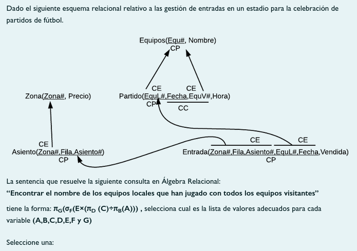
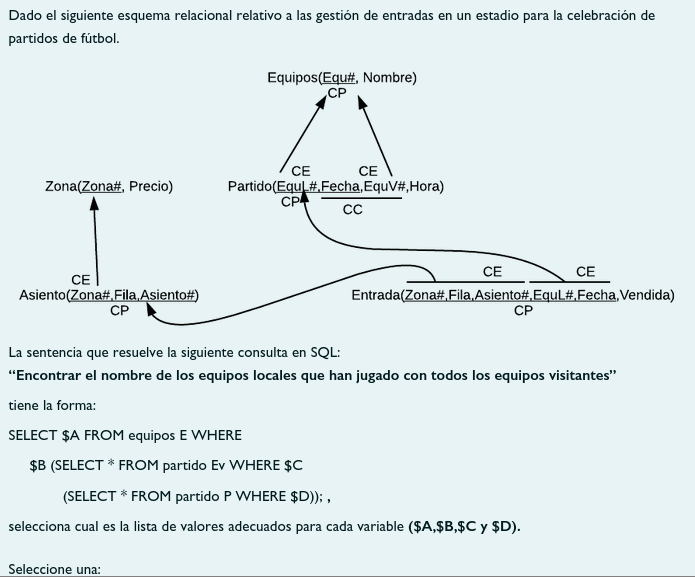
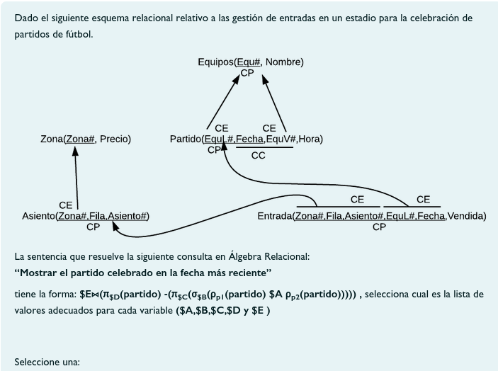
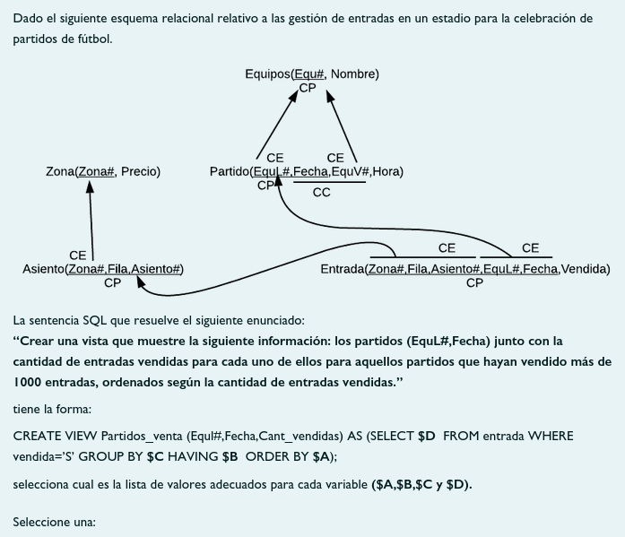

# Cuestionario DML

* **Autor:** Ismael Sallami Moreno
* **Titulación:** Doble Grado en Ingeniería Informática y ADE

1. Ejercicio 1 

    - ( ) A -> partido B-> EquV# C-> partido D-> EquL# E-> equipos F-> Equ#=EquL# G-> nombre
    - ( ) A -> equipos B-> Equ# C-> partido D-> EquL#,EquV# E-> equipos F-> partido.Equ#=equipos.Equ# G-> nombre
    - (x) A -> partido B-> EquV# C-> partido D-> EquL#,EquV# E-> equipos F-> Equ#=EquL# G-> nombre

2. Ejercicio 2 

    - (x) A-> E.nombre B-> NOT EXISTS C-> NOT EXISTS D-> P.EquV#=Ev.EquV# and E.equ#=P.EquL#
    - ( ) A-> E.nombre B-> ALL C-> EXISTS D-> P.EquV#=Ev.EquV# and E.equ#=P.EquL#
    - ( ) A-> E.nombre B-> EXISTS C-> EXISTS D-> P.EquV#=Ev.EquV# and E.equ#=P.EquL#
    - ( ) A-> E.nombre B-> ALL C-> ALL D-> P.EquV#=Ev.EquV# and E.equ#=P.EquL#

3. Pregunta 3 

    - ( ) A -> × B-> p1.fecha<>p2.fecha C-> p2.fecha D-> * E-> equipos
    - ( ) A -> ⋈ B-> p2.fecha p1.fecha D-> fecha E-> partido
    - (x) A -> × B-> p1.fecha p1.fecha D-> fecha E-> partido
    - ( ) A -> × B-> p1.fecha fecha D-> fecha E-> partido

4. p1.fecha D-> fecha E-> partido A -> × B-> p1.fecha p1.fecha D-> fecha E-> partido A -> × B-> p1.fecha fecha D-> fecha E-> partido **4.** Pregunta 4 

    - ( ) A-> E.nombre B-> ALL C-> ALL D-> P.EquV#=Ev.EquV# and E.equ#=P.EquL#
    - ( ) A-> E.nombre B-> ALL C-> EXISTS D-> P.EquV#=Ev.EquV# and E.equ#=P.EquL#
    - ( ) A-> E.nombre B-> EXISTS C-> EXISTS D-> P.EquV#=Ev.EquV# and E.equ#=P.EquL#
    - (x) A-> count(*) B-> HAVING count(*) >1000 C-> (EquL#,Fecha) D-> EquL#,Fecha,count(*)
