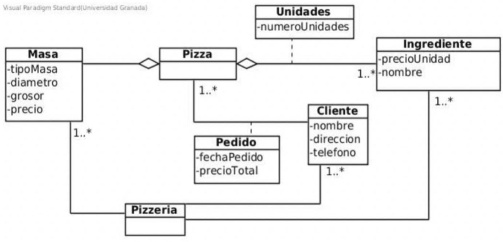
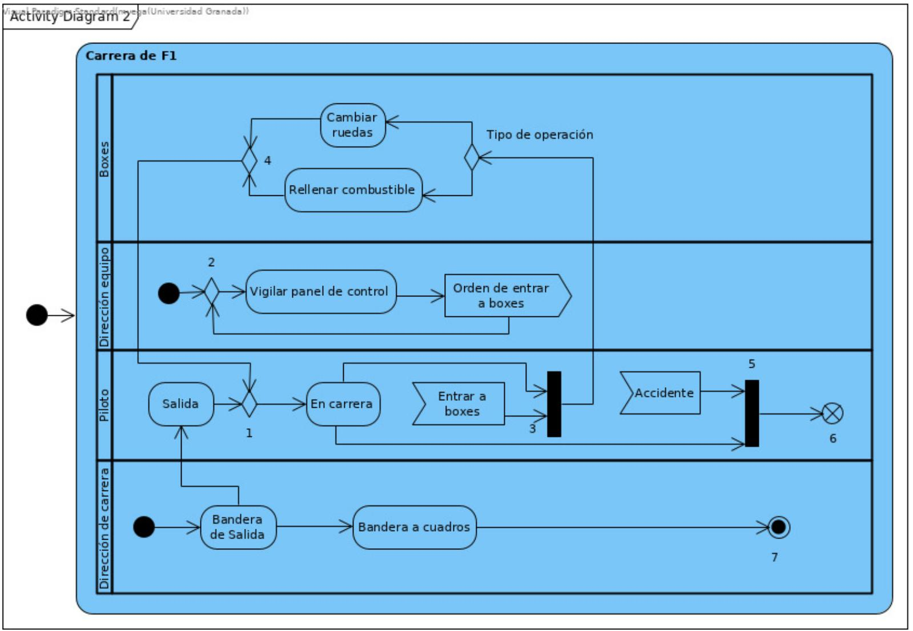

# Test Fundamentos de Ingeniería del Software

* **Autor:** Ismael Sallami Moreno
* **Titulación:** Ingeniería Informática + ADE

1. La validación de requisitos consiste en comprobar que el software cumple con las expectativas del cliente.

    - (x) Verdadero
    - ( ) Falso

2. Las clases que forman parte de un Diagrama de Clases del Diseño (DCD) se identifican exclusivamente a partir del Modelo Conceptual.

    - (x) Falso
    - ( ) Verdadero

3. En el DSS tratamos el sistema como si fuera una caja negra.

    - (x) Verdadero
    - ( ) Falso

4. El Contrato de una operación debe indicar qué hace una operación sin decir cómo lo hace.

    - (x) Verdadero
    - ( ) Falso

5. El uso de los diagramas de comunicación o de secuencia UML para representar el modelo de interacción de objetos nos va a proporcionar distintos resultados de diseño.

    - ( ) Verdadero
    - (x) Falso

6. Según el patrón "Creador", si una clase B registra objetos de la clase A, esto justifica que B tenga la responsabilidad de crear instancias de A.

    - (x) Verdadero
    - ( ) Falso

7. Si una función del sistema no cambia nada de lo especificado en el modelo conceptual su contrato no tendrá poscondiciones.

    - (x) Verdadero
    - ( ) Falso

8. Los diagramas de despliegue muestran la distribución lógica de las clases.

    - (x) Falso
    - ( ) Verdadero

9. Los diagramas de actividad permiten representar el flujo de acciones dentro de los casos de uso.

    - (x) Verdadero
    - ( ) Falso

10. En la gestión de proyectos, el camino crítico es el conjunto de actividades con la mayor holgura dentro del cronograma.

    - (x) Falso
    - ( ) Verdadero

11. Las clases del diagrama de clases del diseño toman todos sus atributos de los diagramas de conceptos.

    - ( ) Verdadero
    - (x) Falso

12. Los diagramas de actividad de UML es una herramienta muy adecuada para el diseño del flujo de control.

    - (x) Verdadero
    - ( ) Falso

13. La generalización permite crear jerarquías de clases.

    - (x) Verdadero
    - ( ) Falso

14. El mantenimiento no debe actualizar la documentación del sistema.

    - (x) Falso
    - ( ) Verdadero

15. Según los estereotipos de visibilidad en los Diagramas de Comunicación, <<parameter>> indica que un objeto tiene vía de comunicación con otro porque este último es una variable definida dentro de un método.

    - (x) Falso
    - ( ) Verdadero

16. Los diagramas de paquetes son útiles para organizar los diagramas de casos de uso.

    - (x) Verdadero
    - ( ) Falso

17. El mayor esfuerzo realizado durante el mantenimiento de un software es para adaptar el software o nuevos requisitos.

    - ( ) Verdadero
    - (x) Falso

18. La especificación de requisitos debe ser completa, verificable, consistente y modificable.

    - (x) Verdadero
    - ( ) Falso

19. Un cambio de estado que se describe en las poscondiciones de un contrato es la creación de un atributo.

    - ( ) Verdadero
    - (x) Falso

20. El resultado del diseño de la arquitectura del software es un conjunto de subsistemas y las relaciones entre ellos.

    - (x) Verdadero
    - ( ) Falso

21. En un diagrama de secuencia del sistema pueden aparecer tantos objetos como se necesiten para modelar la interacción entre ellos.

    - ( ) Verdadero
    - (x) Falso

22. El Paso A.3 en la elaboración del modelo de interacción, que trata sobre la asignación de responsabilidades a objetos, se apoya fundamentalmente en los patrones de diseño de Craig Larman, especialmente Experto en Información y Creador.

    - (x) Verdadero
    - ( ) Falso

23. El análisis orientado a objetos no contempla la posibilidad de herencia múltiple.

    - (x) Falso
    - ( ) Verdadero

24. Los requisitos no funcionales no tienen relación con la calidad del sistema.

    - (x) Falso
    - ( ) Verdadero

25. El diagrama de secuencia del sistema puede contener tantos objetos como sean necesarios para llevar a cabo una operación del sistema.

    - ( ) Verdadero
    - (x) Falso

26. Los proyectos software reales raramente se adaptan a un modelo de ciclo de vida clásico o en cascada.

    - (x) Verdadero
    - ( ) Falso

27. El modelo de casos de uso es la base para obtener información necesaria para el modelo conceptual.

    - (x) Verdadero
    - ( ) Falso

28. El ocultamiento de información limita impacto global de las decisiones de diseño locales.

    - (x) Verdadero
    - ( ) Falso

29. Todos los sustantivos que se identifiquen en los casos de uso se representan como conceptos en el diagrama conceptual.

    - ( ) Verdadero
    - (x) Falso

30. El diagrama de clases de diseño se deduce de los diagramas de comunicación. Se elaboran los diagramas de comunicación y después el diagrama de clases del diseño.

    - (x) Verdadero
    - ( ) Falso

31. Los requisitos de un proyecto software pueden cambiar continuamente, pero esto no es un problema ya que los sistemas software son flexibles (se adaptan a los cambios).

    - ( ) Verdadero
    - (x) Falso

32. En la gestión de proyectos, un hito es un punto de control que representa el inicio de un nuevo ciclo de desarrollo.

    - (x) Falso
    - ( ) Verdadero

33. El principio de modularidad es básico, sin él no tienen sentido los demás principios.

    - (x) Verdadero
    - ( ) Falso

34. Los actores en un modelo de casos de uso pueden representar sistemas externos.

    - (x) Verdadero
    - ( ) Falso

35. Las técnicas de estimación permiten calcular costos y tiempos del proyecto.

    - (x) Verdadero
    - ( ) Falso

36. En la arquitectura MVC (Model View Controller) para cambiar la interfaz de usuario es necesario cambiar el subsistema del modelo ya que este incluye la lógica de funcionamiento del programa.

    - ( ) Verdadero
    - (x) Falso

37. Los costes de mantenimiento incluyen tanto recursos directos como indirectos.

    - (x) Verdadero
    - ( ) Falso

38. Todos los enlaces estereotipados con <<L>>, <
> o <<G>> estarán en el diagrama de clases del diseño como una asociación.

    - ( ) Verdadero
    - (x) Falso

39. El principio de diseño de “Bajo Acoplamiento” busca minimizar las dependencias entre clases.

    - (x) Verdadero
    - ( ) Falso

40. 
Un objeto pedido puede incluir más de una pizza.  

    - ( ) Verdadero
    - (x) Falso

41. La planificación de proyectos solo se realiza al inicio y no requiere seguimiento.

    - (x) Falso
    - ( ) Verdadero

42. Un requisito de rendimiento es un ejemplo de requisito no funcional que puede tener implicaciones en la selección de la arquitectura.

    - (x) Verdadero
    - ( ) Falso

43. Lo siguiente es una poscondición correcta: "se creó una lista en la que se incluye el nombre del cliente, dirección y teléfono, que se proporciona como salida de la operación".

    - ( ) Verdadero
    - (x) Falso

44. Los escenarios y casos de uso son técnicas orientadas a obtener requisitos funcionales y no funcionales.

    - (x) Verdadero
    - ( ) Falso

45. El análisis de riesgos es exclusivo de las fases finales de un proyecto.

    - (x) Falso
    - ( ) Verdadero

46. La gestión de recursos humanos no se considera en la planificación de proyectos.

    - (x) Falso
    - ( ) Verdadero

47. El mayor esfuerzo durante el proceso de producción del software se realiza en la etapa de desarrollo.

    - ( ) Verdadero
    - (x) Falso

48. El mantenimiento correctivo ocurre exclusivamente después de la entrega del producto final.

    - (x) Verdadero
    - ( ) Falso

49. El análisis orientado a objetos facilita la transición entre el análisis y el diseño del sistema.

    - (x) Verdadero
    - ( ) Falso

50. Los modelos del análisis pueden contener tantas inconsistencias como consideremos oportunas, puesto que no son la solución del problema.

    - ( ) Verdadero
    - (x) Falso

51. Con el análisis orientado a objetos sólo se modelan las propiedades estáticas del ámbito del problema.

    - ( ) Verdadero
    - (x) Falso

52. Los requisitos no funcionales suelen describir cualidades o restricciones del sistema.

    - (x) Verdadero
    - ( ) Falso

53. La especificación de requisitos debe evitar la ambigüedad para facilitar el desarrollo posterior.

    - (x) Verdadero
    - ( ) Falso

54. El mantenimiento correctivo incluye la adición de nuevas funcionalidades.

    - (x) Falso
    - ( ) Verdadero

55. Lo siguiente es un recurso funcional "las reservas de préstamos de libros caducan a los 10 días a partir del momento que el libro esté a disposición del usuario".

    - (x) Verdadero
    - ( ) Falso

56. La validación verifica que el software cumpla con las necesidades del usuario.

    - (x) Verdadero
    - ( ) Falso

57. Las técnicas de prueba estáticas permiten detectar errores sin ejecutar el código.

    - (x) Verdadero
    - ( ) Falso

58. La obtención de requisitos debe evitar la participación de los usuarios para no generar conflictos.

    - ( ) Verdadero
    - (x) Falso

59. Las dependencias entre clases se modelan mediante asociaciones en UML.

    - (x) Falso
    - ( ) Verdadero

60. Los actores representan roles que son interpretados por personas, dispositivos, otros sistemas... cuando el sistema está en uso.

    - (x) Verdadero
    - ( ) Falso

61. En el diagrama de clases del diseño, los métodos:

    - ( ) Se obtienen del MC.
    - (x) Se obtienen de los DC.
    - ( ) No se especifican.

62. El numero de iteraciones en las fases de elaboración y construcción del proceso unificado deben ser las mismas.

    - ( ) Verdadero
    - (x) Falso

63. La documentación de requisitos es opcional en proyectos de ciclo de vida ágil.

    - (x) Falso
    - ( ) Verdadero

64. En los diagramas de clases de diseño pueden aparecer relaciones de dependencia.

    - (x) Verdadero
    - ( ) Falso

65. Los modelos de AER son: Modelo conceptual, diagramas de casos de uso y los contratos de las operaciones principales.

    - ( ) Verdadero
    - (x) Falso

66. En el MC (modelo conceptual) se deben incluir las relaciones de generalización entre conceptos.

    - (x) Verdadero
    - ( ) Falso

67. Los casos de uso siempre terminan dando un resultado al actor que los inició.

    - (x) Verdadero
    - ( ) Falso

68. ¿Cuál de los siguientes modelos es más importante para realizar el diagrama de clases de diseño?

    - ( ) Diagramas de interacción del diseño.
    - (x) Todas son correctas.
    - ( ) El modelo conceptual

69. El modelo de casos de uso se usa exclusivamente para la obtención de requisitos.

    - ( ) Verdadero
    - (x) Falso

70. Las relaciones de inclusión permiten reutilizar fragmentos de comportamiento en varios casos de uso.

    - (x) Verdadero
    - ( ) Falso

71. Los diagramas de casos de uso permiten representar la interacción entre los actores y el sistema.

    - (x) Verdadero
    - ( ) Falso

72. Es posible que en un caso de uso no tenga que intervenir el sistema software a modelar.

    - ( ) Verdadero
    - (x) Falso

73. Cuando se construye un modelo conceptual es mejor añadir el mayor número posible de asociaciones entre conceptos.

    - ( ) Verdadero
    - (x) Falso

74. El caso de uso describe sólo las acciones del sistema, no las de los actores.

    - ( ) Verdadero
    - (x) Falso

75. Los diagramas de despliegue muestran la distribución física de los componentes del software sobre el hardware.

    - (x) Verdadero
    - ( ) Falso

76. Las relaciones de generalización en el diagrama de clases del diseño son:

    - ( ) Las que había en el MC.
    - ( ) Las identificadas con <<G>> en los diagramas de interacción.
    - (x) Las que se pueden extraer al encontrar atributos y/o métodos comunes a varias clases.

77. Un modelo de casos de uso se centra en las necesidades que el usuario espera lograr al utilizar el sistema.

    - (x) Verdadero
    - ( ) Falso

78. En un contrato si está relleno el apartado de las excepciones, el apartado de las precondiciones debe estar vacío.

    - ( ) Verdadero
    - (x) Falso

79. Un actor puede desempeñar varios roles a lo largo del tiempo.

    - (x) Verdadero
    - ( ) Falso

80. A la hora de elaborar el diagrama de comunicación de una operación son esenciales los siguientes apartados del contrato correspondiente: excepciones, precondiciones y poscondiciones.

    - ( ) Verdadero
    - (x) Falso

81. El mantenimiento adaptativo consiste únicamente en corregir defectos que surgen tras la entrega del producto.

    - (x) Falso
    - ( ) Verdadero

82. El diseño es una tarea clave para la calidad del producto software.

    - (x) Verdadero
    - ( ) Falso

83. Las relaciones de extensión son necesarias para todos los casos de uso.

    - ( ) Verdadero
    - (x) Falso

84. En el diagrama de clases del diseño, la multiplicidad se obtiene de la existencia o no de multiobjetos en los diagrama de comunicación.

    - (x) Verdadero
    - ( ) Falso

85. Los requisitos no funcionales no tienen ninguna relación con los funcionales.

    - ( ) Verdadero
    - (x) Falso

86. Los casos de uso permiten describir el punto de vista de los usuarios del sistema.

    - (x) Verdadero
    - ( ) Falso

87. Durante la etapa de definición hay que conseguir encontrar la solución software al sistema analizado.

    - ( ) Verdadero
    - (x) Falso

88. La restricción {transient} aplicada a una instancia o enlace en un Diagrama de Comunicación significa que la instancia o enlace se destruye durante la interacción.

    - (x) Falso
    - ( ) Verdadero

89. El diagrama de secuencia es una herramienta para describir el comportamiento dinámico del sistema.

    - (x) Verdadero
    - ( ) Falso

90. El diseño de la estructura de objetos no se relaciona con los patrones de diseño.

    - (x) Falso
    - ( ) Verdadero

91. En la validación de software, las pruebas de caja negra se enfocan en el diseño interno del sistema.

    - (x) Falso
    - ( ) Verdadero

92. Los diagramas de Gantt ayudan a visualizar las actividades y los hitos del proyecto.

    - (x) Verdadero
    - ( ) Falso

93. El análisis de requisitos consiste en examinar, delimitar y definir los requisitos del sistema.

    - (x) Verdadero
    - ( ) Falso

94. Las asociaciones de navegación se obtienen a partir de las asociaciones del modelo conceptual.

    - ( ) Verdadero
    - (x) Falso

95. Las dependencias representan vínculos temporales entre clases.

    - (x) Verdadero
    - ( ) Falso

96. El uso de métodos de desarrollo ágiles rompen con la filosofía de equipos de trabajo organizados de forma jerárquica.

    - (x) Verdadero
    - ( ) Falso

97. Los casos de uso “esenciales” son los procedimientos comunes más importantes del sistema.

    - ( ) Verdadero
    - (x) Falso

98. La arquitectura cliente-servidor favorece la escalabilidad de los sistemas software, porque permite la reconfiguración añadiendo clientes y servidores extra.

    - (x) Verdadero
    - ( ) Falso

99. El uso de mecanismos de abstracción en el diseño permiten obtener la modularidad adecuada de un sistema software.

    - ( ) Verdadero
    - (x) Falso

100. La definición de un actor en un modelo de casos de uso puede coincidir con el concepto de clase en el análisis orientado a objetos.

    - (x) Falso
    - ( ) Verdadero

101. El patrón de diseño “Experto en Información” sugiere asignar la responsabilidad a la clase que tenga la información necesaria para llevarla a cabo.

    - (x) Verdadero
    - ( ) Falso

102. Un diagrama de conceptos sin operaciones es incorrecto.

    - ( ) Verdadero
    - (x) Falso

103. Los actores pueden ser personas u otros sistemas externos.

    - (x) Verdadero
    - ( ) Falso

104. La especificación de requisitos debe ser verificable y modificable según el estándar IEEE 830-1998.

    - (x) Verdadero
    - ( ) Falso

105. Las entrevistas solo deben realizarse con los usuarios finales.

    - ( ) Verdadero
    - (x) Falso

106. El número de operaciones principales de un sistema es el mismo que el número de casos de usos que tengamos.

    - ( ) Verdadero
    - (x) Falso

107. El principio de diseño "Bajo Acoplamiento" busca aumentar la interdependencia entre módulos para facilitar la comunicación.

    - (x) Falso
    - ( ) Verdadero

108. El objetivo de la validación y verificación es establecer confianza en la calidad del software.

    - (x) Verdadero
    - ( ) Falso

109. La Especificación de Requisitos es un documento en el que se dice qué debe hacer el sistema software.

    - (x) Verdadero
    - ( ) Falso

110. Los requisitos se consideran completos cuando representan exactamente lo que el cliente necesita.

    - ( ) Verdadero
    - (x) Falso

111. La planificación del proyecto incluye actividades como la estimación de costos y la definición de entregables.

    - (x) Verdadero
    - ( ) Falso

112. La abstracción de control se refiere al mecanismo que permite abstraer sobre el flujo de control de cualquier proceso, como reemplazar una estructura goto por un bucle while.

    - (x) Verdadero
    - ( ) Falso

113. La agregación y la composición son tipos de relaciones entre clases.

    - (x) Verdadero
    - ( ) Falso

114. Las relaciones de extensión permiten describir variantes de un escenario básico.

    - (x) Verdadero
    - ( ) Falso

115. El diagrama de clases es una herramienta para representar el modelo estático del sistema.

    - (x) Verdadero
    - ( ) Falso

116. Los prototipos siempre se transforman hasta convertirse en el programa que se entrega al cliente.

    - ( ) Verdadero
    - (x) Falso

117. Los casos de uso pueden ser iniciados por un actor principal o secundario.

    - ( ) Verdadero
    - (x) Falso

118. Uno de los objetivos de la fase de inicio del proceso unificado es el estudio de viabilidad del sistema a desarrollar.

    - (x) Verdadero
    - ( ) Falso

119. La diferencia entre una precondición y una excepción es que la precondición no tiene que comprobarse en la operación que se está definiendo.

    - (x) Verdadero
    - ( ) Falso

120. 
El nodo 5 es un nodo join.  

    - (x) Sí
    - ( ) No

121. La validación del software asegura que el producto cumple con las expectativas y necesidades del usuario.

    - (x) Verdadero
    - ( ) Falso

122. Los diagramas de casos de uso representan la arquitectura física del sistema.

    - (x) Falso
    - ( ) Verdadero

123. El mantenimiento incluye adaptaciones para entornos cambiantes.

    - (x) Verdadero
    - ( ) Falso

124. El mantenimiento de software implica corregir errores y mejorar el rendimiento.

    - (x) Verdadero
    - ( ) Falso

125. El usuario es una pieza importante en el proceso de validación de las especificaciones del software.

    - (x) Verdadero
    - ( ) Falso

126. La relación de inclusión se usa para reutilizar comportamientos en varios casos de uso.

    - (x) Verdadero
    - ( ) Falso

127. 
Cuando comienza la actividad "Carrera de F1" se activan las calles "Dirección de carrera" y SI "Dirección de equipo".  

    - (x) Sí
    - ( ) No

128. El proceso de obtención de requisitos no incluye la descripción de implicados o actores relevantes.

    - ( ) Verdadero
    - (x) Falso

129. Un sistema informático externo a la aplicación con el que ésta debe interaccionar puede definirse como actor.

    - (x) Verdadero
    - ( ) Falso

130. Los diagramas de casos de uso son parte del modelo de análisis del sistema.

    - ( ) Verdadero
    - (x) Falso

131. Un requisito funcional describe cómo debe comportarse el sistema y cómo reacciona ante ciertos estímulos.

    - (x) Verdadero
    - ( ) Falso

132. Los paquetes durante el diseño arquitectónico son una representación física de los subsistemas.

    - ( ) Verdadero
    - (x) Falso

133. El patrón experto en información nos dice que el objeto responsable de hacer las cosas es el que tiene el control.

    - ( ) Verdadero
    - (x) Falso

134. El modelo conceptual se representa usando un diagrama de clases que contiene las clases con sus atributos, métodos y asociaciones.

    - ( ) Verdadero
    - (x) Falso

135. La validación es independiente de las expectativas del usuario.

    - (x) Falso
    - ( ) Verdadero

136. La herramienta para representar el modelo de diseño de la interacción de objetos son los diagramas de clases UML.

    - ( ) Verdadero
    - (x) Falso

137. Un caso de uso produce algo de valor para un actor.

    - (x) Verdadero
    - ( ) Falso

138. El Paso C en la elaboración del modelo de interacción consiste en identificar los objetos que se han usado pero nunca se han creado para luego elaborar sus contratos de inicialización.

    - (x) Falso
    - ( ) Verdadero

139. En el modelo conceptual hay que definir los atributos y los métodos de todas las clases.

    - ( ) Verdadero
    - (x) Falso

140. Un caso de uso puede tener varios actores principales.

    - ( ) Verdadero
    - (x) Falso

141. Las relaciones de dependencia en el diagrama de clases del diseño se obtienen de las asociaciones de tipo agregación fuerte.

    - ( ) Verdadero
    - (x) Falso

142. ¿Cuál de las siguientes acciones empeoran el ocultamiento de información?

    - ( ) Declarar atributos con visibilidad pública.
    - ( ) Utilizar variables globales.
    - (x) Todas son correctas.

143. No se deben usar atributos de un concepto como clave de acceso desde otro concepto.

    - (x) Verdadero
    - ( ) Falso

144. El modelo conceptual no debe incluir los nombres de rol de las asociaciones.

    - ( ) Verdadero
    - (x) Falso

145. El nombre que le demos al sistema en el DSS se va a corresponder con el nombre de una clase que va a formar parte de nuestra solución.

    - (x) Verdadero
    - ( ) Falso

146. La verificación dinámica de requisitos incluye técnicas de revisión estática.

    - (x) Falso
    - ( ) Verdadero

147. Un caso de uso esencial describe qué hace el sistema como respuesta a una petición de algún actor, pero no cómo lo hace.

    - (x) Verdadero
    - ( ) Falso

148. Los diagramas de colaboración son equivalentes a los diagramas de secuencia pero con un enfoque diferente.

    - (x) Verdadero
    - ( ) Falso

149. 
Un ingrediente puede tener un precio diferente dependiendo de la pizza en la que esté.  

    - ( ) Verdadero
    - (x) Falso

150. El patrón "Controlador" (o fachada) recomienda que la lógica de la aplicación se maneje en la interfaz de usuario para asegurar una buena reutilización.

    - (x) Falso
    - ( ) Verdadero

151. La semántica de la composición no permite que las partes existan independientemente del compuesto

    - (x) Verdadero
    - ( ) Falso

152. Las clases del diagrama de clases del diseño toman sus atributos de los diagramas de comunicación.

    - ( ) Verdadero
    - (x) Falso

153. Las tareas principales de la ingeniería de requisitos son detección, análisis, especificación, revisión y reacción de requisitos.

    - (x) Verdadero
    - ( ) Falso

154. La especificación de requisitos solo debe ser utilizada durante el desarrollo inicial del software.

    - ( ) Verdadero
    - (x) Falso

155. La verificación de requisitos consiste en comprobar que los requisitos documentados representen correctamente el problema.

    - (x) Verdadero
    - ( ) Falso

156. Las pruebas de aceptación son realizadas únicamente por el equipo de desarrollo.

    - (x) Falso
    - ( ) Verdadero

157. EL acoplamiento es un indicador de la dependencia entre módulos, cuanto más alto sea este valor mejor será el diseño.

    - ( ) Verdadero
    - (x) Falso

158. Los diagramas de clases permiten representar la estructura estática de un sistema.

    - (x) Verdadero
    - ( ) Falso

159. Una de las principales tareas del diseño de la arquitectura es refinar la descomposición del sistema en subsistemas.

    - (x) Verdadero
    - ( ) Falso

160. La gestión de proyectos consiste en coordinar recursos, tiempo y actividades para cumplir los objetivos.

    - (x) Verdadero
    - ( ) Falso

161. Las pruebas de integración se centran en cómo interactúan los componentes.

    - (x) Verdadero
    - ( ) Falso

162. Un caso de uso sólo puede tener un actor principal que coincide con el que inicia el caso de uso.

    - ( ) Verdadero
    - (x) Falso

163. La relación de inclusión entre casos de uso se utiliza para modelar la herencia de comportamiento entre actores.

    - (x) Falso
    - ( ) Verdadero

164. Los tipos de requisitos son funcionales, no funcionales y FURPS+.

    - ( ) Verdadero
    - (x) Falso

165. El incumplimiento de la planificación lleva de forma inmediata al aumento de personal en el equipo de desarrollo.

    - ( ) Verdadero
    - (x) Falso

166. Los diagramas de casos de uso no incluyen relaciones entre los actores.

    - (x) Falso
    - ( ) Verdadero

167. En el proceso de diseño, a mayor refinamiento...

    - ( ) el nivel de abstracción es independiente del nivel de refinamiento.
    - ( ) el nivel de abstracción es más alto.
    - (x) el nivel de abstracción es más bajo.

168. La primera tarea del diseño es encontrar el diseño de la arquitectura del sistema.

    - (x) Verdadero
    - ( ) Falso

169. En el diagrama de clases del diseño pueden aparecer clases que no estaban en el diagrama de conceptos construido en el modelo de análisis.

    - (x) Verdadero
    - ( ) Falso

170. Nivel de acoplamiento nulo de un módulo nos garantiza un diseño de calidad.

    - ( ) Verdadero
    - (x) Falso

171. Los actores de un modelo de casos de uso son siempre humanos.

    - ( ) Verdadero
    - (x) Falso

172. En los diagramas de clases de diseño no se deben representar las relaciones de dependencia entre clases, solo se deben representar las de asociación y de generalización.

    - ( ) Verdadero
    - (x) Falso

173. La forma más directa de identificar casos de uso es identificando los objetivos y necesidades de los actores del sistema.

    - (x) Verdadero
    - ( ) Falso

174. Para elaborar el modelo de análisis es fundamental el modelo de casos de uso.

    - (x) Verdadero
    - ( ) Falso

175. El análisis de riesgo incluye identificar y planificar medidas para evitar o minimizar los riesgos.

    - (x) Verdadero
    - ( ) Falso

176. La verificación estática incluye pruebas dinámicas realizadas por el equipo de desarrollo.

    - (x) Falso
    - ( ) Verdadero

177. La planificación de proyectos incluye la estimación de costes, recursos y tiempo.

    - (x) Verdadero
    - ( ) Falso

178. En un Diagrama de Comunicación, el símbolo * antes de un número de secuencia se utiliza para representar el comportamiento condicional de un mensaje.

    - (x) Falso
    - ( ) Verdadero

179. El modelo estructural del análisis está representado por el/los diagramas de secuencia del sistema.

    - ( ) Verdadero
    - (x) Falso

180. Las relaciones entre actores y casos de uso son la asociación y la dependencia.

    - ( ) Verdadero
    - (x) Falso

181. La descripción de casos de uso puede incluir escenarios alternativos y de error.

    - (x) Verdadero
    - ( ) Falso

182. En la arquitectura multicapa las capas deben estar lo más acopladas posible.

    - ( ) Verdadero
    - (x) Falso

183. El modelo conceptual no puede contener las navegabilidades de las asociaciones.

    - (x) Verdadero
    - ( ) Falso

184. Los requisitos no funcionales determinan los objetivos del diseño.

    - ( ) Verdadero
    - (x) Falso

185. Un patrón de diseño es la descripción del problema con su solución en un determinado contexto.

    - (x) Verdadero
    - ( ) Falso

186. Uno de los problemas más importantes en el proceso de desarrollo del software es el incumplimiento de la planificación.

    - (x) Verdadero
    - ( ) Falso

187. Los requisitos implícitos son aquellos que no se documentan pero que se espera que se cumplan.

    - (x) Verdadero
    - ( ) Falso

188. La descripción del entorno técnico no forma parte de la obtención de requisitos.

    - ( ) Verdadero
    - (x) Falso

189. Las técnicas de entrevistas estructuradas no están recomendadas para obtener requisitos.

    - ( ) Verdadero
    - (x) Falso

190. Los actores tienen que ser necesariamente los identificados como usuarios del sistema.

    - ( ) Verdadero
    - (x) Falso

191. La generalización y la herencia en el análisis orientado a objetos son equivalentes en todos los contextos de modelado.

    - (x) Falso
    - ( ) Verdadero

192. Lo siguiente es un requisito NO funcional de facilidad de uso "el entorno debe avisar al usuario mediante email tras días antes de que finalice el plazo del préstamo".

    - ( ) Verdadero
    - (x) Falso

193. El diseño de casos de uso consiste en detallar las interacciones entre los actores y el sistema.

    - (x) Verdadero
    - ( ) Falso

194. Cuando un objeto se pasa como parámetro, en el diagrama de comunicación de la operación los enlaces con ese objeto tendrán una visibilidad del tipo <<A>>.

    - ( ) Verdadero
    - (x) Falso

195. Según los patrones de diseño de Craig Larman (GRASP), el patrón "Experto en Información" sugiere asignar una responsabilidad a la clase que contiene la información necesaria para llevarla a cabo.

    - (x) Verdadero
    - ( ) Falso

196. Las operaciones de las clases en un Diagrama de Clases del Diseño (DCD) se identifican principalmente a partir de los atributos definidos en el Modelo Conceptual.

    - (x) Falso
    - ( ) Verdadero

197. Las relaciones entre los casos de uso pueden ser asociación, generalización y dependencia.

    - ( ) Verdadero
    - (x) Falso

198. El diagrama de comunicación forma parte del diseño de la estructura de objetos.

    - (x) Verdadero
    - ( ) Falso

199. Las clases que aparezcan en el modelo de dominio son las únicas que tendrán el diagrama de clases del diseño.

    - ( ) Verdadero
    - (x) Falso

200. El modelo de comportamiento se obtiene a partir del modelo conceptual.

    - ( ) Verdadero
    - (x) Falso

201. La verificación asegura que el software cumpla con las especificaciones técnicas.

    - (x) Verdadero
    - ( ) Falso

202. Un alto nivel de "Alta Cohesión" para una clase implica que modela un solo concepto abstracto con un pequeño conjunto de responsabilidades íntimamente relacionadas.

    - (x) Verdadero
    - ( ) Falso

203. Un caso de uso puede ser iniciado por un actor o por un usuario.

    - ( ) Verdadero
    - (x) Falso

204. Es mejor que las actividades de verificación las lleve a cabo el mismo equipo que haya hecho el desarrollo.

    - ( ) Verdadero
    - (x) Falso

205. Un componente en la arquitectura de software debe tener una interfaz que exponga todos sus métodos internos.

    - (x) Falso
    - ( ) Verdadero

206. Los diagramas de secuencia no pueden representar flujos alternativos de un caso de uso.

    - (x) Falso
    - ( ) Verdadero

207. El proceso de análisis de requisitos ayuda a refinar, estructurar y describir los requisitos del sistema.

    - (x) Verdadero
    - ( ) Falso

208. Las pruebas dinámicas y estáticas forman parte de la verificación.

    - (x) Verdadero
    - ( ) Falso

209. Los patrones de diseño para la asignación de responsabilidades a objetas ayudan a obtener el diagrama de clases del diseño.

    - ( ) Verdadero
    - (x) Falso

210. Los requisitos no funcionales definen los criterios de calidad del sistema software.

    - (x) Verdadero
    - ( ) Falso

211. Cada caso de uso debe tener un nombre descriptivo y claro.

    - (x) Verdadero
    - ( ) Falso

212. El diseño es el proceso de refinamiento, en el que partiendo de modelos del análisis vamos añadiendo información hasta completar el diseño.

    - (x) Verdadero
    - ( ) Falso

213. El acoplamiento indica dependencia entre módulos. Cuanto más alto mejor es el diseño.

    - ( ) Verdadero
    - (x) Falso

214. Las pruebas de validación confirman que el sistema cumple los requisitos del usuario.

    - (x) Verdadero
    - ( ) Falso

215. Los requisitos no funcionales suponen limitaciones para el diseño de un sistema software.

    - (x) Verdadero
    - ( ) Falso

216. En un diagrama de secuencia del sistema pueden aparecer tantos objetos como necesitemos para modelar la interacción entre ellos y con los actores.

    - ( ) Verdadero
    - (x) Falso

217. Para obtener un buen diseño, cada módulo debe presentar un bajo nivel de cohesión.

    - ( ) Verdadero
    - (x) Falso

218. La Etnografía es una técnica de obtención de requisitos que consiste en preguntar a los trabajadores de un negocio sobre la forma en que realizan sus tareas.

    - ( ) Verdadero
    - (x) Falso

219. Los actores en un modelo de casos de uso pueden ser internos o externos.

    - (x) Verdadero
    - ( ) Falso

220. La fase de mantenimiento del software puede implicar cambios en la arquitectura de alto nivel del sistema.

    - (x) Verdadero
    - ( ) Falso

221. Las relaciones de generalización son la única forma de representar relaciones entre casos de uso.

    - ( ) Verdadero
    - (x) Falso

222. La herencia simple y múltiple son formas de generalización.

    - (x) Verdadero
    - ( ) Falso

223. Un enlace entre objetos en un diagrama de colaboración especifica un camino a lo largo del cual un objeto puede enviar mensajes a otro o a sí mismo.

    - (x) Verdadero
    - ( ) Falso

224. Un concepto no debe incluir los atributos de otros conceptos que indiquen las relaciones entre ellos.

    - (x) Verdadero
    - ( ) Falso

225. Una característica de los métodos ágiles es las entregas frecuentes.

    - (x) Verdadero
    - ( ) Falso

226. El modelo de casos de uso puede ser usado como guía para el diseño de la interfaz de usuario y para facilitar la construcción de prototipos.

    - (x) Verdadero
    - ( ) Falso

227. La priorización de requisitos es innecesaria cuando todos los requisitos tienen la misma importancia.

    - ( ) Verdadero
    - (x) Falso

228. Las vías de comunicación o enlaces entre objetos en un diagrama de colaboración son bidireccionales.

    - (x) Verdadero
    - ( ) Falso

229. El patrón experto en información propone asignar una responsabilidad a la clase que conoce la información necesaria para llevarla a cabo.

    - (x) Verdadero
    - ( ) Falso

230. La detección de conflictos entre los requisitos es una de las principales actividades del análisis de requisitos.

    - (x) Verdadero
    - ( ) Falso

231. La gestión de proyectos no se basa en estándares internacionales.

    - (x) Falso
    - ( ) Verdadero

232. El diseño de casos de uso es independiente de los requisitos del sistema.

    - (x) Falso
    - ( ) Verdadero

233. La facilidad de mantenimiento es una característica deseable en el software.

    - (x) Verdadero
    - ( ) Falso

234. La definición de clases y sus atributos no se considera en el diseño de la estructura de objetos.

    - (x) Falso
    - ( ) Verdadero

235. Contra del patrón experto en información: va en contra de principios de acoplamiento y cohesión.

    - (x) Verdadero
    - ( ) Falso

236. El análisis de la productividad permite realizar una buena gestión de proyectos.

    - (x) Verdadero
    - ( ) Falso

237. Un enlace entre objetos estereotipado como local <<L>> nos está indicando que esa vía de comunicación queda establecida para cualquier otra colaboración entre esos objetos.

    - ( ) Verdadero
    - (x) Falso

238. La validación de la especificación no forma parte de la Ingeniería de requisitos.

    - ( ) Verdadero
    - (x) Falso

239. La especificación de requisitos representa los requisitos de manera informal y no debe ser completa.

    - ( ) Verdadero
    - (x) Falso

240. 
Cuando se alcanza el nodo 6 termina la actividad "Carrera de F1".  

    - ( ) Sí
    - (x) No

241. El análisis orientado a objetos solo considera los aspectos estáticos del dominio.

    - ( ) Verdadero
    - (x) Falso

242. El patrón experto en información nos ayuda a conocer qué clases son las encargadas de crear y destruir objetos en un DC (diagrama de comunicación).

    - ( ) Verdadero
    - (x) Falso

243. Ejemplo de requisito funcional: La aplicación debe ser fácil de utilizar, e incluir ayudas en línea fáciles de entender.

    - ( ) Verdadero
    - (x) Falso

244. Los diagramas de paquetes pueden servir para organizar tanto clases como casos de uso.

    - (x) Verdadero
    - ( ) Falso

245. La clasificación de los requisitos según su ámbito distingue entre requisitos funcionales, no funcionales y de información.

    - ( ) Verdadero
    - (x) Falso

246. El modelo conceptual o modelo de dominio es básico para especifiar las postcondiciones de un contrato.

    - (x) Verdadero
    - ( ) Falso

247. El uso del patrón controlador en la elaboración del modelo de diseño se hace para reducir el nivel de acoplamiento entre los elementos de la interfaz de usuario y los que modelan la solución.

    - (x) Verdadero
    - ( ) Falso

248. La planificación incremental de un proyecto implica la definición de requisitos únicamente al inicio del ciclo de vida.

    - (x) Falso
    - ( ) Verdadero

249. El modelo de prototipos es un buen método para validar los requisitos de los usuarios en cualquier proyecto de desarrollo de software.

    - ( ) Verdadero
    - (x) Falso

250. Una mala solución para remediar el retraso en la entrega de un proyecto software es la llamada "horda mongoliana".

    - (x) Verdadero
    - ( ) Falso

251. Un requisito no funcional puede influir en la estructura de datos de un sistema pero no en su arquitectura de componentes.

    - (x) Falso
    - ( ) Verdadero

252. El número de secuencia de un mensaje en un Diagrama de Comunicación se construye como una concatenación de números que indican la prioridad del mensaje en la secuencia general.

    - (x) Falso
    - ( ) Verdadero

253. Un diagrama de secuencia del sistema es un diagrama de secuencia de UML en el que se muestran los eventos generados por los actores.

    - (x) Verdadero
    - ( ) Falso

254. En el Diagrama de Clases del Diseño (DCD), los enlaces estereotipados con <<local>>, <<parameter>> o <<global>> en los Diagramas de Comunicación se representan como una asociación entre clases.

    - (x) Falso
    - ( ) Verdadero

255. Uno de los objetivos del análisis es conseguir los requisitos del software a partir de los requisitos de usuario mediante un proceso de refinamiento.

    - (x) Verdadero
    - ( ) Falso

256. La arquitectura de un sistema software facilita la comprensión de la estructura global del sistema.

    - (x) Verdadero
    - ( ) Falso

257. El mantenimiento es la etapa que menos recursos consume en el ciclo de vida del software.

    - (x) Falso
    - ( ) Verdadero

258. La navegabilidad de las asociaciones en el diagrama de clases del diseño se obtiene teniendo en cuenta la dirección en los envíos de mensaje en los diagramas de comunicación.

    - (x) Verdadero
    - ( ) Falso

259. Uno de los pasos a realizar en la elaboración del modelo de interacción de objetos es la incorporación de las asociaciones entre las clases de objetos.

    - ( ) Verdadero
    - (x) Falso

260. Al elaborar el DC de una operación son esenciales los siguientes apartados del contrato: excepciones, precondiciones y poscondiciones.

    - ( ) Verdadero
    - (x) Falso

261. Un participante en un diagrama de secuencia puede ser un objeto individual o un multiobjeto.

    - (x) Verdadero
    - ( ) Falso

262. La gestión de proyectos considera factores humanos como habilidades y experiencia.

    - (x) Verdadero
    - ( ) Falso

263. Las relaciones de asociación entre clases deben ser bidireccionales para asegurar la consistencia del modelo.

    - (x) Falso
    - ( ) Verdadero

264. La satisfacción del cliente puede verse afectada por retrasos en el mantenimiento.

    - (x) Verdadero
    - ( ) Falso

265. Un modelo de casos de uso lo componen los diagramas de casos de uso y la especificación de actores y casos de uso.

    - (x) Verdadero
    - ( ) Falso

266. El diagrama de clases de análisis no puede ser refinado durante la etapa de diseño.

    - (x) Falso
    - ( ) Verdadero

267. Hacer diagramas de comunicación es sitemático, no interviene la creatividad del diseñador.

    - ( ) Verdadero
    - (x) Falso

268. En el diagrama de conceptos no deben aparecer atributos no primitivos.

    - (x) Verdadero
    - ( ) Falso

269. Las relaciones de composición en UML son menos restrictivas que las relaciones de agregación.

    - (x) Falso
    - ( ) Verdadero

270. En el diagrama de clases del diseño:

    - ( ) Las clases se obtienen del MC y los atributos del DC.
    - (x) Las clases y atributos se obtienen de DC.
    - ( ) Clases se obtienen de DC y atributos de MC.

271. Una de las ventajas al incluir las relaciones entre los casos de uso es que se reduce el texto generado en la descripción de los casos de uso.

    - (x) Verdadero
    - ( ) Falso

272. El diagrama de componentes especifica el hardware físico sobre el que se ejecutará el sistema software.

    - ( ) Verdadero
    - (x) Falso

273. Las tareas del diseño de software, según la estructura temática, incluyen el diseño de los casos de uso, pero este se realiza después de haber completado el diseño de la estructura de objetos (Diagrama de Clases del Diseño).

    - (x) Falso
    - ( ) Verdadero

274. La especificación de requisitos nunca debe incluir restricciones tecnológicas.

    - (x) Falso
    - ( ) Verdadero

275. Las actividades del análisis incluyen la priorización y la verificación de requisitos.

    - (x) Verdadero
    - ( ) Falso

276. El mantenimiento perfectivo busca optimizar el rendimiento y la eficiencia del sistema.

    - (x) Verdadero
    - ( ) Falso

277. El análisis orientado a objetos facilita la evolución del sistema durante su mantenimiento.

    - (x) Verdadero
    - ( ) Falso

278. Las asociaciones representan las relaciones permanentes entre objetos.

    - (x) Verdadero
    - ( ) Falso

279. Los problemas de la ingeniería de requisitos suelen incluir dificultades de comunicación entre el cliente y los desarrolladores.

    - (x) Verdadero
    - ( ) Falso

280. La validación de software puede realizarse antes de la verificación para asegurar la coherencia interna del sistema.

    - (x) Falso
    - ( ) Verdadero

281. El modelo conceptual debe representar cualquier tipo de relación que se dé entre los conceptos que forman parte de él.

    - ( ) Verdadero
    - (x) Falso

282. Una consecuencia buena del patrón "Experto en Información" es que en ocasiones va en contra de los principios de acoplamiento o de cohesión.

    - (x) Falso
    - ( ) Verdadero

283. En la validación de requisitos, la inspección formal busca identificar ambigüedades y omisiones.

    - (x) Verdadero
    - ( ) Falso

284. El proceso de obtención de requisitos comienza con la identificación de las necesidades y características del sistema.

    - (x) Verdadero
    - ( ) Falso

285. Una asociación es una conexión significativa y relevante entre conceptos.

    - (x) Verdadero
    - ( ) Falso

286. El análisis orientado a objetos representa los requisitos desde la perspectiva de los procesos de negocio.

    - ( ) Verdadero
    - (x) Falso

287. Durante el análisis se crea un modelo conceptual que representa los principales conceptos del dominio del problema.

    - (x) Verdadero
    - ( ) Falso

288. ¿Qué principio del diseño facilita el trabajo independiente y concurrente de un equipo software?

    - ( ) Abstracción
    - (x) Modularidad
    - ( ) Alta cohesión

289. La evolución del software es una parte esencial del mantenimiento.

    - (x) Verdadero
    - ( ) Falso

290. Los casos de uso ayudan a comprender el alcance y los límites del sistema.

    - (x) Verdadero
    - ( ) Falso

291. Una de las funciones de la relación de inclusión en los casos de uso es descomponer un caso de uso complejo y largo en varios, para facilitar su comprensión.

    - (x) Verdadero
    - ( ) Falso

292. El uso del patrón controlador aumenta el número de conexiones entre las capas de interfaz de dominio. Esto implica que aumenta su acoplamiento.

    - ( ) Verdadero
    - (x) Falso

293. Los patrones de diseño se consideran herramientas exclusivamente para el diseño de la arquitectura y no para la especificación de requisitos.

    - (x) Falso
    - ( ) Verdadero

294. La ingeniería de requisitos se ocupa de identificar y documentar las necesidades del cliente para construir un software que las satisfaga.

    - (x) Verdadero
    - ( ) Falso

295. El análisis de requisitos permite descubrir los conflictos existentes entre los requisitos.

    - (x) Verdadero
    - ( ) Falso

296. Los diagramas de paquetes se usan para representar la estructura de los diagramas de casos de uso.

    - (x) Verdadero
    - ( ) Falso

297. El tipo de relación entre actor y CU es de asociación.

    - (x) Verdadero
    - ( ) Falso

298. Durante la obtención de requisitos se debe identificar tanto los requisitos funcionales como los no funcionales.

    - (x) Verdadero
    - ( ) Falso

299. Un caso de uso puede generar más de una operación en el diagrama de secuencia del sistema.

    - (x) Verdadero
    - ( ) Falso

300. Durante la obtención de requisitos, es importante elaborar una lista de participantes.

    - (x) Verdadero
    - ( ) Falso

301. Los patrones de diseño pueden facilitar la extensibilidad y la reutilización del software.

    - (x) Verdadero
    - ( ) Falso

302. Los diagramas de actividad ayudan a representar los flujos de acciones en los casos de uso.

    - (x) Verdadero
    - ( ) Falso

303. Una de las actividades principales de la obtención de requisitos es identificar y describir a los implicados o stakeholders.

    - (x) Verdadero
    - ( ) Falso

304. Los diagramas de clases no forman parte de este diseño.

    - (x) Falso
    - ( ) Verdadero

305. Un requisito no funcional puede, en ocasiones, convertirse en un requisito funcional durante la evolución del sistema.

    - (x) Verdadero
    - ( ) Falso

306. En los diagramas de clases no pueden aparecer relaciones de generalización.

    - ( ) Verdadero
    - (x) Falso

307. El diagrama de casos de uso representa la vista interna del sistema.

    - ( ) Verdadero
    - (x) Falso

308. Las pruebas unitarias validan los requisitos globales del sistema.

    - (x) Falso
    - ( ) Verdadero

309. Con la abstracción de datos se abstraen sobre el funcionamiento para conseguir una estructura modular basada en procedimientos.

    - ( ) Verdadero
    - (x) Falso

310. Un requisito funcional describe el comportamiento del sistema.

    - (x) Verdadero
    - ( ) Falso

311. ¿Cuando el diseño de la arquitectura no es conveniente?

    - (x) Subsistemas están muy acoplados.
    - ( ) Ninguna es verdad.
    - ( ) Subsistemas tienen alta cohesión.

312. El diseño arquitectónico establece la estructura global del sistema.

    - (x) Verdadero
    - ( ) Falso

313. La identificación de los implicados facilita la obtención de requisitos.

    - (x) Verdadero
    - ( ) Falso

314. Diseño es el proceso de aplicar distintos métodos, herramientas y principios con el propósito de definir un dispositivo, proceso o sistema con el suficiente detalle como para permitir su realización física.

    - (x) Verdadero
    - ( ) Falso

315. El modelo de casos de uso representa las interacciones entre actores y sistema.

    - (x) Verdadero
    - ( ) Falso

316. El mantenimiento adaptativo consiste en corregir errores del sistema.

    - (x) Falso
    - ( ) Verdadero

317. Los diagramas de paquetes pueden ayudar a organizar los casos de uso.

    - (x) Verdadero
    - ( ) Falso

318. Durante el análisis no se estudia la solución que se va a proponer al problema planteado, eso se deja a la fase de diseño.

    - ( ) Verdadero
    - (x) Falso

319. El diseño de software es principalmente el proceso de verificar y validar que el software construido cumple con los requisitos del análisis.

    - (x) Falso
    - ( ) Verdadero

320. Los contratos de las operaciones son elementos del modelo dinámico.

    - (x) Verdadero
    - ( ) Falso

321. Cuando establecemos una relación de generalización entre clases todas las subclases deben cumplir con la regla “es-un”.

    - (x) Verdadero
    - ( ) Falso

322. El modelo conceptual en el análisis de requisitos debe ser completamente independiente de cualquier restricción técnica o de implementación.

    - (x) Verdadero
    - ( ) Falso

323. En el diagrama de clases del diseño pueden aparecer nuevas clases, es decir, que no estén en el modelo conceptual.

    - (x) Verdadero
    - ( ) Falso

324. El camino crítico se determina considerando la holgura de cada actividad.

    - (x) Verdadero
    - ( ) Falso

325. Las relaciones que se dan entre casos de uso es la dependencia y la generalización.

    - (x) Verdadero
    - ( ) Falso

326. El modelado de casos de uso solo puede ser usado en la etapa de detección de requisitos.

    - ( ) Verdadero
    - (x) Falso

327. El rendimiento es uno de los problemas importantes del diseño arquitectónico usando multicapas.

    - (x) Verdadero
    - ( ) Falso

328. La descripción de un caso de uso incluye actores, precondición y poscondición.

    - (x) Verdadero
    - ( ) Falso

329. La restricción de UML `{new}` se usa en los DC (diagramas de comunicación) para representar la creación de un objeto o la creación de un enlace entre 2 objetos.

    - (x) Verdadero
    - ( ) Falso

330. Los estereotipos de visibilidad representan tipo de acceso que se da entre objetos en los DC.

    - (x) Verdadero
    - ( ) Falso

331. Un nivel de acoplamiento alto y de cohesión bajo en un módulo garantiza un diseño de calidad.

    - ( ) Verdadero
    - (x) Falso

332. La entrevista es una técnica encaminada a obtener información sobre el sistema mediante el diálogo con los expertos en el dominio del problema.

    - (x) Verdadero
    - ( ) Falso

333. El diseño de la estructura de objetos incluye la definición de operaciones y atributos, pero no de restricciones de visibilidad.

    - (x) Falso
    - ( ) Verdadero

334. Antes de definir una subclase en un modelo conceptual se debe comprobar que cumple las reglas del 100% y del “es-un”.

    - (x) Verdadero
    - ( ) Falso

335. Un escenario de un caso de uso puede tener múltiples flujos de eventos, incluyendo errores y excepciones.

    - (x) Verdadero
    - ( ) Falso

336. El modelo del diseño se considera una elaboración o refinamiento del modelo del análisis, incorporando detalles técnicos para la implementación.

    - (x) Verdadero
    - ( ) Falso

337. La planificación de proyectos no contempla los recursos necesarios.

    - (x) Falso
    - ( ) Verdadero

338. Un concepto debe incluir los atributos que indique las asociaciones que tienen otros conceptos.

    - ( ) Verdadero
    - (x) Falso

339. El proceso unificado es un modelo de proceso dirigido por casos de uso.

    - (x) Verdadero
    - ( ) Falso

340. El número de módulos de un sistema software debe ser cuantos más mejor, pues así garantizamos la independencia modular de cada uno de ellos.

    - ( ) Verdadero
    - (x) Falso

341. La descripción extendida de un caso de uso complementa a la básica con mayor nivel de detalle.

    - (x) Verdadero
    - ( ) Falso

342. Un caso de uso esencial describe una actividad que es imprescindible para el funcionamiento del sistema que modela.

    - ( ) Verdadero
    - (x) Falso

343. Las actividades de planificación deben ser revisadas y actualizadas regularmente.

    - (x) Verdadero
    - ( ) Falso

344. Los actores siempre son usuarios finales del sistema.

    - (x) Falso
    - ( ) Verdadero

345. La verificación dinámica de requisitos es innecesaria cuando se han realizado inspecciones estáticas exhaustivas.

    - (x) Falso
    - ( ) Verdadero

346. Los diagramas de actividad se usan como complemento a la descripción de un caso de uso complejo.

    - (x) Verdadero
    - ( ) Falso

347. El modelo de comportamiento estático representa la interacción entre objetos en tiempo de ejecución.

    - (x) Falso
    - ( ) Verdadero

348. El diseño de la estructura de objetos permite definir cómo se comunican los objetos del sistema.

    - (x) Verdadero
    - ( ) Falso

349. Los requisitos funcionales son independientes de los requisitos no funcionales.

    - (x) Falso
    - ( ) Verdadero

350. El diagrama de clases del diseño describe la estructura:

    - ( ) Del modelo de análisis.
    - ( ) En el dominio del problema.
    - (x) En el dominio de la solución.

351. Respecto a la independencia modular, rasgos en diseño de un módulo:

    - (x) Alta cohesión y bajo acoplamiento.
    - ( ) Alta cohesión y alto acoplamiento.
    - ( ) Baja cohesión y bajo acoplamiento.

352. Las técnicas etnográficas permiten comprender mejor el contexto de uso real del sistema.

    - (x) Verdadero
    - ( ) Falso

353. El mantenimiento del software nunca introduce nuevos errores en el sistema.

    - (x) Falso
    - ( ) Verdadero

354. El mantenimiento perfecto se centra en corregir errores sin introducir nuevas características.

    - (x) Falso
    - ( ) Verdadero

355. El modelo de casos de uso permite determinar con facilidad los requisitos no funcionales del sistema.

    - ( ) Verdadero
    - (x) Falso

356. Para incorporar generalizaciones es necesario encontrar clases conceptuales con elementos comunes.

    - (x) Verdadero
    - ( ) Falso

357. Las pruebas de regresión son importantes durante el mantenimiento.

    - (x) Verdadero
    - ( ) Falso

358. Los diagramas de interacción y los diagramas de actividad UML son herramientas de diseño que permiten representar lo mismo, son equivalentes.

    - ( ) Verdadero
    - (x) Falso

359. El mantenimiento adaptativo busca que el software se adapte a nuevos entornos.

    - (x) Verdadero
    - ( ) Falso

360. La especificación de requisitos puede ser complementada con modelos matemáticos y simulaciones.

    - (x) Verdadero
    - ( ) Falso

361. El análisis orientado a objetos representa los requisitos desde la perspectiva de los objetos del dominio del problema.

    - (x) Verdadero
    - ( ) Falso

362. Los Diagramas de Secuencia y los Diagramas de Comunicación de UML son semánticamente equivalentes, aunque destacan aspectos diferentes de la interacción.

    - (x) Verdadero
    - ( ) Falso

363. 
Este modelo conceptual está mal, faltaría incluir la navegabilidad que hay entre Pizza y Masa, pues una pizza es la que está formada por la masa, igualmente ocurre entre Pizza e Ingrediente.  

    - ( ) Verdadero
    - (x) Falso

364. Un caso de uso puede describir explícitamente un requisito no funcional mediante relaciones de extensión.

    - (x) Verdadero
    - ( ) Falso

365. Las bases principales para obtener los diagramas de comunicación son los contratos y el modelo conceptual.

    - (x) Verdadero
    - ( ) Falso

366. Un Diagrama de Secuencia del Sistema se puede corresponder con un caso de uso, con un diagrama de casos de uso o con todo el sistema.

    - (x) Verdadero
    - ( ) Falso

367. Una de las actividades del análisis de requisitos es detectar conflictos entre los requisitos.

    - (x) Verdadero
    - ( ) Falso

368. Las inspecciones de software permiten detectar defectos sin ejecutar el sistema.

    - (x) Verdadero
    - ( ) Falso

369. La cohesión es indicador de la unión formal de los elementos que forman un módulo.

    - (x) Verdadero
    - ( ) Falso

370. El modelado de casos de uso ayuda a delimitar el sistema y el contexto de uso.

    - (x) Verdadero
    - ( ) Falso
