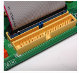

# Preguntas Tipo Test - Parte Teórica

- **Autor:** Ismael Sallami Moreno
- **Titulación:** Ingeniería Informática + ADE
- **Descripción:** Preguntas de la parte de teoría.

1. Señala las clasificaciones de los sistemas informáticos según su uso:
- ( ) Uso general, donde encontramos de sobremesa y portátiles.
- ( ) Uso general, donde encontramos de sobremesa.
- ( ) De uso específico, donde encontramos sistemas empotrados y servidores.
- (x) Todas son correctas.

1. ¿Qué es un sistema empotrado?
- ( ) Un sistema informático diseñado para realizar múltiples tareas generales.
- (x) Un sistema informático acoplado a otro dispositivo, diseñado para funciones dedicadas.
- ( ) Un sistema informático sin restricciones de tamaño ni consumo.
- ( ) Un sistema informático utilizado solo en servidores.

1. ¿Cuál de las siguientes características suele estar asociada a los sistemas empotrados?
- ( ) Gran capacidad de procesamiento y almacenamiento masivo.
- (x) Restricciones de tamaño, tiempo de respuesta, consumo y coste.
- ( ) Funcionamiento exclusivo en ordenadores de sobremesa.
- ( ) Ausencia de interfaces de comunicación.

1. ¿Cuál es la principal característica de la arquitectura cliente/servidor?
- ( ) Todos los nodos realizan las mismas tareas.
- (x) Las tareas se reparten entre clientes y servidores.
- ( ) Solo existen servidores en la red.
- ( ) No hay interacción entre nodos.

1. ¿Qué ventaja ofrece la arquitectura cliente/servidor de varios niveles?
- ( ) Menor escalabilidad.
- ( ) Menor complejidad de programación.
- (x) Permite distribuir la carga entre varios servidores.
- ( ) Reduce la carga en la red.

1. En una arquitectura cliente/servidor de tres niveles, ¿qué función cumple el tercer nivel?
- ( ) Gestionar la interfaz de usuario.
- ( ) Procesar las solicitudes de los clientes.
- (x) Almacenar y gestionar los datos para los servidores de comercio-e.
- ( ) Sincronizar las peticiones de los clientes.

1. ¿Cuál es el papel del servidor en la arquitectura cliente-cola-cliente?
- ( ) Realizar todas las tareas de procesamiento.
- ( ) Actuar como cliente adicional.
- (x) Capturar las peticiones y sincronizar el sistema.
- ( ) Almacenar únicamente los datos.

1. ¿Qué tipo de aplicaciones suelen usar la arquitectura cliente-cola-cliente?
- ( ) Procesadores de texto.
- ( ) Bases de datos centralizadas.
- (x) Intercambio y búsqueda de ficheros como BitTorrent o eMule.
- ( ) Navegadores web.

1. ¿Qué mide el tiempo de respuesta (latencia) en un servidor?
- ( ) La cantidad de datos transmitidos por segundo.
- (x) El tiempo que transcurre desde que se solicita una tarea hasta que finaliza.
- ( ) El número de usuarios conectados simultáneamente.
- ( ) El tamaño de la memoria RAM utilizada.

1. ¿Cuál de las siguientes opciones es un ejemplo de productividad (throughput) en un servidor?
- ( ) Tiempo que tarda en ejecutarse un programa.
- ( ) Tiempo de espera de una petición.
- (x) Número de páginas web servidas por hora.
- ( ) Latencia de acceso a disco.

1. Señala cuáles son sinónimos:
- ( ) latencia y ancho de banda
- (x) latencia y tiempo de respuesta
- ( ) tiempo de respuesta y productividad
- (x) productividad y ancho de banda
- ( ) ancho de banda y ancho de rango
- ( ) productividad y tiempo de respuesta

1. ¿Qué factores pueden afectar a las prestaciones de un sistema?
- (x) Componentes hardware, sistema operativo y aplicaciones.
- ( ) Solo el tipo de aplicaciones instaladas.
- ( ) Únicamente la configuración de la memoria virtual.
- ( ) Ninguno de los anteriores.

1. ¿Cuál de las siguientes acciones puede mejorar el rendimiento de un sistema?
- ( ) Reducir la cantidad de memoria RAM.
- (x) Actualizar componentes hardware o añadir balanceo de carga.
- ( ) Limitar el acceso a E/S.
- ( ) Desactivar la planificación de procesos.

1. ¿Qué es el cuello de botella en un sistema informático?
- ( ) Un tipo de memoria virtual.
- (x) Un componente cuya capacidad limita el rendimiento global.
- ( ) Un fallo de caché u otro tipo de fallo similar visto en teoría.
- ( ) Un proceso de optimización.

1. ¿Qué se entiende por ajuste o sintonización en un sistema?
- ( ) Sustituir todos los componentes hardware.
- (x) Configurar hardware, parámetros del sistema operativo y optimizar programas.
- ( ) Instalar más aplicaciones, cuantas más es mejor, según se ha visto en clase.
- ( ) Desactivar la memoria virtual.

1. ¿Qué función cumple la política de planificación de procesos en el sistema operativo?
- ( ) Gestionar la memoria caché.
- (x) Determinar el orden de ejecución de los procesos.
- ( ) Optimizar el acceso a disco.
- ( ) Sincronizar la red, entre otros muchos que se pueden dar.

1. ¿Qué es un "hot spot" en el contexto de sistemas informáticos?
- ( ) Un componente que nunca se utiliza durante la ejecución de un programa, de ahí el nombre.
- (x) Una parte del sistema o código donde se concentra la mayor carga de trabajo o uso de recursos.
- ( ) Un tipo de memoria de acceso aleatorio.
- ( ) Un error crítico en el sistema operativo.

1. ¿Qué es la fiabilidad en el contexto de sistemas informáticos?
- ( ) La capacidad de un sistema para ser actualizado fácilmente.
- (x) La probabilidad de que el sistema funcione correctamente durante un intervalo de tiempo determinado.
- ( ) El rendimiento máximo alcanzable por el sistema.
- ( ) La facilidad de uso del sistema por parte de los usuarios.

1. ¿Cuál de los siguientes es un ejemplo de fallo físico permanente?
- ( ) Un bit cambia de valor debido a ruido electromagnético.
- ( ) El sistema operativo se cuelga por un error de programación.
- (x) Un componente se estropea y necesita ser reemplazado.
- ( ) El sistema responde más lento de lo habitual.

1. ¿Qué caracteriza a un fallo físico temporal?
- (x) El componente da una respuesta incorrecta puntual pero sigue operativo.
- ( ) El componente deja de funcionar permanentemente.
- ( ) El fallo es causado únicamente por errores de software.
- ( ) El sistema requiere ser reiniciado para recuperarse.

1. ¿Cuál de los siguientes es un ejemplo de fallo software?
- ( ) Un disco duro deja de funcionar y debe ser reemplazado.
- ( ) Un bit cambia de valor por alta temperatura.
- (x) El servidor da una respuesta equivocada por un error de programación.
- ( ) El sistema pierde la conexión de red por un corte eléctrico.

1. ¿Qué significa la sigla FIT en el contexto de fiabilidad?
- (x) Failures in Time.
- ( ) Fast Input Transfer.
- ( ) Fault Injection Test.
- ( ) Functional Integrity Test.

1. ¿Qué significa la sigla MTBF?
- ( ) Mean Time Before Failure.
- (x) Mean Time Between Failures.
- ( ) Maximum Time Before Failure.
- ( ) Minimum Time Between Faults.

1. ¿Qué significa la sigla MTTF en el contexto de fiabilidad?
- (x) Mean Time To Failure.
- ( ) Maximum Time To Failure.
- ( ) Mean Time To Fix.
- ( ) Minimum Time To Failure.

1. ¿Qué significa la sigla AFR en el contexto de fiabilidad?
- ( ) Average Failure Rate.
- (x) Annualized Failure Rate.
- ( ) Automated Failure Recovery.
- ( ) Annualized Fix Rate.

1. Selecciona los tipos de inactividad:
- (x) Tiempo de inactividad planificado.
- ( ) Tiempo de actividad  planificado. 
- (x) Tiempo de inactividad no planificado.

1. ¿Qué es la escalabilidad en un sistema informático?
- ( ) La capacidad de reducir recursos ante una disminución de la carga o bien la facilidad para conseguirlos.
- (x) La facilidad para aumentar recursos o características ante un aumento significativo de la carga.
- ( ) La capacidad de mantener el mismo rendimiento sin importar la carga.
- ( ) La facilidad de actualizar el sistema operativo.

1. ¿Cuál de las siguientes NO es una solución para mejorar la escalabilidad?
- ( ) Cloud computing y virtualización.
- ( ) Servidores modulares o clusters.
- (x) Reducir el número de nodos en el sistema.
- ( ) Programación paralela.

1. ¿Qué caracteriza a la escalabilidad vertical?
- (x) Aumentar la capacidad de un único servidor.
- ( ) Añadir más servidores al sistema.
- ( ) Dividir la carga entre varios servidores pequeños.
- ( ) Utilizar únicamente software distribuido.

1. ¿Qué caracteriza a la escalabilidad horizontal?
- ( ) Mejorar el hardware de un solo servidor, o intentar el de varios.
- (x) Añadir más servidores para repartir la carga.
- ( ) Reducir el número de procesos en ejecución.
- ( ) Utilizar solo arquitecturas monolíticas.

1. ¿Cuál de las siguientes afirmaciones es correcta respecto a sistemas escalables y extensibles?
- ( ) Todos los sistemas extensibles son escalables y a la inversa.
- (x) Todos los sistemas escalables son extensibles, pero no a la inversa.
- ( ) Ningún sistema escalable es extensible.
- ( ) Escalabilidad y extensibilidad son sinónimos.

1. ¿Que es la figura de la imagen? 

- ( ) Tarjeta gráfica
- ( ) Fuente de alimentación
- (x) Placa Base
- ( ) Memoria RAM

1. ¿Que es la figura de la imagen? 

- ( ) Tarjeta gráfica
- (x) Regulador de voltaje
- ( ) Placa Base
- ( ) Memoria RAM

1. ¿De que tipo es el zócalo de la imagen? 

- (x) PGA
- ( ) LGA
- ( ) FGA
- ( ) HGA

1. ¿De que tipo es el zócalo de la imagen? 

- ( ) PGA
- (x) LGA
- ( ) FGA
- ( ) HGA

1. Señala las respuestas que son correctas.
- (x) La familia de procesadores de AMD para servidores fue inicialmente Opteron.
- ( ) El primer Opteron tenia instrucciones x64. 
- (x) El primer Opteron tenia instrucciones x86-64.
- (x) Recientemente, AMD ha modificado el nombre de sus procesadores para servidores, denominándolos EPYC.
- ( ) Recientemente, AMD ha modificado el nombre de sus procesadores para servidores, denominándolos EYC.
- (x) En 2004, los Opteron fueron los primeros procesadores x86 con 2 núcleos.

1. Señala las respuestas que son correctas.
- ( ) En 2004, los Opteron fueron los primeros procesadores x86 con 6 núcleos.
- (x) Cada CCD tiene hasta 8 cores Zen x86-64 más memorias caché.
- ( ) Cada CCD tiene hasta 12 cores Zen x86-64 más memorias caché.
- ( ) Cada CCD tiene hasta 6 cores Zen x86-64 más memorias caché.
- (x) CCD es Core Chiplet Die.
- ( ) CCD es Core Chipet Die.
- ( ) CCD es Core Chiple Die.

1. ¿Que significa las siglas POWER?
- ( ) Perforance Optimization With Enhanced RISC
- ( ) Performance Optimiation With Enhanced RISC
- (x) Performance Optimization With Enhanced RISC
- ( ) Performance Optimization Without Enhanced RISC
- ( ) Performance Oracle With Enhanced RISC

1. Señala las correctas
- ( ) SIP: Single In-line Pin Package
- (x) SIMM: Single In-line Memory Module
- ( ) DIM: Dual In-line Memory Module
- ( ) SIPP: Sing In-line Pin Package
- ( ) SIMM: Sing In-line Memory Module
- ( ) DIMM: Duality In-line Memory Module
- (x) SIPP: Single In-line Pin Package
- ( ) SIM: Single In-line Memory Module
- (x) DIMM: Dual In-line Memory Module
- ( ) SI: Single In-line Pin Package
- ( ) SIMM: In-line Memory Module
- ( ) DIMM: Dual Inline Memory Module

1. ¿Qué tipo de módulo de memoria es más común en PC y portátiles?
- (x) DIMM o U-DIMM (Unbuffered DIMM)
- ( ) R-DIMM
- ( ) LR-DIMM
- ( ) EU-DIMM

1. ¿Cuál es la principal característica de los módulos SO-DIMM?
- ( ) Mayor tamaño y más contactos.
- (x) Tamaño más reducido y menos contactos, usados en portátiles.
- ( ) Incluyen ECC obligatoriamente.
- ( ) Solo se usan en servidores.

1. ¿Qué diferencia principal existe entre U-DIMM y EU-DIMM?
- ( ) EU-DIMM es más pequeño.
- (x) EU-DIMM incluye ECC para mayor fiabilidad.
- ( ) U-DIMM tiene mayor latencia.
- ( ) U-DIMM solo se usa en servidores.

1. ¿Qué característica distingue a los módulos R-DIMM respecto a EU-DIMM?
- ( ) Menor latencia y sin ECC.
- (x) Incluyen un registro para señales de control, mayor latencia, permiten módulos de mayor tamaño y tienen ECC.
- ( ) Solo se usan en portátiles.
- ( ) No permiten ECC.

1. ¿Cuál es la principal ventaja de los módulos LR-DIMM frente a los R-DIMM?
- ( ) Menor latencia y menor capacidad.
- ( ) No incluyen ECC.
- (x) Permiten módulos de mayor tamaño gracias a un buffer que almacena señales de control y datos, aunque tienen mayor latencia.
- ( ) Solo se usan en PC de sobremesa.

1. ¿Qué módulos de memoria suelen incluir ECC?
- ( ) Solo SO-DIMM.
- (x) EU-DIMM, R-DIMM y LR-DIMM.
- ( ) U-DIMM y SO-DIMM.
- ( ) Ninguno.

1. ¿Para qué tipo de equipos están pensados los módulos LR-DIMM?
- ( ) Portátiles.
- ( ) PC de sobremesa.
- (x) Servidores que requieren módulos de gran capacidad.
- ( ) Dispositivos móviles.

1. Señala la opción correcta o las opciones correctas:
- ( ) Un microprocesador puede acceder simultáneamente a dos módulos del mismo banco de memoria ya que usan el mismo canal de memoria para comunicarse con él.
- ( ) Un microprocesador no puede acceder simultáneamente a dos módulos del distinto banco de memoria ya que usan el mismo canal de memoria para comunicarse con él.
- (x) Un microprocesador no puede acceder simultáneamente a dos módulos del mismo banco de memoria ya que usan el mismo canal de memoria para comunicarse con él.
- (x) Un microprocesador  puede acceder simultáneamente a dos módulos del distinto banco de memoria ya que usan el mismo canal de memoria para comunicarse con él.

1. Señale las opciones correctas:
- (x) Cada módulo de memoria puede estar, a su vez, distribuido en rangos de memoria que no son más que agrupaciones de chips que proporcionan la palabra completa de 64 bits (72 bits en caso de memorias DDR2, DDR3 o DDR4 con ECC, 80 bits si DDR5 con ECC).
- ( ) Cada módulo de memoria puede estar, a su vez, distribuido en rangos de memoria que no son más que agrupaciones de chips que proporcionan la palabra completa de 72 bits (64 bits en caso de memorias DDR2, DDR3 o DDR4 con ECC, 80 bits si DDR5 con ECC).
- ( ) Cada módulo de memoria puede estar, a su vez, distribuido en rangos de memoria que no son más que agrupaciones de chips que proporcionan la palabra completa de 64 bits (72 bits en caso de memorias DDR2, DDR3 o DDR4 con ECC, 86 bits si DDR5 con ECC).
- (x) Si es un módulo de un solo rango, todos se asocian para obtener la palabra completa.
- (x) La notación *1Rx8* es Módulo de 1 rango con chips de 8 bits.

1. ¿Qué significa las siglas PCI?
- (x) Peripheral Component Interconnect
- ( ) Personal Computer Interface
- ( ) Processor Communication Interface
- ( ) Peripheral Communication Interconnect

2. Señala las opciones correctas sobre el PCI.
- (x) Las líneas se comparten entre todos los dispositivos PCI.
- ( ) Las líneas no se comparten entre todos los dispositivos PCI.
- (x) Half Duplex.
- ( ) Full Duplex.
- (x) Plug and play.

1. ¿Qué significa el término "Plug and Play" en el contexto de sistemas informáticos?
- (x) La capacidad de un dispositivo para ser detectado y configurado automáticamente por el sistema operativo sin necesidad de intervención manual.
- ( ) La capacidad de un dispositivo para funcionar únicamente después de instalar controladores manualmente.
- ( ) La capacidad de un dispositivo para conectarse a otros dispositivos sin cables.
- ( ) La capacidad de un dispositivo para funcionar solo en sistemas operativos específicos.

2. Señala las características correctas de "Plug and Play":
- (x) Permite la instalación automática de controladores.
- (x) Facilita la detección y configuración de hardware.
- ( ) Requiere configuración manual del usuario.
- ( ) Solo funciona en sistemas operativos antiguos.

1. ¿Qué significa las siglas AGP en el contexto de sistemas informáticos?
- (x) Accelerated Graphics Port
- ( ) Advanced Graphics Processor
- ( ) Automatic Graphics Protocol
- ( ) Advanced Gateway Port

1. Señala las opciones correctas en base a la interfaz AGP.
- (x) Bus pararelo de 32 bits.
- ( ) Bus pararelo de 64 bits.
- (x) Sincronizados por una misma señal de reloj.
- ( ) Sincronizados por una distinta señal de reloj.
- (x) Half-Duplex
- ( ) Full-Duplex.

1. Señala las opciones correctas en base al PCI-Express.
- (x) Conexión serie punto a punto.
- () Es un bus con líneas compartidas.
- () Es por medio de una única **LAN**.
- (x) Es por medio de varias **LANES**.
- () Cada **LANE** esta compuesta por 2 cables.
- (x) Cada **LANE** esta compuesta por 4 cables.
- (x) Tiene 2 cables por cada sentido.
- () Tiene 1 cable por cada sentido.
- (x) Full-Duplex.
- ( ) Half Duplex.
- (x) Hot plug.
- (x) Transmisión SÍNCRONA *estando el reloj embebido en los datos*.
- ( ) Transmisión ASÍNCRONA *estando el reloj embebido en los datos*.

1. ¿Qué ventaja o ventajas ofrece una interfaz serie con reloj embebido respecto a una paralela con reloj común?
- (x) Mayor frecuencia de reloj que evita el desfase entre las señales (timing skew).
- (x) Menor número de pistas para un rendimiento similar.
- (x) Mayor facilidad para obtener conexiones full duplex.
- ( ) Mayor consumo energético.
- ( ) Menor capacidad de transmisión de datos.

2. ¿Qué es el "timing skew" en el contexto de interfaces paralelas?
- (x) El desfase entre las señales debido a que no todas las pistas recorren la misma distancia.
- ( ) La sincronización perfecta entre todas las señales, evitando el desfase respecto de las señales.
- ( ) La pérdida de datos por interferencias electromagnéticas.
- ( ) La reducción de la velocidad de transmisión por errores de hardware.

3. ¿Cuál de las siguientes afirmaciones es correcta respecto a las interfaces serie con reloj embebido?
- (x) No todas las interfaces serie con reloj embebido son full duplex.
- ( ) Todas las interfaces serie con reloj embebido son full duplex.
- ( ) USB 2.0 es un ejemplo de interfaz full duplex con reloj embebido.
- (x) USB 2.0 no es full duplex.

1. ¿Qué tipo de comunicaciones son correctas?
- ( ) USB 2.O es *Full-Duplex*.
- (x) USB 3.O es *Full-Duplex*.
- (x) USB 2.O es *Half-Duplex*.
- ( ) USB 3.O es *Half-Duplex*.

1. ¿Qué caracteriza al almacenamiento permanente (no volátil)?
- (x) Conserva la información incluso cuando deja de recibir alimentación.
- ( ) Pierde la información al apagar el dispositivo en todo caso, aunque se puede recuperar.
- ( ) Solo funciona en dispositivos móviles.
- ( ) Es más rápido que la memoria RAM.

1. ¿Cuáles son los tipos de almacenamiento permanente vistos en clase?
- (x) Magnéticos: HDD (Hard Disk Drives), cintas.
- (x) Ópticos: CD, DVD, Blu-Ray (BD).
- (x) NVRAM: SSD (Solid State Drives).
- ( ) Volátiles: RAM y caché.

1. ¿Cuáles son los factores de forma más utilizados en almacenamiento permanente?
- ( ) 8, 5.25, 1.8, 0.85.
- (x) 3.5, 2.5, 1.8.
- ( ) 5.25, 3.5, 0.85.
- ( ) 2.5, 1.8, 0.85.

1. ¿Qué tipos de conexión a la placa base son correctos para almacenamiento permanente?
- (x) P-ATA, SATA, SCSI.
- (x) PCIe, M.2, USB.
- (x) SAS, SATAe, U.2.
- ( ) RAM, ROM, NVRAM.

<!-- HDD -->

1. ¿Qué caracteriza a los discos duros (HDD)?
- (x) Almacenamiento permanente (no volátil) a lo largo de la superficie de discos recubiertos de material magnético.
- ( ) Almacenamiento no volátil que pierde datos al apagar el dispositivo.
- ( ) Solo se utiliza en dispositivos móviles y es más rápido que la memoria RAM.
- ( ) Todas son correctas.

2. ¿Cómo se realiza la lectura y escritura en un disco duro?
- (x) A través de cabezales magnéticos controlados por un brazo motor y el giro de los discos.
- ( ) Mediante pulsos eléctricos sin partes móviles.
- ( ) Por medio de tecnología óptica, similar a la utilizada en los CD, donde un haz láser lee y escribe información en la superficie del disco mediante cambios en la reflectividad.
- ( ) Utilizando memoria flash, que almacena los datos en celdas electrónicas no volátiles, permitiendo la conservación de la información incluso cuando el dispositivo está apagado y ofreciendo tiempos de acceso muy reducidos.

3. ¿Cómo se distribuyen los datos en un disco duro?
- (x) En pistas (tracks), subdivididas en sectores de 512 bytes, agrupados en clusters lógicos.
- ( ) En bloques de memoria aleatoria distribuidos a lo largo de la superficie del disco, sin seguir un orden específico, lo que puede dificultar el acceso secuencial a los datos y aumentar la fragmentación.
- ( ) En celdas de memoria flash organizadas en páginas y bloques, permitiendo un acceso rápido y eficiente, pero con limitaciones en el número de escrituras por celda y una gestión especial para el borrado y la reescritura de datos.
- ( ) En sectores ópticos.

4. ¿Qué afecta a los tiempos de respuesta (latencias) en un disco duro?
- (x) La pista y el sector donde se encuentra el cabezal y el sector concreto al que se quiere acceder.
- ( ) La cantidad de memoria RAM instalada.
- ( ) La velocidad del procesador.
- ( ) La temperatura del disco, el estado de los componentes internos, la calidad de los materiales y posibles vibraciones mecánicas.

1. ¿Cuáles son las velocidades de rotación más habituales en los discos duros?
- (x) 5400, 7200, 10000, 15000 r.p.m.
- ( ) 3200, 4800, 10000, 15000 r.p.m.
- ( ) 2000, 4000, 6000, 8000 r.p.m.
- ( ) 1000, 2000, 3000, 4000 r.p.m.

<!-- SSD -->

1. ¿Qué caracteriza a las unidades de estado sólido (SSD)?
- ( ) Almacenamiento volátil que pierde datos al apagar el dispositivo.
- ( ) Utilizan discos magnéticos para almacenar información.
- ( ) Solo funcionan en dispositivos móviles, como teléfonos inteligentes y tabletas, y no pueden utilizarse en ordenadores de sobremesa, portátiles u otros dispositivos electrónicos.
- (x) Almacenamiento no volátil distribuido en varios circuitos integrados (chips) de memoria flash.
- ( ) Solo son compatibles con sistemas operativos móviles y no pueden ser reconocidas por sistemas operativos de escritorio.
- ( ) Están diseñadas exclusivamente para aplicaciones móviles y no ofrecen soporte para almacenamiento de datos en otros entornos.
- ( ) Almacenamiento no volátil distribuido en varios circuitos integrados (chips) de memoria flash.

1. ¿Qué tipos de celdas son habituales en las SSD?
- (x) SLC (single-level cell).
- (x) MLC (multi-level cell).
- ( ) TLC (triple-level cell).
- ( ) QLC (quad-level cell).

1. ¿Qué ventaja ofrece el acceso aleatorio en las SSD?
- (x) Mismo tiempo de respuesta (latencia) independientemente de la celda de memoria a la que se quiere acceder.
- ( ) Mayor tiempo de respuesta en comparación con los discos duros, ya que las SSD presentan retardos.
- ( ) Acceso secuencial más rápido que el acceso aleatorio, lo que significa que leer o escribir datos de manera continua es más eficiente que acceder a posiciones dispersas en la memoria.
- ( ) Latencia variable dependiendo de la ubicación de los datos, ya que el controlador puede tardar más en localizar y acceder a ciertas celdas de memoria.
- ( ) El rendimiento de la SSD puede verse afectado por el nivel de llenado de la unidad, ya que a medida que se ocupa más espacio.

1. ¿Qué función cumple el controlador en las SSD?
- ( ) Distribuir la dirección física de las celdas de memoria para evitar su desgaste tras múltiples re-escrituras (wear levelling).
- (x) Distribuir la dirección lógica de las celdas de memoria para evitar su desgaste tras múltiples re-escrituras (wear levelling).
- ( ) Aumentar la velocidad de lectura y escritura mediante discos magnéticos.
- ( ) Reducir el consumo energético de la unidad.
- ( ) Sincronizar el acceso a las celdas de memoria con el procesador.

1. ¿Qué tecnología se utiliza en las SSD para almacenar datos?
- (x) Transistores MOSFET de puerta flotante.
- ( ) Discos magnéticos recubiertos de material ferromagnético.
- ( ) Láseres para leer y escribir datos en discos ópticos.
- ( ) Memoria RAM volátil.

1. ¿Qué caracteriza a las unidades ópticas?
- ( ) Almacenan información de forma volátil, es decir, pierden todos los datos almacenados cuando se interrumpe la alimentación eléctrica o se apaga el dispositivo.
- (x) Almacenan información de forma permanente (no volátil) a través de surcos en un disco que pueden ser leídos por un haz de luz láser.
- ( ) Utilizan discos magnéticos para almacenar información.
- ( ) Solo funcionan en dispositivos móviles.

1. ¿Cuáles son los tipos de medios ópticos más comunes?
- (x) CD (Compact Disc).
- (x) DVD (Digital Versatile Disc).
- ( ) HDD (Hard Disk Drive).
- (x) Blu-ray (BD).

1. ¿Cuál es la capacidad máxima de almacenamiento de un disco Blu-ray?
- ( ) 4.7 GB.
- ( ) 8.5 GB.
- (x) 25-128 GB.
- ( ) 0.64-0.7 GB.

1. ¿Qué ancho de banda máximo (Mbps) puede alcanzar un disco Blu-ray?
- ( ) 88 Mbps.
- ( ) 266 Mbps.
- (x) 576 Mbps.
- ( ) 150 Mbps.

1. ¿Qué caracteriza a las unidades de cinta (tape drives)?
- (x) Almacenan información de forma permanente (no volátil).
- ( ) Utilizan discos ópticos para almacenar información.
- ( ) Solo funcionan en dispositivos móviles.
- ( ) Almacenan información de forma volátil.
- (x) En una cinta recubierta de material magnético que se enrolla por medio de carretes almacenan información.

1. ¿Cuál es una desventaja de las unidades de cinta?
- (x) Las latencias suelen ser muy altas. 
- ( ) Tienen menor densidad de bits por área en comparación con otros medios.
- ( ) Son el medio de almacenamiento más caro.
- ( ) No permiten almacenamiento masivo.
- (x) Hay que rebobinar la cinta hasta que el cabezal se encuentre en la posición deseada.

1. ¿Qué capacidad de almacenamiento pueden alcanzar las unidades de cinta actualmente?
- ( ) Hasta 128 GB.
- ( ) Hasta 1 TB.
- (x) Decenas de TB por cinta.
- (x) Centenas de TB por cinta.
- ( ) Hasta 576 Mbps.

1. ¿Para qué se utilizan normalmente las unidades de cinta?
- (x) Almacenamiento de respaldo (backup) y archivado.
- ( ) Almacenamiento de datos en dispositivos móviles.
- ( ) Almacenamiento de datos en sistemas operativos volátiles.
- ( ) Almacenamiento de datos en discos ópticos.

<!-- P-ATA -->

1. ¿Qué significa la sigla ATA en el contexto de P-ATA?
- ( ) Advanced Transfer Architecture.
- ( ) Advanced Technology Application.
- (x) Advanced Technology Attachment.
- ( ) Advanced Transmission Attachment.

1. ¿Qué tipo de bus utiliza la interfaz P-ATA?
- ( ) Óptico, mediante el uso de un haz láser que lee y escribe datos en la superficie de discos ópticos como CD, DVD o Blu-ray, aprovechando cambios en la reflectividad del material para almacenar la información.
- (x) Paralelo, con un bus de datos de 16 bits sincronizado por una misma señal de reloj.
- ( ) Serie, con un bus de datos de 8 bits.
- ( ) Magnético, utilizando discos recubiertos de material magnético donde los datos se almacenan mediante la orientación de partículas magnéticas, como ocurre en los discos duros (HDD) y cintas magnéticas.

1. ¿Qué tipo de comunicación utiliza P-ATA?
- ( ) Full-duplex.
- (x) Half-duplex.
- ( ) Comunicación asíncrona.
- ( ) Comunicación inalámbrica.

1. ¿Cuántos dispositivos se pueden conectar por cada conector P-ATA?
- ( ) 1 dispositivo.
- (x) 2 dispositivos.
- ( ) 4 dispositivos.
- ( ) 8 dispositivos.

1. ¿Cuál es la distancia máxima permitida por la interfaz P-ATA?
- ( ) 30 cm.
- (x) 45.7 cm.
- ( ) 62.4 cm.
- ( ) 75.6 cm.

1. ¿Cuáles son las versiones de ATA estudiadas?
- (x) ATA33, ATA66, ATA100, ATA133.
- ( ) ATA16, ATA32, ATA64, ATA128.
- ( ) ATA50, ATA75, ATA125, ATA150.
- ( ) ATA20, ATA40, ATA80, ATA160.

1. ¿Cuáles son las velocidades de transferencia máximas de las versiones de ATA?
- (x) 33 MBps, 66 MBps, 100 MBps, 133 MBps.
- ( ) 20 MBps, 40 MBps, 80 MBps, 160 MBps.
- ( ) 25 MBps, 50 MBps, 75 MBps, 125 MBps.
- ( ) 30 MBps, 60 MBps, 90 MBps, 120 MBps.

1. ¿Qué figura es la de la imagen? 

- ( ) Serial-ata
- ( ) Placa Base
- ( ) Fuente de alimencación
- (X) P-ata 

<!-- s-ata -->

1. ¿Qué tipo de conexión utiliza la interfaz Serial-ATA (SATA)?
- ( ) Paralela, con múltiples discos por conector.
- (x) Serie, punto a punto (1 disco por conector).
- ( ) Óptica, con transmisión por láser.
- ( ) Magnética, con discos recubiertos de material ferromagnético.

2. ¿Qué tipo de comunicación utiliza SATA?
- ( ) Full-duplex, con transmisión simultánea en ambos sentidos.
- (x) Half-duplex, con transmisión alternada en ambos sentidos.
- ( ) Comunicación inalámbrica, sin necesidad de cables.
- ( ) Comunicación asíncrona, sin sincronización de reloj.

3. ¿Cuál es la longitud máxima del cable en la interfaz SATA?
- (x) 1 metro.
- ( ) 2 metros.
- ( ) 1.5 metros.
- ( ) 0.5 metros.

4. ¿Qué protocolo utiliza SATA para mejorar el rendimiento?
- ( ) Advanced Host Controller Interface (AHCI) con Native Command Queueing (NCQ) y hot-plug.
- (x) Advanced Host Controller Interface (AHCI) con Native Command Queueing (NCQ).
- ( ) Advanced Host Controller Interface (AHCI) sin soporte para hot-plug.
- ( ) Advanced Host Controller Interface (AHCI) con soporte para discos ópticos.

5. ¿Qué codificación utiliza SATA para la transmisión de datos?
- ( ) 10b/8b con una eficiencia del 90%.
- (x) 8b/10b con una eficiencia del 80%.
- ( ) 8b/8b con una eficiencia del 100%.
- ( ) 10b/10b con una eficiencia del 70%.

6. ¿Cuáles son las velocidades reales de transferencia en SATA III?
- ( ) 150 MB/s.
- ( ) 300 MB/s.
- (x) 600 MB/s.
- ( ) 450 MB/s.

7. ¿Qué característica distingue a SATA respecto a P-ATA?
- ( ) Utiliza un bus paralelo para conectar múltiples discos.
- (x) Utiliza una conexión serie punto a punto.
- ( ) No permite hot-plug en ningún caso.
- ( ) Tiene una distancia máxima de cable de 45.7 cm.

1. Elige la imagen que corresponda a `SATA`.
- ( ) 
- ( ) 
- ( ) 
- (x) 

1. Elige la imagen que corresponda a `P-ATA`.
- ( ) 
- (x) 
- (x) 
- ( ) 

<!-- Interfaces SCSI y SAS -->

1. ¿Qué significa la sigla SCSI?
- (x) Small Computer System Interface.
- ( ) Serial Computer System Interface.
- ( ) Simple Computer System Integration.
- ( ) Small Communication System Interface.

2. ¿Qué tipo de conexión utiliza SCSI?
- (x) Paralelo, con 16 bits sincronizados por la misma señal de reloj.
- ( ) Serie, con transmisión punto a punto.
- ( ) Óptico, con transmisión por láser.
- ( ) Magnético, con discos recubiertos de material ferromagnético.

3. ¿Qué característica tiene Ultra-SCSI?
- (x) Velocidad de hasta 320 MBps, permite conectar hasta 16 dispositivos y tiene una longitud máxima de cable de 12 metros.
- ( ) Velocidad de hasta 150 MBps, permite conectar hasta 8 dispositivos y tiene una longitud máxima de cable de 6 metros.
- ( ) Velocidad de hasta 600 MBps, permite conectar hasta 32 dispositivos y tiene una longitud máxima de cable de 15 metros.
- ( ) Velocidad de hasta 2400 MBps, permite conectar hasta 10 dispositivos y tiene una longitud máxima de cable de 10 metros.

4. ¿Qué tipo de conexión utiliza SAS?
- ( ) Paralelo, con transmisión simultánea en ambos sentidos.
- (x) Serie, con transmisión punto a punto.
- ( ) Óptico, con transmisión por láser.
- ( ) Magnético, con discos recubiertos de material ferromagnético.

5. ¿Qué tipo de comunicación utiliza SAS?
- (x) Full-duplex, con transmisión simultánea en ambos sentidos.
- ( ) Half-duplex, con transmisión alternada en ambos sentidos.
- ( ) Comunicación inalámbrica, sin necesidad de cables.
- ( ) Comunicación asíncrona, sin sincronización de reloj.

6. ¿Qué codificación utiliza SAS para la transmisión de datos?
- ( ) 10b/8b con una eficiencia del 90%.
- (x) 8b/10b con una eficiencia del 80%.
- ( ) 8b/8b con una eficiencia del 100%.
- ( ) 10b/10b con una eficiencia del 70%.

7. ¿Cuáles son las frecuencias de operación de SAS?
- ( ) 1, 2, 4 y 8 GHz.
- (x) 3, 6, 12 y 22.5 GHz.
- ( ) 5, 10, 15 y 20 GHz.
- ( ) 2, 4, 8 y 16 GHz.

8. ¿Cuál es la velocidad máxima de transferencia en SAS-4?
- ( ) 320 MBps.
- ( ) 600 MBps.
- ( ) 1500 MBps.
- (x) 2400 MBps.

9. ¿Qué longitud máxima de cable permite SAS?
- (x) 10 metros.
- ( ) 12 metros.
- ( ) 15 metros.
- ( ) 8 metros.

10. ¿Qué característica distingue a SAS respecto a SCSI?
- ( ) Utiliza una conexión paralela con múltiples dispositivos en cadena.
- (x) Utiliza una conexión serie punto a punto y es compatible con discos SATA.
- ( ) No permite hot-plug en ningún caso.
- ( ) Tiene una velocidad máxima de 320 MBps.