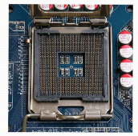
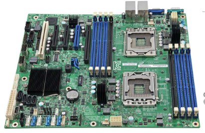
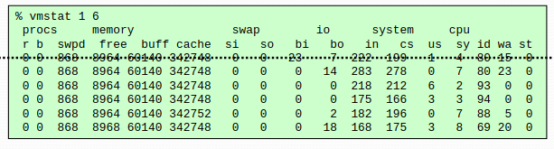
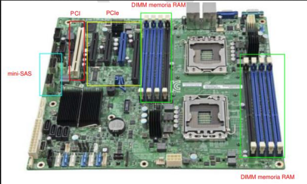
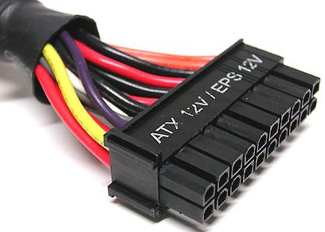
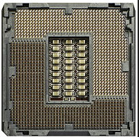
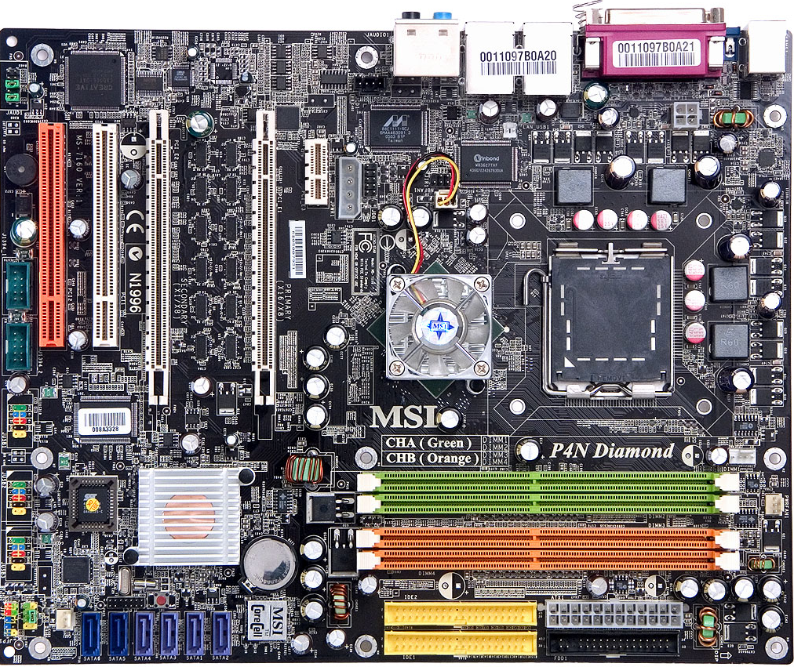

# Preguntas Tipo Test Ingeniería de Servidores - Parte Teórica

- **Autor:** Ismael Sallami Moreno
- **Titulación:** Ingeniería Informática + ADE
- **Descripción:** Preguntas de la parte de teoría de la asignatura Ingeniería de Servidores. Las preguntas del tema 6 relacionadas con el BOE y demás, al no caer no se tratan en este archivo.

1. Señala las clasificaciones de los sistemas informáticos según su uso:
- ( ) Uso general, donde encontramos de sobremesa y portátiles.
- ( ) Uso general, donde encontramos de sobremesa.
- ( ) De uso específico, donde encontramos sistemas empotrados y servidores.
- (x) Todas son correctas.

1. ¿Qué es un sistema empotrado?
- ( ) Un sistema informático diseñado para realizar múltiples tareas generales.
- (x) Un sistema informático acoplado a otro dispositivo, diseñado para funciones dedicadas.
- ( ) Un sistema informático sin restricciones de tamaño ni consumo.
- ( ) Un sistema informático utilizado solo en servidores.

1. ¿Cuál de las siguientes características suele estar asociada a los sistemas empotrados?
- ( ) Gran capacidad de procesamiento y almacenamiento masivo.
- (x) Restricciones de tamaño, tiempo de respuesta, consumo y coste.
- ( ) Funcionamiento exclusivo en ordenadores de sobremesa.
- ( ) Ausencia de interfaces de comunicación.

1. ¿Cuál es la principal característica de la arquitectura cliente/servidor?
- ( ) Todos los nodos realizan las mismas tareas.
- (x) Las tareas se reparten entre clientes y servidores.
- ( ) Solo existen servidores en la red.
- ( ) No hay interacción entre nodos.

1. ¿Qué ventaja ofrece la arquitectura cliente/servidor de varios niveles?
- ( ) Menor escalabilidad.
- ( ) Menor complejidad de programación.
- (x) Permite distribuir la carga entre varios servidores.
- ( ) Reduce la carga en la red.

1. En una arquitectura cliente/servidor de tres niveles, ¿qué función cumple el tercer nivel?
- ( ) Gestionar la interfaz de usuario.
- ( ) Procesar las solicitudes de los clientes.
- (x) Almacenar y gestionar los datos para los servidores de comercio-e.
- ( ) Sincronizar las peticiones de los clientes.

1. ¿Cuál es el papel del servidor en la arquitectura cliente-cola-cliente?
- ( ) Realizar todas las tareas de procesamiento.
- ( ) Actuar como cliente adicional.
- (x) Capturar las peticiones y sincronizar el sistema.
- ( ) Almacenar únicamente los datos.

1. ¿Qué tipo de aplicaciones suelen usar la arquitectura cliente-cola-cliente?
- ( ) Procesadores de texto.
- ( ) Bases de datos centralizadas.
- (x) Intercambio y búsqueda de ficheros como BitTorrent o eMule.
- ( ) Navegadores web.

1. ¿Qué mide el tiempo de respuesta (latencia) en un servidor?
- ( ) La cantidad de datos transmitidos por segundo.
- (x) El tiempo que transcurre desde que se solicita una tarea hasta que finaliza.
- ( ) El número de usuarios conectados simultáneamente.
- ( ) El tamaño de la memoria RAM utilizada.

1. ¿Cuál de las siguientes opciones es un ejemplo de productividad (throughput) en un servidor?
- ( ) Tiempo que tarda en ejecutarse un programa.
- ( ) Tiempo de espera de una petición.
- (x) Número de páginas web servidas por hora.
- ( ) Latencia de acceso a disco.

1. Señala cuáles son sinónimos:
- ( ) latencia y ancho de banda
- (x) latencia y tiempo de respuesta
- ( ) tiempo de respuesta y productividad
- (x) productividad y ancho de banda
- ( ) ancho de banda y ancho de rango
- ( ) productividad y tiempo de respuesta

1. ¿Qué factores pueden afectar a las prestaciones de un sistema?
- (x) Componentes hardware, sistema operativo y aplicaciones.
- ( ) Solo el tipo de aplicaciones instaladas.
- ( ) Únicamente la configuración de la memoria virtual.
- ( ) Ninguno de los anteriores.

1. ¿Cuál de las siguientes acciones puede mejorar el rendimiento de un sistema?
- ( ) Reducir la cantidad de memoria RAM.
- (x) Actualizar componentes hardware o añadir balanceo de carga.
- ( ) Limitar el acceso a E/S.
- ( ) Desactivar la planificación de procesos.

1. ¿Qué es el cuello de botella en un sistema informático?
- ( ) Un tipo de memoria virtual.
- (x) Un componente cuya capacidad limita el rendimiento global.
- ( ) Un fallo de caché u otro tipo de fallo similar visto en teoría.
- ( ) Un proceso de optimización.

1. ¿Qué se entiende por ajuste o sintonización en un sistema?
- ( ) Sustituir todos los componentes hardware.
- (x) Configurar hardware, parámetros del sistema operativo y optimizar programas.
- ( ) Instalar más aplicaciones, cuantas más es mejor, según se ha visto en clase.
- ( ) Desactivar la memoria virtual.

1. ¿Qué función cumple la política de planificación de procesos en el sistema operativo?
- ( ) Gestionar la memoria caché.
- (x) Determinar el orden de ejecución de los procesos.
- ( ) Optimizar el acceso a disco.
- ( ) Sincronizar la red, entre otros muchos que se pueden dar.

1. ¿Qué es un "hot spot" en el contexto de sistemas informáticos?
- ( ) Un componente que nunca se utiliza durante la ejecución de un programa, de ahí el nombre.
- (x) Una parte del sistema o código donde se concentra la mayor carga de trabajo o uso de recursos.
- ( ) Un tipo de memoria de acceso aleatorio.
- ( ) Un error crítico en el sistema operativo.

1. ¿Qué es la fiabilidad en el contexto de sistemas informáticos?
- ( ) La capacidad de un sistema para ser actualizado fácilmente.
- (x) La probabilidad de que el sistema funcione correctamente durante un intervalo de tiempo determinado.
- ( ) El rendimiento máximo alcanzable por el sistema.
- ( ) La facilidad de uso del sistema por parte de los usuarios.

1. ¿Cuál de los siguientes es un ejemplo de fallo físico permanente?
- ( ) Un bit cambia de valor debido a ruido electromagnético.
- ( ) El sistema operativo se cuelga por un error de programación.
- (x) Un componente se estropea y necesita ser reemplazado.
- ( ) El sistema responde más lento de lo habitual.

1. ¿Qué caracteriza a un fallo físico temporal?
- (x) El componente da una respuesta incorrecta puntual pero sigue operativo.
- ( ) El componente deja de funcionar permanentemente.
- ( ) El fallo es causado únicamente por errores de software.
- ( ) El sistema requiere ser reiniciado para recuperarse.

1. ¿Cuál de los siguientes es un ejemplo de fallo software?
- ( ) Un disco duro deja de funcionar y debe ser reemplazado.
- ( ) Un bit cambia de valor por alta temperatura.
- (x) El servidor da una respuesta equivocada por un error de programación.
- ( ) El sistema pierde la conexión de red por un corte eléctrico.

1. ¿Qué significa la sigla FIT en el contexto de fiabilidad?
- (x) Failures in Time.
- ( ) Fast Input Transfer.
- ( ) Fault Injection Test.
- ( ) Functional Integrity Test.

1. ¿Qué significa la sigla MTBF?
- ( ) Mean Time Before Failure.
- (x) Mean Time Between Failures.
- ( ) Maximum Time Before Failure.
- ( ) Minimum Time Between Faults.

1. ¿Qué significa la sigla MTTF en el contexto de fiabilidad?
- (x) Mean Time To Failure.
- ( ) Maximum Time To Failure.
- ( ) Mean Time To Fix.
- ( ) Minimum Time To Failure.

1. ¿Qué significa la sigla AFR en el contexto de fiabilidad?
- ( ) Average Failure Rate.
- (x) Annualized Failure Rate.
- ( ) Automated Failure Recovery.
- ( ) Annualized Fix Rate.

1. Selecciona los tipos de inactividad:
- (x) Tiempo de inactividad planificado.
- ( ) Tiempo de actividad  planificado. 
- (x) Tiempo de inactividad no planificado.

1. ¿Qué es la escalabilidad en un sistema informático?
- ( ) La capacidad de reducir recursos ante una disminución de la carga o bien la facilidad para conseguirlos.
- (x) La facilidad para aumentar recursos o características ante un aumento significativo de la carga.
- ( ) La capacidad de mantener el mismo rendimiento sin importar la carga.
- ( ) La facilidad de actualizar el sistema operativo.

1. ¿Cuál de las siguientes NO es una solución para mejorar la escalabilidad?
- ( ) Cloud computing y virtualización.
- ( ) Servidores modulares o clusters.
- (x) Reducir el número de nodos en el sistema.
- ( ) Programación paralela.

1. ¿Qué caracteriza a la escalabilidad vertical?
- (x) Aumentar la capacidad de un único servidor.
- ( ) Añadir más servidores al sistema.
- ( ) Dividir la carga entre varios servidores pequeños.
- ( ) Utilizar únicamente software distribuido.

1. ¿Qué caracteriza a la escalabilidad horizontal?
- ( ) Mejorar el hardware de un solo servidor, o intentar el de varios.
- (x) Añadir más servidores para repartir la carga.
- ( ) Reducir el número de procesos en ejecución.
- ( ) Utilizar solo arquitecturas monolíticas.

1. ¿Cuál de las siguientes afirmaciones es correcta respecto a sistemas escalables y extensibles?
- ( ) Todos los sistemas extensibles son escalables y a la inversa.
- (x) Todos los sistemas escalables son extensibles, pero no a la inversa.
- ( ) Ningún sistema escalable es extensible.
- ( ) Escalabilidad y extensibilidad son sinónimos.

1. ¿Que es la figura de la imagen? 

- ( ) Tarjeta gráfica
- ( ) Fuente de alimentación
- (x) Placa Base
- ( ) Memoria RAM

1. ¿Que es la figura de la imagen? 

- ( ) Tarjeta gráfica
- (x) Regulador de voltaje
- ( ) Placa Base
- ( ) Memoria RAM

1. ¿De que tipo es el zócalo de la imagen? 

- (x) PGA
- ( ) LGA
- ( ) FGA
- ( ) HGA

1. ¿De que tipo es el zócalo de la imagen? 

- ( ) PGA
- (x) LGA
- ( ) FGA
- ( ) HGA

1. Señala las respuestas que son correctas.
- (x) La familia de procesadores de AMD para servidores fue inicialmente Opteron.
- ( ) El primer Opteron tenia instrucciones x64. 
- (x) El primer Opteron tenia instrucciones x86-64.
- (x) Recientemente, AMD ha modificado el nombre de sus procesadores para servidores, denominándolos EPYC.
- ( ) Recientemente, AMD ha modificado el nombre de sus procesadores para servidores, denominándolos EYC.
- (x) En 2004, los Opteron fueron los primeros procesadores x86 con 2 núcleos.

1. Señala las respuestas que son correctas.
- ( ) En 2004, los Opteron fueron los primeros procesadores x86 con 6 núcleos.
- (x) Cada CCD tiene hasta 8 cores Zen x86-64 más memorias caché.
- ( ) Cada CCD tiene hasta 12 cores Zen x86-64 más memorias caché.
- ( ) Cada CCD tiene hasta 6 cores Zen x86-64 más memorias caché.
- (x) CCD es Core Chiplet Die.
- ( ) CCD es Core Chipet Die.
- ( ) CCD es Core Chiple Die.

1. ¿Que significa las siglas POWER?
- ( ) Perforance Optimization With Enhanced RISC
- ( ) Performance Optimiation With Enhanced RISC
- (x) Performance Optimization With Enhanced RISC
- ( ) Performance Optimization Without Enhanced RISC
- ( ) Performance Oracle With Enhanced RISC

1. Señala las correctas
- ( ) SIP: Single In-line Pin Package
- (x) SIMM: Single In-line Memory Module
- ( ) DIM: Dual In-line Memory Module
- ( ) SIPP: Sing In-line Pin Package
- ( ) SIMM: Sing In-line Memory Module
- ( ) DIMM: Duality In-line Memory Module
- (x) SIPP: Single In-line Pin Package
- ( ) SIM: Single In-line Memory Module
- (x) DIMM: Dual In-line Memory Module
- ( ) SI: Single In-line Pin Package
- ( ) SIMM: In-line Memory Module
- ( ) DIMM: Dual Inline Memory Module

1. ¿Qué tipo de módulo de memoria es más común en PC y portátiles?
- (x) DIMM o U-DIMM (Unbuffered DIMM)
- ( ) R-DIMM
- ( ) LR-DIMM
- ( ) EU-DIMM

1. ¿Cuál es la principal característica de los módulos SO-DIMM?
- ( ) Mayor tamaño y más contactos.
- (x) Tamaño más reducido y menos contactos, usados en portátiles.
- ( ) Incluyen ECC obligatoriamente.
- ( ) Solo se usan en servidores.

1. ¿Qué diferencia principal existe entre U-DIMM y EU-DIMM?
- ( ) EU-DIMM es más pequeño.
- (x) EU-DIMM incluye ECC para mayor fiabilidad.
- ( ) U-DIMM tiene mayor latencia.
- ( ) U-DIMM solo se usa en servidores.

1. ¿Qué característica distingue a los módulos R-DIMM respecto a EU-DIMM?
- ( ) Menor latencia y sin ECC.
- (x) Incluyen un registro para señales de control, mayor latencia, permiten módulos de mayor tamaño y tienen ECC.
- ( ) Solo se usan en portátiles.
- ( ) No permiten ECC.

1. ¿Cuál es la principal ventaja de los módulos LR-DIMM frente a los R-DIMM?
- ( ) Menor latencia y menor capacidad.
- ( ) No incluyen ECC.
- (x) Permiten módulos de mayor tamaño gracias a un buffer que almacena señales de control y datos, aunque tienen mayor latencia.
- ( ) Solo se usan en PC de sobremesa.

1. ¿Qué módulos de memoria suelen incluir ECC?
- ( ) Solo SO-DIMM.
- (x) EU-DIMM, R-DIMM y LR-DIMM.
- ( ) U-DIMM y SO-DIMM.
- ( ) Ninguno.

1. ¿Para qué tipo de equipos están pensados los módulos LR-DIMM?
- ( ) Portátiles.
- ( ) PC de sobremesa.
- (x) Servidores que requieren módulos de gran capacidad.
- ( ) Dispositivos móviles.

1. Señala la opción correcta o las opciones correctas:
- ( ) Un microprocesador puede acceder simultáneamente a dos módulos del mismo banco de memoria ya que usan el mismo canal de memoria para comunicarse con él.
- ( ) Un microprocesador no puede acceder simultáneamente a dos módulos del distinto banco de memoria ya que usan el mismo canal de memoria para comunicarse con él.
- (x) Un microprocesador no puede acceder simultáneamente a dos módulos del mismo banco de memoria ya que usan el mismo canal de memoria para comunicarse con él.
- (x) Un microprocesador  puede acceder simultáneamente a dos módulos del distinto banco de memoria ya que usan el mismo canal de memoria para comunicarse con él.

1. Señale las opciones correctas:
- (x) Cada módulo de memoria puede estar, a su vez, distribuido en rangos de memoria que no son más que agrupaciones de chips que proporcionan la palabra completa de 64 bits (72 bits en caso de memorias DDR2, DDR3 o DDR4 con ECC, 80 bits si DDR5 con ECC).
- ( ) Cada módulo de memoria puede estar, a su vez, distribuido en rangos de memoria que no son más que agrupaciones de chips que proporcionan la palabra completa de 72 bits (64 bits en caso de memorias DDR2, DDR3 o DDR4 con ECC, 80 bits si DDR5 con ECC).
- ( ) Cada módulo de memoria puede estar, a su vez, distribuido en rangos de memoria que no son más que agrupaciones de chips que proporcionan la palabra completa de 64 bits (72 bits en caso de memorias DDR2, DDR3 o DDR4 con ECC, 86 bits si DDR5 con ECC).
- (x) Si es un módulo de un solo rango, todos se asocian para obtener la palabra completa.
- (x) La notación *1Rx8* es Módulo de 1 rango con chips de 8 bits.

1. ¿Qué significa las siglas PCI?
- (x) Peripheral Component Interconnect
- ( ) Personal Computer Interface
- ( ) Processor Communication Interface
- ( ) Peripheral Communication Interconnect

2. Señala las opciones correctas sobre el PCI.
- (x) Las líneas se comparten entre todos los dispositivos PCI.
- ( ) Las líneas no se comparten entre todos los dispositivos PCI.
- (x) Half Duplex.
- ( ) Full Duplex.
- (x) Plug and play.

1. ¿Qué significa el término "Plug and Play" en el contexto de sistemas informáticos?
- (x) La capacidad de un dispositivo para ser detectado y configurado automáticamente por el sistema operativo sin necesidad de intervención manual.
- ( ) La capacidad de un dispositivo para funcionar únicamente después de instalar controladores manualmente.
- ( ) La capacidad de un dispositivo para conectarse a otros dispositivos sin cables.
- ( ) La capacidad de un dispositivo para funcionar solo en sistemas operativos específicos.

2. Señala las características correctas de "Plug and Play":
- (x) Permite la instalación automática de controladores.
- (x) Facilita la detección y configuración de hardware.
- ( ) Requiere configuración manual del usuario.
- ( ) Solo funciona en sistemas operativos antiguos.

1. ¿Qué significa las siglas AGP en el contexto de sistemas informáticos?
- (x) Accelerated Graphics Port
- ( ) Advanced Graphics Processor
- ( ) Automatic Graphics Protocol
- ( ) Advanced Gateway Port

1. Señala las opciones correctas en base a la interfaz AGP.
- (x) Bus pararelo de 32 bits.
- ( ) Bus pararelo de 64 bits.
- (x) Sincronizados por una misma señal de reloj.
- ( ) Sincronizados por una distinta señal de reloj.
- (x) Half-Duplex
- ( ) Full-Duplex.

1. Señala las opciones correctas en base al PCI-Express.
- (x) Conexión serie punto a punto.
- () Es un bus con líneas compartidas.
- () Es por medio de una única **LAN**.
- (x) Es por medio de varias **LANES**.
- () Cada **LANE** esta compuesta por 2 cables.
- (x) Cada **LANE** esta compuesta por 4 cables.
- (x) Tiene 2 cables por cada sentido.
- () Tiene 1 cable por cada sentido.
- (x) Full-Duplex.
- ( ) Half Duplex.
- (x) Hot plug.
- (x) Transmisión SÍNCRONA *estando el reloj embebido en los datos*.
- ( ) Transmisión ASÍNCRONA *estando el reloj embebido en los datos*.

1. ¿Qué ventaja o ventajas ofrece una interfaz serie con reloj embebido respecto a una paralela con reloj común?
- (x) Mayor frecuencia de reloj que evita el desfase entre las señales (timing skew).
- (x) Menor número de pistas para un rendimiento similar.
- (x) Mayor facilidad para obtener conexiones full duplex.
- ( ) Mayor consumo energético.
- ( ) Menor capacidad de transmisión de datos.

2. ¿Qué es el "timing skew" en el contexto de interfaces paralelas?
- (x) El desfase entre las señales debido a que no todas las pistas recorren la misma distancia.
- ( ) La sincronización perfecta entre todas las señales, evitando el desfase respecto de las señales.
- ( ) La pérdida de datos por interferencias electromagnéticas.
- ( ) La reducción de la velocidad de transmisión por errores de hardware.

3. ¿Cuál de las siguientes afirmaciones es correcta respecto a las interfaces serie con reloj embebido?
- (x) No todas las interfaces serie con reloj embebido son full duplex.
- ( ) Todas las interfaces serie con reloj embebido son full duplex.
- ( ) USB 2.0 es un ejemplo de interfaz full duplex con reloj embebido.
- (x) USB 2.0 no es full duplex.

1. ¿Qué tipo de comunicaciones son correctas?
- ( ) USB 2.O es *Full-Duplex*.
- (x) USB 3.O es *Full-Duplex*.
- (x) USB 2.O es *Half-Duplex*.
- ( ) USB 3.O es *Half-Duplex*.

1. ¿Qué caracteriza al almacenamiento permanente (no volátil)?
- (x) Conserva la información incluso cuando deja de recibir alimentación.
- ( ) Pierde la información al apagar el dispositivo en todo caso, aunque se puede recuperar.
- ( ) Solo funciona en dispositivos móviles.
- ( ) Es más rápido que la memoria RAM.

1. ¿Cuáles son los tipos de almacenamiento permanente vistos en clase?
- (x) Magnéticos: HDD (Hard Disk Drives), cintas.
- (x) Ópticos: CD, DVD, Blu-Ray (BD).
- (x) NVRAM: SSD (Solid State Drives).
- ( ) Volátiles: RAM y caché.

1. ¿Cuáles son los factores de forma más utilizados en almacenamiento permanente?
- ( ) 8, 5.25, 1.8, 0.85.
- (x) 3.5, 2.5, 1.8.
- ( ) 5.25, 3.5, 0.85.
- ( ) 2.5, 1.8, 0.85.

1. ¿Qué tipos de conexión a la placa base son correctos para almacenamiento permanente?
- (x) P-ATA, SATA, SCSI.
- (x) PCIe, M.2, USB.
- (x) SAS, SATAe, U.2.
- ( ) RAM, ROM, NVRAM.

<!-- HDD -->

1. ¿Qué caracteriza a los discos duros (HDD)?
- (x) Almacenamiento permanente (no volátil) a lo largo de la superficie de discos recubiertos de material magnético.
- ( ) Almacenamiento no volátil que pierde datos al apagar el dispositivo.
- ( ) Solo se utiliza en dispositivos móviles y es más rápido que la memoria RAM.
- ( ) Todas son correctas.

2. ¿Cómo se realiza la lectura y escritura en un disco duro?
- (x) A través de cabezales magnéticos controlados por un brazo motor y el giro de los discos.
- ( ) Mediante pulsos eléctricos sin partes móviles.
- ( ) Por medio de tecnología óptica, similar a la utilizada en los CD, donde un haz láser lee y escribe información en la superficie del disco mediante cambios en la reflectividad.
- ( ) Utilizando memoria flash, que almacena los datos en celdas electrónicas no volátiles, permitiendo la conservación de la información incluso cuando el dispositivo está apagado y ofreciendo tiempos de acceso muy reducidos.

3. ¿Cómo se distribuyen los datos en un disco duro?
- (x) En pistas (tracks), subdivididas en sectores de 512 bytes, agrupados en clusters lógicos.
- ( ) En bloques de memoria aleatoria distribuidos a lo largo de la superficie del disco, sin seguir un orden específico, lo que puede dificultar el acceso secuencial a los datos y aumentar la fragmentación.
- ( ) En celdas de memoria flash organizadas en páginas y bloques, permitiendo un acceso rápido y eficiente, pero con limitaciones en el número de escrituras por celda y una gestión especial para el borrado y la reescritura de datos.
- ( ) En sectores ópticos.

4. ¿Qué afecta a los tiempos de respuesta (latencias) en un disco duro?
- (x) La pista y el sector donde se encuentra el cabezal y el sector concreto al que se quiere acceder.
- ( ) La cantidad de memoria RAM instalada.
- ( ) La velocidad del procesador.
- ( ) La temperatura del disco, el estado de los componentes internos, la calidad de los materiales y posibles vibraciones mecánicas.

1. ¿Cuáles son las velocidades de rotación más habituales en los discos duros?
- (x) 5400, 7200, 10000, 15000 r.p.m.
- ( ) 3200, 4800, 10000, 15000 r.p.m.
- ( ) 2000, 4000, 6000, 8000 r.p.m.
- ( ) 1000, 2000, 3000, 4000 r.p.m.

<!-- SSD -->

1. ¿Qué caracteriza a las unidades de estado sólido (SSD)?
- ( ) Almacenamiento volátil que pierde datos al apagar el dispositivo.
- ( ) Utilizan discos magnéticos para almacenar información.
- ( ) Solo funcionan en dispositivos móviles, como teléfonos inteligentes y tabletas, y no pueden utilizarse en ordenadores de sobremesa, portátiles u otros dispositivos electrónicos.
- (x) Almacenamiento no volátil distribuido en varios circuitos integrados (chips) de memoria flash.
- ( ) Solo son compatibles con sistemas operativos móviles y no pueden ser reconocidas por sistemas operativos de escritorio.
- ( ) Están diseñadas exclusivamente para aplicaciones móviles y no ofrecen soporte para almacenamiento de datos en otros entornos.
- ( ) Almacenamiento no volátil distribuido en varios circuitos integrados (chips) de memoria flash.

1. ¿Qué tipos de celdas son habituales en las SSD?
- (x) SLC (single-level cell).
- (x) MLC (multi-level cell).
- ( ) TLC (triple-level cell).
- ( ) QLC (quad-level cell).

1. ¿Qué ventaja ofrece el acceso aleatorio en las SSD?
- (x) Mismo tiempo de respuesta (latencia) independientemente de la celda de memoria a la que se quiere acceder.
- ( ) Mayor tiempo de respuesta en comparación con los discos duros, ya que las SSD presentan retardos.
- ( ) Acceso secuencial más rápido que el acceso aleatorio, lo que significa que leer o escribir datos de manera continua es más eficiente que acceder a posiciones dispersas en la memoria.
- ( ) Latencia variable dependiendo de la ubicación de los datos, ya que el controlador puede tardar más en localizar y acceder a ciertas celdas de memoria.
- ( ) El rendimiento de la SSD puede verse afectado por el nivel de llenado de la unidad, ya que a medida que se ocupa más espacio.

1. ¿Qué función cumple el controlador en las SSD?
- ( ) Distribuir la dirección física de las celdas de memoria para evitar su desgaste tras múltiples re-escrituras (wear levelling).
- (x) Distribuir la dirección lógica de las celdas de memoria para evitar su desgaste tras múltiples re-escrituras (wear levelling).
- ( ) Aumentar la velocidad de lectura y escritura mediante discos magnéticos.
- ( ) Reducir el consumo energético de la unidad.
- ( ) Sincronizar el acceso a las celdas de memoria con el procesador.

1. ¿Qué tecnología se utiliza en las SSD para almacenar datos?
- (x) Transistores MOSFET de puerta flotante.
- ( ) Discos magnéticos recubiertos de material ferromagnético.
- ( ) Láseres para leer y escribir datos en discos ópticos.
- ( ) Memoria RAM volátil.

1. ¿Qué caracteriza a las unidades ópticas?
- ( ) Almacenan información de forma volátil, es decir, pierden todos los datos almacenados cuando se interrumpe la alimentación eléctrica o se apaga el dispositivo.
- (x) Almacenan información de forma permanente (no volátil) a través de surcos en un disco que pueden ser leídos por un haz de luz láser.
- ( ) Utilizan discos magnéticos para almacenar información.
- ( ) Solo funcionan en dispositivos móviles.

1. ¿Cuáles son los tipos de medios ópticos más comunes?
- (x) CD (Compact Disc).
- (x) DVD (Digital Versatile Disc).
- ( ) HDD (Hard Disk Drive).
- (x) Blu-ray (BD).

1. ¿Cuál es la capacidad máxima de almacenamiento de un disco Blu-ray?
- ( ) 4.7 GB.
- ( ) 8.5 GB.
- (x) 25-128 GB.
- ( ) 0.64-0.7 GB.

1. ¿Qué ancho de banda máximo (Mbps) puede alcanzar un disco Blu-ray?
- ( ) 88 Mbps.
- ( ) 266 Mbps.
- (x) 576 Mbps.
- ( ) 150 Mbps.

1. ¿Qué caracteriza a las unidades de cinta (tape drives)?
- (x) Almacenan información de forma permanente (no volátil).
- ( ) Utilizan discos ópticos para almacenar información.
- ( ) Solo funcionan en dispositivos móviles.
- ( ) Almacenan información de forma volátil.
- (x) En una cinta recubierta de material magnético que se enrolla por medio de carretes almacenan información.

1. ¿Cuál es una desventaja de las unidades de cinta?
- (x) Las latencias suelen ser muy altas. 
- ( ) Tienen menor densidad de bits por área en comparación con otros medios.
- ( ) Son el medio de almacenamiento más caro.
- ( ) No permiten almacenamiento masivo.
- (x) Hay que rebobinar la cinta hasta que el cabezal se encuentre en la posición deseada.

1. ¿Qué capacidad de almacenamiento pueden alcanzar las unidades de cinta actualmente?
- ( ) Hasta 128 GB.
- ( ) Hasta 1 TB.
- (x) Decenas de TB por cinta.
- (x) Centenas de TB por cinta.
- ( ) Hasta 576 Mbps.

1. ¿Para qué se utilizan normalmente las unidades de cinta?
- (x) Almacenamiento de respaldo (backup) y archivado.
- ( ) Almacenamiento de datos en dispositivos móviles.
- ( ) Almacenamiento de datos en sistemas operativos volátiles.
- ( ) Almacenamiento de datos en discos ópticos.

<!-- P-ATA -->

1. ¿Qué significa la sigla ATA en el contexto de P-ATA?
- ( ) Advanced Transfer Architecture.
- ( ) Advanced Technology Application.
- (x) Advanced Technology Attachment.
- ( ) Advanced Transmission Attachment.

1. ¿Qué tipo de bus utiliza la interfaz P-ATA?
- ( ) Óptico, mediante el uso de un haz láser que lee y escribe datos en la superficie de discos ópticos como CD, DVD o Blu-ray, aprovechando cambios en la reflectividad del material para almacenar la información.
- (x) Paralelo, con un bus de datos de 16 bits sincronizado por una misma señal de reloj.
- ( ) Serie, con un bus de datos de 8 bits.
- ( ) Magnético, utilizando discos recubiertos de material magnético donde los datos se almacenan mediante la orientación de partículas magnéticas, como ocurre en los discos duros (HDD) y cintas magnéticas.

1. ¿Qué tipo de comunicación utiliza P-ATA?
- ( ) Full-duplex.
- (x) Half-duplex.
- ( ) Comunicación asíncrona.
- ( ) Comunicación inalámbrica.

1. ¿Cuántos dispositivos se pueden conectar por cada conector P-ATA?
- ( ) 1 dispositivo.
- (x) 2 dispositivos.
- ( ) 4 dispositivos.
- ( ) 8 dispositivos.

1. ¿Cuál es la distancia máxima permitida por la interfaz P-ATA?
- ( ) 30 cm.
- (x) 45.7 cm.
- ( ) 62.4 cm.
- ( ) 75.6 cm.

1. ¿Cuáles son las versiones de ATA estudiadas?
- (x) ATA33, ATA66, ATA100, ATA133.
- ( ) ATA16, ATA32, ATA64, ATA128.
- ( ) ATA50, ATA75, ATA125, ATA150.
- ( ) ATA20, ATA40, ATA80, ATA160.

1. ¿Cuáles son las velocidades de transferencia máximas de las versiones de ATA?
- (x) 33 MBps, 66 MBps, 100 MBps, 133 MBps.
- ( ) 20 MBps, 40 MBps, 80 MBps, 160 MBps.
- ( ) 25 MBps, 50 MBps, 75 MBps, 125 MBps.
- ( ) 30 MBps, 60 MBps, 90 MBps, 120 MBps.

1. ¿Qué figura es la de la imagen? 

- ( ) Serial-ata
- ( ) Placa Base
- ( ) Fuente de alimencación
- (x) P-ata 

<!-- s-ata -->

1. ¿Qué tipo de conexión utiliza la interfaz Serial-ATA (SATA)?
- ( ) Paralela, con múltiples discos por conector.
- (x) Serie, punto a punto (1 disco por conector).
- ( ) Óptica, con transmisión por láser.
- ( ) Magnética, con discos recubiertos de material ferromagnético.

2. ¿Qué tipo de comunicación utiliza SATA?
- ( ) Full-duplex, con transmisión simultánea en ambos sentidos.
- (x) Half-duplex, con transmisión alternada en ambos sentidos.
- ( ) Comunicación inalámbrica, sin necesidad de cables.
- ( ) Comunicación asíncrona, sin sincronización de reloj.

3. ¿Cuál es la longitud máxima del cable en la interfaz SATA?
- (x) 1 metro.
- ( ) 2 metros.
- ( ) 1.5 metros.
- ( ) 0.5 metros.

4. ¿Qué protocolo utiliza SATA para mejorar el rendimiento?
- ( ) Advanced Host Controller Interface (AHCI) con Native Command Queueing (NCQ) y hot-plug.
- (x) Advanced Host Controller Interface (AHCI) con Native Command Queueing (NCQ).
- ( ) Advanced Host Controller Interface (AHCI) sin soporte para hot-plug.
- ( ) Advanced Host Controller Interface (AHCI) con soporte para discos ópticos.

5. ¿Qué codificación utiliza SATA para la transmisión de datos?
- ( ) 10b/8b con una eficiencia del 90%.
- (x) 8b/10b con una eficiencia del 80%.
- ( ) 8b/8b con una eficiencia del 100%.
- ( ) 10b/10b con una eficiencia del 70%.

6. ¿Cuáles son las velocidades reales de transferencia en SATA III?
- ( ) 150 MB/s.
- ( ) 300 MB/s.
- (x) 600 MB/s.
- ( ) 450 MB/s.

7. ¿Qué característica distingue a SATA respecto a P-ATA?
- ( ) Utiliza un bus paralelo para conectar múltiples discos.
- (x) Utiliza una conexión serie punto a punto.
- ( ) No permite hot-plug en ningún caso.
- ( ) Tiene una distancia máxima de cable de 45.7 cm.

1. Elige la imagen que corresponda a `SATA`.
- ( ) 
- ( ) 
- ( ) 
- (x) 

1. Elige la imagen que corresponda a `P-ATA`.
- ( ) 
- (x) 
- (x) 
- ( ) 

<!-- Interfaces SCSI y SAS -->

1. ¿Qué significa la sigla SCSI?
- (x) Small Computer System Interface.
- ( ) Serial Computer System Interface.
- ( ) Simple Computer System Integration.
- ( ) Small Communication System Interface.

2. ¿Qué tipo de conexión utiliza SCSI?
- (x) Paralelo, con 16 bits sincronizados por la misma señal de reloj.
- ( ) Serie, con transmisión punto a punto.
- ( ) Óptico, con transmisión por láser.
- ( ) Magnético, con discos recubiertos de material ferromagnético.

3. ¿Qué característica tiene Ultra-SCSI?
- (x) Velocidad de hasta 320 MBps, permite conectar hasta 16 dispositivos y tiene una longitud máxima de cable de 12 metros.
- ( ) Velocidad de hasta 150 MBps, permite conectar hasta 8 dispositivos y tiene una longitud máxima de cable de 6 metros.
- ( ) Velocidad de hasta 600 MBps, permite conectar hasta 32 dispositivos y tiene una longitud máxima de cable de 15 metros.
- ( ) Velocidad de hasta 2400 MBps, permite conectar hasta 10 dispositivos y tiene una longitud máxima de cable de 10 metros.

4. ¿Qué tipo de conexión utiliza SAS?
- ( ) Paralelo, con transmisión simultánea en ambos sentidos.
- (x) Serie, con transmisión punto a punto.
- ( ) Óptico, con transmisión por láser.
- ( ) Magnético, con discos recubiertos de material ferromagnético.

5. ¿Qué tipo de comunicación utiliza SAS?
- (x) Full-duplex, con transmisión simultánea en ambos sentidos.
- ( ) Half-duplex, con transmisión alternada en ambos sentidos.
- ( ) Comunicación inalámbrica, sin necesidad de cables.
- ( ) Comunicación asíncrona, sin sincronización de reloj.

6. ¿Qué codificación utiliza SAS para la transmisión de datos?
- ( ) 10b/8b con una eficiencia del 90%.
- (x) 8b/10b con una eficiencia del 80%.
- ( ) 8b/8b con una eficiencia del 100%.
- ( ) 10b/10b con una eficiencia del 70%.

7. ¿Cuáles son las frecuencias de operación de SAS?
- ( ) 1, 2, 4 y 8 GHz.
- (x) 3, 6, 12 y 22.5 GHz.
- ( ) 5, 10, 15 y 20 GHz.
- ( ) 2, 4, 8 y 16 GHz.

8. ¿Cuál es la velocidad máxima de transferencia en SAS-4?
- ( ) 320 MBps.
- ( ) 600 MBps.
- ( ) 1500 MBps.
- (x) 2400 MBps.

9. ¿Qué longitud máxima de cable permite SAS?
- (x) 10 metros.
- ( ) 12 metros.
- ( ) 15 metros.
- ( ) 8 metros.

10. ¿Qué característica distingue a SAS respecto a SCSI?
- ( ) Utiliza una conexión paralela con múltiples dispositivos en cadena.
- (x) Utiliza una conexión serie punto a punto y es compatible con discos SATA.
- ( ) No permite hot-plug en ningún caso.
- ( ) Tiene una velocidad máxima de 320 MBps.

1. Selecciona las opciones correctas en base a los conectores *mini-SAS*.
- ( ) Permiten hasta 6 conectores SAS o SATA usando un 1-to-6 splitter cable.
- (x) Permiten hasta 4 conectores SAS o SATA usando un 1-to-4 splitter cable.
- ( ) Permiten hasta 8 conectores SAS o SATA usando un 1-to-8 splitter cable.
- ( ) Solo permiten conectar discos ópticos mediante adaptadores especiales.

1. ¿Cuál es la función principal de un SAS Expander?
- ( ) Aumentar la velocidad de transferencia de un solo disco SAS.
- (x) Permitir la conexión de múltiples unidades SAS a través de un único puerto o controlador, facilitando así la expansión del sistema de almacenamiento sin necesidad de añadir más controladoras físicas y optimizando el uso de los recursos disponibles.
- ( ) Convertir señales SAS en señales SATA para que los dispositivos SATA puedan comunicarse con controladores SAS, permitiendo así la compatibilidad entre diferentes tipos de discos y ampliando las posibilidades de configuración del sistema de almacenamiento.
- ( ) Mejorar la eficiencia energética de los discos duros mediante la gestión avanzada del consumo eléctrico y la optimización de los ciclos de encendido y apagado de las unidades conectadas, contribuyendo a reducir el gasto energético global del sistema.

2. ¿Qué ventaja ofrecen los SAS Expanders en sistemas de almacenamiento?
- (x) Escalabilidad, permitiendo conectar más discos SAS sin requerir más puertos físicos en el controlador.
- ( ) Reducción de la capacidad total del sistema.
- ( ) Limitación del número de discos conectados a uno por puerto.
- ( ) Solo permiten la conexión de discos SATA.

<!-- NVMe -->

1. ¿Qué significa la sigla NVMe?
- (x) Non-Volatile Memory Express.
- ( ) Non-Volatile Memory Expansion.
- ( ) Non-Volatile Memory Extension.
- ( ) Non-Volatile Memory Execution.

2. ¿Qué tipo de conexión utiliza **NVMe para acceder a las SSD**?
- ( ) SATA.
- (x) PCIe.
- ( ) SCSI.
- ( ) SAS.

3. ¿Cuántas colas de peticiones de E/S permite NVMe en paralelo?
- ( ) 32 colas con 32k peticiones cada una.
- (x) 64 colas con 64k peticiones cada una.
- ( ) 128 colas con 128k peticiones cada una.
- ( ) 16 colas con 16k peticiones cada una.

4. ¿Qué tipo de conector utiliza NVMe en formato tarjeta?
- (x) PCIe x4.
- ( ) SATA III.
- ( ) SAS.
- ( ) USB 3.0.

5. ¿Qué tipo de conector utiliza NVMe en formato M.2?
- ( ) PCIe x2.
- (x) PCIe x4.
- ( ) SATA.
- ( ) SAS.

6. ¿Qué tipo de conector utiliza NVMe en formato U.2?
- (x) PCIe x4.
- ( ) PCIe x2.
- ( ) SATA III.
- ( ) SAS.

7. ¿Cuál es una ventaja principal de NVMe frente a SATA?
- (x) Permite acceso en paralelo con múltiples colas de peticiones.
- ( ) Utiliza cables más largos para mayor flexibilidad.
- ( ) Es compatible con discos ópticos y utiliza cables más cortos para mayor flexibilidad.
- ( ) Tiene menor velocidad de transferencia.

8. ¿Qué característica distingue a NVMe respecto a otros protocolos de almacenamiento?
- ( ) Solo funciona con discos magnéticos.
- ( ) Utiliza conexiones inalámbricas.
- (x) Está diseñado específicamente para aprovechar la velocidad de las SSD.
- ( ) Está diseñado específicamente para aprovechar la velocidad de las HDD.
- ( ) No permite acceso en paralelo.

<!-- USB -->

1. ¿Qué significa la sigla USB?
- (x) Universal Serial Bus.
- ( ) Universal System Bus.
- ( ) Unified Serial Bus.
- ( ) Universal Storage Bus.

2. ¿Qué tipo de conexión utiliza USB?
- ( ) Paralela.
- (x) Serie, con reloj embebido en los datos.
- ( ) Óptica, sin reloj embebido en los datos.
- ( ) Serie, sin reloj embebido en los datos.
- ( ) Magnética.

1. ¿Qué característica tiene USB 2.0?
- (x) Ancho de banda de hasta 60 MBps, **Half-duplex**, intensidad de recarga de dispositivos de 500 mA.
- ( ) Ancho de banda de hasta 500 MBps, **Full-duplex**, intensidad de recarga de dispositivos de 900 mA.
- ( ) Ancho de banda de hasta 1200 MBps, **Full-duplex**, intensidad de recarga de dispositivos de 1500 mA.
- ( ) Ancho de banda de hasta 2400 MBps, **Full-duplex**, intensidad de recarga de dispositivos de 1500 mA.

1. ¿Qué característica tiene USB 3.0?
- ( ) Ancho de banda de hasta 60 MBps, Half-duplex, intensidad de recarga de dispositivos de 500 mA.
- (x) Ancho de banda de hasta 500 MBps, Full-duplex, intensidad de recarga de dispositivos de 900 mA.
- ( ) Ancho de banda de hasta 1200 MBps, Full-duplex, intensidad de recarga de dispositivos de 1500 mA.
- ( ) Ancho de banda de hasta 2400 MBps, Full-duplex, intensidad de recarga de dispositivos de 1500 mA.

1. ¿Qué característica tiene USB 3.1 y USB 3.2?
- ( ) Ancho de banda de hasta 60 MBps, Half-duplex, intensidad de recarga de dispositivos de 500 mA.
- ( ) Ancho de banda de hasta 500 MBps, Full-duplex, intensidad de recarga de dispositivos de 900 mA.
- (x) Ancho de banda de hasta 1200 MBps (2400 MBps para USB 3.2), Full-duplex, intensidad de recarga de dispositivos de 1500 mA.
- ( ) Ancho de banda de hasta 2400 MBps, Half-duplex, intensidad de recarga de dispositivos de 1500 mA.

1. ¿Qué tipo de comunicación utiliza USB 2.0?
- (x) Half-duplex.
- ( ) Full-duplex.
- ( ) Comunicación inalámbrica.
- ( ) Comunicación asíncrona.

1. ¿Qué tipo de comunicación utiliza USB 3.0 y USB 3.1/3.2?
- ( ) Half-duplex.
- (x) Full-duplex.
- ( ) Comunicación inalámbrica.
- ( ) Comunicación asíncrona.

1. ¿Cuál es la intensidad de recarga de dispositivos en USB 3.1 y USB 3.2?
- ( ) 500 mA.
- ( ) 900 mA.
- (x) 1500 mA.
- ( ) 2000 mA.

1. ¿Qué característica distingue a USB respecto a otros estándares de conexión?
- (x) Hot plug, permitiendo conectar y desconectar dispositivos sin necesidad de apagar el sistema.
- ( ) Solo permite conexiones paralelas.
- ( ) No permite recarga de dispositivos.
- ( ) Solo funciona con discos ópticos.

1. ¿Qué se ve en la imagen? 

- ( ) RAM
- ( ) Disipador de calor
- ( ) Pila
- (x) ROM
- ( ) Regulador de voltaje

<!-- ROM -->

1. ¿Qué función principal tiene la ROM/Flash BIOS?
- ( ) Almacenar datos temporales para el sistema operativo.
- ( ) Ejecutar aplicaciones de usuario directamente.
- (x) Almacenar el programa de arranque del computador.
- ( ) Almacenar archivos multimedia.

1. ¿Qué tareas realiza el programa almacenado en la ROM/Flash BIOS?
- (x) Identificar los dispositivos instalados, instalar drivers básicos y realizar el Power-on self-test (POST).
- ( ) Ejecutar el sistema operativo tras finalizar el POST e instalar drivers básicos.
- ( ) Almacenar configuraciones de hardware y parámetros de arranque.
- ( ) Realizar comprobaciones de integridad y preparar el sistema para el arranque.

1. ¿Dónde se almacenan los parámetros de configuración de la placa?
- ( ) En el disco duro del sistema o en la memoria ROM del sistema.
- ( ) En la memoria principal del sistema operativo.
- (x) En una memoria RAM alimentada por una pila o en una memoria flash.
- ( ) En un dispositivo externo conectado por USB.

1. ¿Qué función tiene la pila en la placa base?
- ( ) Proveer energía al procesador.
- ( ) Almacenar datos del sistema operativo.
- (x) Alimentar la memoria RAM para el reloj en tiempo real.
- ( ) Ejecutar el programa de arranque.

1. ¿Cómo se configuran la mayoría de los parámetros de la placa base?
- ( ) Mediante aplicaciones del sistema operativo y otras operaciones.
- (x) A través de un programa especial que se ejecuta antes de arrancar el sistema operativo.
- ( ) Por medio de comandos en el terminal.
- ( ) Utilizando un dispositivo externo.

1. ¿Qué son los *jumpers* en la placa base?
- ( ) Conectores para dispositivos externos.
- (x) Elementos que permiten seleccionar algunos parámetros de configuración directamente en la placa.
- ( ) Chips de memoria para almacenar datos, solamente aquellos datos que puede reconocer o intentar procesar.
- ( ) Componentes para aumentar la velocidad del procesador.

1. ¿Qué es un *chipset* en la placa base?
- (x) Circuitos que permiten la comunicación entre los componentes internos.
- ( ) Memoria integrada para almacenar instrucciones básicas del sistema.
- ( ) Ventiladores que enfrían el procesador y los módulos de memoria.
- ( ) Controladores que sincronizan los periféricos con la fuente de energía.

2. ¿Para qué tipo de microprocesadores se diseña un chipset?
- ( ) Para todos los procesadores existentes, sin importar el fabricante.
- (x) Para una familia concreta de procesadores compatibles con la placa.
- ( ) Para modelos diseñados con arquitectura híbrida y personalizada.
- ( ) Para equipos que necesitan múltiples sistemas de procesamiento.

3. ¿Qué función tiene el puente norte (*north bridge*) del chipset?
- ( ) Controlar los puertos USB y las conexiones de red cableada.
- (x) Conectar el procesador con la memoria, la gráfica y el sur.
- ( ) Activar el sistema de arranque y cargar los programas básicos.
- ( ) Estabilizar la energía de entrada en todos los componentes clave.

4. ¿Para qué sirve el puente sur (*south bridge*) del chipset?
- ( ) Interconectar la tarjeta gráfica con el sistema de refrigeración.
- ( ) Proteger al sistema frente a sobrecargas de los periféricos.
- ( ) Encargarse del suministro eléctrico a todos los buses de datos.
- (x) Gestionar las conexiones lentas entre el sur y otros dispositivos.

<!-- Placa base 1 -->

1. ¿Cuántas ranuras para memoria RAM DDR tiene esta placa base? 
- ( ) Tiene 4 ranuras DIMM distribuidas en dos bloques iguales.
- (x) Dispone de 8 ranuras DIMM colocadas junto a los dos sockets de CPU.
- ( ) Cuenta con 6 ranuras en total, divididas en pares asimétricos.
- ( ) Tiene solo 2 ranuras de RAM debido a su diseño compacto.

2. ¿Qué característica principal se puede observar sobre los sockets de CPU? 
- (x) Tiene dos sockets físicos para procesadores, uno junto al otro.
- ( ) Tiene un solo socket central con disipador integrado.
- ( ) Está limitado a procesadores tipo móvil sin refrigeración activa.
- ( ) Tiene un socket principal y uno secundario oculto bajo los puertos.

3. ¿Qué tipo de conectores de expansión se observan en la placa? 
- ( ) Solo cuenta con puertos SATA y USB, sin ranuras de expansión.
- ( ) Tiene dos ranuras M.2 para almacenamiento rápido.
- (x) Incluye ranuras PCIe de diferentes tamaños para tarjetas de expansión.
- ( ) Dispone de conectores ISA y AGP para compatibilidad retroactiva.

1. ¿Qué función cumplen los disipadores de aluminio negro sobre la placa? 
- ( ) Son decorativos y no influyen en el rendimiento térmico.
- ( ) Aumentan la velocidad de los ventiladores mediante sensores internos.
- (x) Disipan el calor de los componentes críticos como el chipset o VRM.
- ( ) Conectan eléctricamente los dos sockets para trabajar en paralelo.

1. ¿Cuántas ranuras de memoria RAM DDR3/DDR4 se observan en la placa? 
- ( ) La placa cuenta con 4 ranuras de RAM colocadas en paralelo.
- (x) Tiene 8 ranuras RAM organizadas en dos grupos de cuatro.
- ( ) Dispone de 6 ranuras DIMM junto a un solo socket.
- ( ) Solo hay 2 ranuras de RAM para sistemas compactos.

2. ¿Cuántos zócalos para CPU (sockets) se pueden ver? 
- ( ) Tiene un único socket para procesadores Xeon.
- ( ) No tiene sockets visibles, solo el chipset integrado.
- (x) Se observan 2 sockets físicos para CPU simétricos.
- ( ) Tiene 3 sockets: dos principales y uno auxiliar.

3. ¿Cuántos conectores SATA para discos duros/SSD se identifican? 
- (x) La placa incluye 4 conectores SATA dispuestos en línea.
- ( ) Tiene 2 conectores SATA y un conector IDE adicional.
- ( ) Dispone de 6 puertos SATA divididos en dos grupos.
- ( ) No incluye conectores SATA, solo ranuras NVMe.

4. ¿Cuántas ranuras PCI Express aparecen en la imagen? 
- ( ) Hay una única ranura PCIe de tamaño completo.
- (x) Se observan 2 ranuras PCI Express, una larga y una corta.
- ( ) Cuenta con 3 ranuras PCIe para tarjetas gráficas en paralelo.
- ( ) No tiene PCIe, solo conectores antiguos como AGP.

5. ¿Cuántos puertos Ethernet se ven en el panel trasero? 
- ( ) Solo dispone de un puerto Ethernet en la parte superior.
- ( ) Tiene 3 puertos Ethernet apilados verticalmente.
- ( ) No incluye ningún conector RJ-45 visible.
- (x) Se pueden ver claramente 2 puertos Ethernet juntos.

6. ¿Cuántos bancos de VRM/disipadores principales hay en la placa? 
- (x) Se observan 2 disipadores grandes de aluminio negro.
- ( ) Solo hay un disipador central sin aletas visibles.
- ( ) Hay 4 disipadores pequeños distribuidos por la placa.
- ( ) No hay disipadores visibles en esta placa.

<!-- Tema de monitorización -->

1. ¿Cuál es la fórmula correcta de la sobrecarga?
- ( ) $$\text{Sobrecarga}_{\text{Recurso}}(\%)=\frac{\text{Uso del recurso por parte del monitor}}{\text{Capacidad media del recurso}}\times 1$$
- (x) $$\text{Sobrecarga}_{\text{Recurso}}(\%)=\frac{\text{Uso del recurso por parte del monitor}}{\text{Capacidad total del recurso}}\times 100$$
- ( ) $$\text{Sobrecarga}_{\text{Monitor}}(\%)=\frac{\text{Uso del recurso por parte del monitor}}{\text{Capacidad total del recurso}}\times 100$$
- ( ) $$\text{Sobrecarga}_{\text{Recurso}}(\%)=\frac{\text{Uso del recurso por parte del monitor}}{\text{Tiempo de uso del recurso}}\times 100$$

1. ¿Qué muestra el comando `vmstat` principalmente? 
- (x) Estadísticas de memoria, CPU e interrupciones.
- ( ) Servicios en red y conexiones activas.
- ( ) Procesos en ejecución en segundo plano.
- ( ) Espacio en disco y sistemas de archivos.

2. ¿Para qué sirve el campo `r` en la salida de `vmstat`? 
- (x) Número de procesos listos o ejecutándose.
- ( ) Cantidad de páginas activas en memoria RAM.
- ( ) Porcentaje de CPU dedicado a cada tarea.
- ( ) Tiempos de espera de entrada y salida.

3. ¿Qué representan los campos `si` y `so`? 
- (x) Datos intercambiados con la partición swap.
- ( ) Transferencias de bloques entre discos.
- ( ) Cambios de contexto del sistema operativo.
- ( ) Procesos suspendidos por falta de CPU.

4. ¿Qué significan `bi` y `bo` en `vmstat`? 
- (x) Bloques que entran y salen por segundo.
- ( ) Bytes libres en memoria virtual.
- ( ) Procesos bloqueados por I/O.
- ( ) Núcleos disponibles para el sistema.

5. ¿Qué muestra el campo `cs`? 
- ( ) Cantidad de procesos bloqueados.
- (x) Cambios de contexto por segundo.
- ( ) Memoria usada por el kernel.
- ( ) Transferencias entre discos duros.

1. ¿Qué representa el campo `in`? 
- ( ) Instrucciones ejecutadas por segundo.
- ( ) Velocidad de escritura a disco.
- (x) Interrupciones por segundo del sistema.
- ( ) Uso total de CPU y memoria.

1. ¿Qué indica la primera línea de la salida de `vmstat`? 
- (x) Información desde que se inició el sistema.
- ( ) Cambios del último minuto.
- ( ) Resultados en tiempo real del kernel.
- ( ) Solo encabezados de columnas visibles.

1. ¿Qué significan las siglas **vmstat**?
- ( ) Virtual Machine Status.
- ( ) Virtual Monitor State.
- (x) Virtual Memory Statistics.
- ( ) Variable Memory Status.

1. ¿Qué significan las siglas **sar**?
- ( ) System Analysis Report.
- (x) System Activity Reporter.
- ( ) Storage Activity Recorder.
- ( ) System Administration Resource.

1. ¿Qué significan las siglas **sadc**?
- ( ) System Activity Data Controller.
- ( ) Storage Analysis Data Collector.
- ( ) System Administration Data Collector.
- (x) System Accounting Data Collector.

<!-- comandos sar -->

1. ¿Qué indica la opción `-u` en el comando `sar`?
- (x) Muestra el uso global de todos los núcleos de CPU.
- ( ) Lista los procesos que generan carga en disco local.
- ( ) Informa sobre errores del sistema de archivos.
- ( ) Monitoriza la ocupación de la red local.

2. ¿Para qué sirve la opción `-P` en `sar`?
- (x) Muestra el uso de un núcleo de CPU específico.
- ( ) Indica el número de paquetes enviados por red.
- ( ) Refleja la carga del sistema al iniciar sesión.
- ( ) Verifica errores en la caché de disco.

3. ¿Qué muestra `sar -I`?
- ( ) Estadísticas de uso de GPU e interfaz gráfica.
- (x) Información sobre interrupciones del sistema.
- ( ) Estadísticas de procesos con errores fatales.
- ( ) Cambios de prioridad en los núcleos.

4. ¿Qué función cumple `sar -w`?
- (x) Presenta los cambios de contexto del sistema.
- ( ) Reporta los ciclos de reloj perdidos y/o recuperados.
- ( ) Informa de errores en la memoria física.
- ( ) Lista procesos en modo espera por I/O.

5. ¿Qué muestra la opción `-q`?
- ( ) Actividad de red local y conexiones UDP.
- ( ) Procesos bloqueados esperando disco.
- (x) Tamaño de la cola y carga media del sistema.
- ( ) Cambios en la política de scheduling.

6. ¿Qué hace `sar -b`?
- ( ) Reporta tráfico multicast por interfaz.
- (x) Muestra transferencias globales de almacenamiento.
- ( ) Da uso de RAM por proceso.
- ( ) Mide velocidad de lectura de CPU.

1. ¿Qué analiza `sar -d`?
- (x) Transferencias por unidad de almacenamiento.
- ( ) Latencia por uso de CPU en procesos hijos.
- ( ) Accesos fallidos a puertos abiertos.
- ( ) Errores detectados en buffers compartidos.

1. ¿Qué muestra `sar -n`?
- ( ) Información sobre tarjetas gráficas.
- (x) Estadísticas de las conexiones de red.
- ( ) Estado de las conexiones SSH activas.
- ( ) Niveles de temperatura de los núcleos.

1. ¿Qué evalúa `sar -r`?
- (x) Estadísticas de uso de la memoria del sistema.
- ( ) Consumo eléctrico de la CPU por segundo.
- ( ) Uso de caché por parte del navegador.
- ( ) Actividad de lectura sobre sockets abiertos.

1.  ¿Qué hace `sar -R`?
- (x) Muestra estadísticas adicionales sobre la memoria.
- ( ) Muestra los hilos activos del kernel.
- ( ) Calcula el tiempo medio de acceso a disco.
- ( ) Lanza procesos en paralelo con prioridad.

1.  ¿Para qué sirve `sar -A`?
- ( ) Elimina registros antiguos del sistema.
- ( ) Ejecuta una prueba de estrés completa.
- (x) Muestra toda la información disponible.
- ( ) Compara el rendimiento entre CPUs.

1.  ¿Qué función tiene `sar -f`?
- ( ) Fuerza el reinicio de los contadores del sistema.
- ( ) Filtra los resultados dejando solo procesos root.
- ( ) Formatea los resultados como tabla HTML.
- (x) Permite especificar el fichero de entrada.

1.  ¿Qué permite la opción `-s`?
- (x) Establecer la hora de inicio de la monitorización.
- ( ) Mostrar solo estadísticas del último minuto.
- ( ) Suspender la ejecución del sistema por tiempo dado.
- ( ) Cerrar automáticamente el archivo de salida.

1.  ¿Para qué se usa `sar -e`?
- ( ) Ejecutar el análisis de forma extendida.
- ( ) Enviar los resultados por correo.
- (x) Definir la hora de fin para la monitorización.
- ( ) Exportar el análisis a formato binario.

1. ¿Qué significan las siglas del método *USE* en monitorización de sistemas?
- ( ) Utilización, Seguridad, Eficiencia
- (x) Utilización, Saturación, Errores
- ( ) Uso, Servicio, Escalabilidad
- ( ) Unidad, Suministro, Estabilidad

1. ¿Qué información aporta un profiler?
- ( ) Información de la ejecución de procesos.
- ( ) Información del uso de CPU y otros componentes.
- (x) Información para poder optimizar su código.
- ( ) Información para poder sincronizar los procesos.

1. ¿En qué parte del código pasa la mayor parte de su tiempo de ejecución?
- ( ) Cold Spots
- ( ) Fragmentos poco fragmentados.
- ( ) Fragmentos muy fragmentados.
- (x) Hot Spots

1. Señala la afirmación correcta:
- ( ) Estima el tiempo de CPU que consume cada función de un proceso/hilo. NO calcula el número de veces que se ejecuta cada función y cuántas veces una función llama a otra.
- (x) Estima el tiempo de CPU que consume cada función de un proceso/hilo. También calcula el número de veces que se ejecuta cada función y cuántas veces una función llama a otra.
- ( ) Calcula de manera exacta el tiempo de CPU que consume cada función de un proceso/hilo.
- ( ) No tiene nada que ver sobre el cáculo del tiempo de CPU que consume cada función de un proceso/hilo.

1.¿Cómo funciona un programa instrumentado por gprof?
- (x) Genera una tabla con la dirección física en memoria de cada función del programa.
- ( ) Genera una tabla con la dirección lógica en memoria de cada función del programa.
- ( ) Se inicializan contadores de cada función del programa a 0. Hay dos contadores por función: c1 para
medir el número de veces que se compila y c2 para estimar su tiempo de CPU.
- (x) Se inicializan contadores de cada función del programa a 0. Hay dos contadores por función: c1 para medir el número de veces que se ejecuta y c2 para estimar su tiempo de CPU.
- ( ) El S.O. programa un temporizador (por defecto 0,01s) que irá decrementándose cada vez que se ejecute código del programa.
- () El S.O. no programa un temporizador (por defecto 0,01s) que irá incrementándose cada vez que se ejecute código del programa.
- ( ) Cada vez que se ejecuta una función se decrementa el contador c1 asociado a la función. De paso, se mira a través de la pila qué función la ha llamado y se guarda esa información. Cada vez que el temporizador llega a 0s se interrumpe el programa y se incrementa el contador c2 de la función interrumpida. Se reinicia el temporizador.
- (x) Cada vez que se ejecuta una función se incrementa el contador c1 asociado a la función. De paso, se mira a través de la pila qué función la ha llamado y se guarda esa información. Cada vez que el temporizador llega a 0s se interrumpe el programa y se incrementa el contador c2 de la función interrumpida. Se reinicia el temporizador.
- (x) Teniendo en cuenta el tiempo total de CPU del programa y los contadores c2, se estima el tiempo de CPU de cada función. Se generan el flat profile y el call profile a partir de la información recopilada.
- ( ) Teniendo en cuenta el tiempo total de CPU del programa y los contadores c1, se estima el tiempo de CPU de cada función. Se generan el flat profile y el call profile a partir de la información recopilada.

<!-- Wuolah preguntas verdadero y falso-->

1. Xeon es una familia de microprocesadores de IBM especialmente dirigida a los servidores.
- ( ) Verdadero
- (x) Falso

2. PCIe es retrocompatible y compatible hacia delante.
- (x) Verdadero.
- ( ) Falso.

3.  En SoC nos podemos comunicar directamente con la memoria RAM.
- (x) Verdadero
- ( ) Falso

4.  Los conectores de la placa base de la figura podrían ser de tipo SATA.  
- (x) Verdadero
- ( ) Falso

17. Un servidor que siempre me da respuesta, pero que a veces me da respuestas incorrectas, tiene una disponibilidad del 100%.
- (x) Verdadero
- ( ) Falso

18. Con “sar -P 1” puedo conocer el estado del proceso con id=1.
- ( ) Verdadero
- (x) Falso

18. Con “sar -P 1” puedo conocer la utilización del segundo núcleo lógico de CPU.
- (x) Verdadero
- ( ) Falso

5. El p-value es la **probabilidad de obtener un resultado igual o más extremo que el observado, asumiendo que la hipótesis nula es cierta.
- (x) Verdadero
- ( ) Falso

6.  \\(S_i = \frac{C_i}{B_i}\\)
- ( ) Verdadero.
- (x) Falso.

7.  Con "sar -u", sin más argumentos, iremos obteniendo la información de la utilización global del procesador desde el momento actual en adelante.
- ( ) Verdadero
- (x) Falso

8.  El tiempo de respuesta medio de un servidor es la suma de los tiempos de respuesta de las estaciones de servicio.
- ( ) Verdadero
- (x) Falso

9.  Si el servidor A es el doble de rápido que el servidor B para todos los programas de un benchmark cuyo rendimiento se calcula según el criterio SPEC, entonces ese índice SPEC del servidor A será mayor que el del servidor B, independientemente de la máquina de referencia elegida.
- (x) Verdadero
- ( ) Falso

10.  Si aplicamos la ley de Little a los usuarios en reflexión de una red de colas cerrada Interactiva, podemos relacionar el número medio de usuarios en reflexión con la productividad media del servidor y el tiempo medio de reflexión de dichos usuarios.
- (x) Verdadero
- ( ) Falso

11.  Con "sar -u", sin más argumentos, iremos obteniendo la información de la utilización global del procesador desde el último arranque o a comienzos del día.
- (x) Verdadero
- ( ) Falso

12.  Llamamos "rango" a cada una de las caras de un módulo de memoria RAM.
- ( ) Verdadero
- (x) Falso

13. Si ejecutamos la línea `sar -d` en un servidor con `sar` instalado, iremos obteniendo información sobre las transferencias de cada disco del servidor de forma interactiva.
- ( ) Verdadero.
- (x) Falso.

14.  Time skew es un protocolo de comunicación paralelo.
- ( ) Verdadero
- (x) Falso

15.  El conjunto de instrucciones `POST` se encuentra en la ROM.
- (x) Verdadero.
- ( ) Falso.

16.  Una memoria dual-ranked puede tener hasta 2 rangos.
- (x) Verdadero
- ( ) Falso

17. Las latencias de las unidades de cinta suelen ser muy altas ya que hay que rebobinar la cinta hasta que el cabezal se encuentre en la posición deseada. 
- (x) Verdadero
- ( ) Falso

18.  PCle 5.0 usa codificación 8b/10b.
- ( ) Verdadero
- (x) Falso

19. AMD ofrece los procesadores EPYC para el mercado de sobremesa y los OPTERON para el de servidores.
- ( ) Verdadero
- (x) Falso

20.  NCQ (Native Command Queuing) es una extensión de SATA concebida especialmente para optimizar el acceso a unidades de estado sólido.
- ( ) Verdadero
- (x) Falso

21.  La ganancia en velocidad siempre es un número comprendido entre 0 y 2, ambos inclusive.
- ( ) Verdadero
- (x) Falso

22. La placa base de la figura tiene una ranura PCI y 4 PCIe: 
- (x) Verdadero.
- ( ) Falso.

23.  En un test `ANOVA`, si `F_{exp}` es mayor que el grado de significatividad concluiremos que no podemos decir que el factor a considerar influya en la variable respuesta.
- ( ) Verdadero
- (x) Falso

24.  Los protocolos de comunicación serie pueden ser half-duplex.
- (x) Verdadero.
- ( ) Falso.

25.  En un test `ANOVA`, si `F_{exp}` es mayor que el grado de significatividad concluiremos que el factor tiene un efecto significativo en la variable respuesta.
- (x) Verdadero
- ( ) Falso

26.  Las placas de servidores suelen tener un conector VGA en el panel trasero.
- (x) Verdadero
- ( ) Falso

27.  EPYC es una familia de procesadores de AMD para servidores.
- (x) Verdadero
- ( ) Falso

28.  Si el número total de usuarios en un servidor modelado mediante una red de colas cerrada interactiva es superior a `NT*`, entonces el servidor está saturado. 
- ( ) Verdadero.
- (x) Falso.

29. Los procesadores Opteron son los procesadores de Intel para servidores.
- ( ) Verdadero
- (x) Falso

30.  Jugando con las distintas configuraciones de un RAID se puede conseguir más fiabilidad o más disponibilidad, pero no mayores prestaciones.
- ( ) Verdadero.
- (x) Falso.

31.  Una memoria DRAM necesita refresco porque es volátil.
- ( ) Verdadero
- (x) Falso

32. Un servidor blade es menos complejo que un rack.
- ( ) Verdadero
- (x) Falso

33.  Un zócalo PGA tiene patillas para que se conecte el procesador.
- ( ) Verdadero
- (x) Falso

34.  La familia AMD Opteron X Series usa microprocesadores de ARM.
- ( ) Verdadero
- (x) Falso

35. Un módulo de DRAM con chips en ambas caras no tiene por qué ser de doble rango (dual ranked).
- (x) Verdadero.
- ( ) Falso.

36.  El fenómeno llamado "timing skew" motivó la aparición de protocolos de comunicación paralelos como P-ATA (también llamado IDE) o PCI.
- ( ) Verdadero
- (x) Falso

37.  USB 3.0 es Full-duplex
- (x) Verdadero
- ( ) Falso

38.  EPYC es un procesador de AMD.
- (x) Verdadero
- ( ) Falso

39. Los discos SAS pueden conectarse a controladores SATA sin ningún adaptador.
- ( ) Verdadero
- (x) Falso

40.  SO-DIMM tiene un menor número de contactos que DIMM.
- (x) Verdadero
- ( ) Falso

41. Tanto las SRAM como las DRAM son volátiles, pero solo las DRAM necesitan refresco. 
- (x) Verdadero.
- ( ) Falso.

42. Whetstone está diseñado para medir el rendimiento de operaciones en coma flotante, funciones matemáticas, llamadas a procedimientos, etc.
- (x) Verdadero
- ( ) Falso

43.  `gprof` da información exacta (no estimada) del tiempo de ejecución de cada función de un programa instrumentado por esta herramienta.
- ( ) Verdadero
- (x) Falso

44.  La versión serie de SCSI se llama SAS, también conocida como NGFF.
- (x) Verdadero.
- ( ) Falso.

45.  `sar` no solo mide párametros relativos a CPU, sino que es una herramienta muy completa.
- (x) Verdadero
- ( ) Falso

46.  Si lanzo dos dados (sin truncar) muchas veces, la media de la diferencia entre los valores de sus lanzamientos debería tender a 0.
- (x) Verdadero
- ( ) Falso

47.  El puente sur del chipset es el encargado de las transferencias entre el puente norte y el resto de periféricos con menores exigencias de velocidad de la placa.
- (x) Verdadero
- ( ) Falso

48. Las latencias de las unidades de cinta suelen ser muy bajas ya que hay que rebobinar la cinta hasta que el cabezal se encuentre en la posición deseada. 
- ( ) Verdadero
- (x) Falso

49.  Conforme aumenta la generación de memorias DDR aumenta el ancho de banda y disminuye el voltaje.
- (x) Verdadero.
- ( ) Falso.

50. Todos los sistemas extensibles son escalables, pero no a la inversa.
- ( ) Verdadero
- (x) Falso

51. La versión serie del interfaz SCSI se llama SAS, cuyas siglas provienen de "Serial Attached SCSI".
- (x) Verdadero
- ( ) Falso

52. El puente norte del chipset es el que se encarga de las transferencias de alta velocidad.
- (x) Verdadero
- ( ) Falso

53. Si ejecutamos la línea `sar -d` en un servidor con `sar` instalado, muestra estadísticas de actividad de disco por dispositivo.
- (x) Verdadero.
- ( ) Falso.

54.  La transmisión de información entre un módulo de memoria de tipo DDR4 y la CPU es half-duplex.
- (x) Verdadero
- ( ) Falso

55. PCle 2.0 x4 tiene un ancho de banda de 6GB/s en cada sentido.
- ( ) Verdadero
- (x) Falso

56.  Si reemplazamos un dispositivo por otro el doble de rápido, su razón de visita será menor.
- ( ) Verdadero.
- (x) Falso.

57. En la monitorización de un servidor durante un tiempo \\(T\\), \\(C_0\\) no puede ser mayor que \\(A_0\\).
- ( ) Verdadero
- (x) Falso

58. La interfaz SATA permite conectar un único dispositivo por canal.
- (x) Verdadero
- ( ) Falso

59.  Existen servidores con fuentes de alimentación reemplazables en caliente (hot swappable).
- (x) Verdadero
- ( ) Falso

60. Puedo conectar una tarjeta PCIe 2.0 en un conector PCIe 4.0 de la placa base, pero no al revés.
- ( ) Verdadero
- (x) Falso

61.  La *precisión* de un sensor se refiere esencialmente a cómo se aproximan las medidas que toma al valor verdadero.
- ( ) Verdadero
- (x) Falso

62. Decimos que un módulo de DRAM tiene dos rangos si internamente agrupa los chips en dos bloques lógicos que acceden por separado.
- (x) Verdadero
- ( ) Falso

63.  Con "almacenamiento permanente" queremos indicar que el dispositivo es de solo lectura y que el dato se va a quedar escrito en el dispositivo de forma permanente. 
- ( ) Verdadero.
- (x) Falso.

64.  El conjunto de instrucciones `POST` se encuentra en la RAM.
- ( ) Verdadero.
- (x) Falso.

65. PCle 2.0 x4 tiene un ancho de banda de 2GB/s en cada sentido.
- (x) Verdadero
- ( ) Falso

66.  Con un conector mini SAS de la placa base puedo conectar 4 discos SATA.
- (x) Verdadero.
- ( ) Falso.

67.  \\(Z=N_z\cdot R_0\\)
- ( ) Verdadero.
- (x) Falso.

68.  Un microprocesador puede acceder a la vez a dos módulos de memoria del banco de un mismo canal.
- ( ) Verdadero
- (x) Falso

69.  Los paneles traseros de placas de servidores suelen tener conectores de audio y video de altas prestaciones.
- ( ) Verdadero.
- (x) Falso.

70.  Si un servidor web ha recibido una media de 10 visitas por segundo, entonces la razón media de visita del servidor es 10 tr/s.
- ( ) Verdadero
- (x) Falso

71.   Cuando comparamos tiempos de ejecución, expresados en segundos, de programas ejecutados en servidores utilizando el test t, el estadístico \\(t_{exp}\\) también se puede expresar en segundos.
- ( ) Verdadero
- (x) Falso

72.  En el servidor modelado mediante una red abierta la tasa de llegada no puede superar \\(\frac{1}{D_b}\\)
- ( ) Verdadero.
- (x) Falso.

73.  EPYC es un procesador de Intel.
- ( ) Verdadero
- (x) Falso

74.  El resultado de un benchmark siempre se expresa como el tiempo necesario para ejecutar una cantidad pre-establecida de tareas.
- ( ) Verdadero.
- (x) Falso.

75. La placa base de la figura admite hasta dos microprocesadores y un máximo de cuatro DIMM de memoria RAM dinámica en total.: 
- ( ) Verdadero.
- (x) Falso.

76.  La expresión \\(U_i = X_i \cdot S_i\\) solo es válida si el servidor no está saturado.
- ( ) Verdadero.
- (x) Falso.

77. SAS es más utilizado en entornos domésticos por su bajo coste.
- ( ) Verdadero
- (x) Falso

78.   En una red abierta en equilibrio de flujo se cumple que \\(R_0 = R_1 + R_2 + \dots + R_K\\), siendo \\(K\\) el número de estaciones de servicio de nuestro modelo.
- ( ) Verdadero
- (x) Falso

79.  La razón media de visita de un dispositivo no tiene por qué ser necesariamente un número entero no negativo.
- (x) Verdadero
- ( ) Falso

80.  La carga de sistema en Linux, que se muestra en `uptime`, entre otros comandos, está formada únicamente por los procesos en estado `running` y `runnable`.
- ( ) Verdadero
- (x) Falso

81. La ROM tiene el código para instalar los drivers que se usarán por el SO para funcionar normalmente.
- ( ) Verdadero
- (x) Falso

82.  NVMe es un protocolo para conectar dispositivos SSD por PCIe.
- (x) Verdadero
- ( ) Falso

83.  `gprof` da información estimada (no exacta) del tiempo de ejecución de cada función de un programa instrumentado por esta herramienta.
- ( ) Verdadero
- (x) Falso

84.  PCI-X es una versión de PCI-Express.
- ( ) Verdadero.
- (x) Falso.

85.  La versión serie de SCSI se llama M2, también conocida como NGFF.
- ( ) Verdadero.
- (x) Falso.

86. La cola/pasta térmica es un aislante que evita que el calor salga de la CPU.
- ( ) Verdadero
- (x) Falso

87.  En una placa base de un PC es habitual encontrar tanto conectores SATA como SAS.
- ( ) Verdadero
- (x) Falso

88.  Con un conector SATA de la placa base puedo conectar 4 discos mini SAS.
- ( ) Verdadero.
- (x) Falso.

89.  La anchura de entrada de un monitor es la frecuencia máxima de la ocurrencia de los eventos.
- ( ) Verdadero
- (x) Falso

90. PCle 2.0 x4 tiene un ancho de banda de 4GB/s en cada sentido.
- ( ) Verdadero
- (x) Falso

91. Puedo conectar un disco SATA usando el controlador SAS de la placa, pero no un disco SAS usando el controlador SATA de la placa.
- (x) Verdadero
- ( ) Falso

92.  Una de las líneas del protocolo PCIe se usa en exclusiva para transmitir la señal de reloj.
- ( ) Verdadero
- (x) Falso

93.  Si añado una nueva CPU a nuestro servidor, el tiempo mínimo medio de respuesta del servidor seguro que disminuye.
- ( ) Verdadero
- (x) Falso

94. El puente sur del chipset se encarga de la comunicación con la DRAM
- ( ) Verdadero.
- (x) Falso.

95.  En un análisis estadístico como el de t Student, si el \\(p-value\\) es menor que el nivel de significatividad (alpha), entonces podemos rechazar la hipótesis nula.
- (x) Verdadero
- ( ) Falso

96. \\(C_0\\) es un valor medio calculado durante el periodo de monitorización \\(T\\)
- ( ) Verdadero.
- (x) Falso.

97.  Linpack y Dhrystone miden el rendimiento de operaciones con coma flotante, mientras que Whetstone mide el rendimiento de operaciones con enteros.
- ( ) Verdadero.
- (x) Falso.

98.  \\(\lambda_i = \frac{Q_i}{W_i}\\)
- (x) Verdadero.
- ( ) Falso.

99.  `sar` es un monitor software por eventos. 
- ( ) Verdadero.
- (x) Falso.

100.  Medir los `MIPS` es un buen índice de rendimiento.
- ( ) Verdadero
- (x) Falso

101.  Una memoria dual-ranked puede tener hasta 4 rangos.
- ( ) Verdadero
- (x) Falso

102.  El número medio de trabajos en un servidor es la suma de los números medios de trabajos en cada uno de sus componentes. 
- (x) Verdadero.
- ( ) Falso.

103. AMD ofrece los procesadores EPYC para el mercado de servidores y los Ryzen para el de sobremesa.
- (x) Verdadero
- ( ) Falso

104.  La ley de Little establece que el número promedio de clientes en un sistema estacionario es igual a la tasa promedio de llegada multiplicada por el tiempo promedio que pasa en el sistema y es válida si está en equilibrio de flujo.
- (x) Verdadero
- ( ) Falso

105. \\(\sum\limits_{i=1}^k R_i = R_0\\)
- ( ) Verdadero.
- (x) Falso.

106. \\(R_i=W_i+Q_i\\), para todo \\(i=106..K\\)
- ( ) Verdadero
- (x) Falso

107.  El puente sur del chipset se encarga de las líneas de PCIe x1 o x4.
- (x) Verdadero
- ( ) Falso

108.  En un servidor modelado mediante una red de colas se cumple que \\(B_i = (N_i-Q_i) \cdot T\\).
- (x) Verdadero.
- ( ) Falso.

109. El voltaje que usa un módulo DDR4 es menor que el de un módulo DDR3.
- (x) Verdadero
- ( ) Falso

110.  La memoria caché L3 se comparte por todos los cores de un microprocesador. 
- (x) Verdadero.
- ( ) Falso.

111. \\(R_i=W_i+S_i\\), para todo \\(i=111..K\\)
- (x) Verdadero
- ( ) Falso

112. Las memorias de tipo **LR-DIMM**, gracias a su diseño con búfer y registros internos, son las que permiten albergar la mayor cantidad de memoria por módulo.  
- (x) Verdadero  
- ( ) Falso

113. Podemos aumentar la escalabilidad de un servidor añadiendo fuentes de alimentación redundantes.
- ( ) Verdadero
- (x) Falso

114.  A través del System Panel (o Front Panel) se puede conectar un dispositivo USB del chasis a la placa base.
- ( ) Verdadero
- (x) Falso

115.  Si aplicamos la ley de Little a cada cola de una estación de servicio obtenemos que: \\(V_i = X_i \cdot S_i\\)
- ( ) Verdadero.
- (x) Falso.

116. La "S" del acrónimo SRAM es por Static.
- (x) Verdadero
- ( ) Falso

117. SATA y SAS tienen el mismo tipo de conector y la misma velocidad máxima.
- ( ) Verdadero
- (x) Falso

118.  \\(N_0 = \sum\limits_{i=1}^n N_i\\)
- (x) Verdadero.
- ( ) Falso.

119.  La pila que hay en la placa base sirve, entre otras cosas, para tener el reloj en tiempo real de dicha placa actualizado. 
- (x) Verdadero
- ( ) Falso

120. Soc quiere decir *System on carry*.
- ( ) Verdadero
- (x) Falso

121.  El microbenchmark SPEC CPU 2017 mide las prestaciones de CPU, sistema de memoria y de compilador (C, C++, Fortran).
- (x) Verdadero
- ( ) Falso

122. Todos los sistemas escalables son extensibles, pero no a la inversa.
- (x) Verdadero
- ( ) Falso

123.  Un zócalo PGA tiene agujeritos para que entren las patillas del procesador.
- (x) Verdadero
- ( ) Falso

124. PCI soporta *Hot Plugging*.
- ( ) Verdadero
- (x) Falso

125.  La expresión \\(N_0 = X_0 \cdot R_0\\) solo es válida si el servidor no está saturado. 
- (x) Verdadero.
- ( ) Falso.

126.  Es el propio microprocesador en muchos computadores actuales el que realiza la función de puente norte del chipset.
- (x) Verdadero
- ( ) Falso

127.  La hipótesis inicial de un test t es que los rendimientos de ambas alternativas a analizar son estadísticamente diferentes.
- ( ) Verdadero.
- (x) Falso.

128.  Un monitor por eventos no siempre da información exacta.
- ( ) Verdadero
- (x) Falso

129. Puedo conectar una tarjeta PCIe 2.0 en un conector PCIe 4.0 de la placa base, pero no al revés.
- ( ) Verdadero
- (x) Falso

130.  En un test t, el *p-value* equivale esencialmente a la probabilidad de que la hipótesis nula sea falsa.
- ( ) Verdadero
- (x) Falso

131. SSD procede de las siglas "Solid State Disk":
- ( ) Verdadero.
- (x) Falso.

132. `/proc` se usa para consultar información sobre procesos en ejecución.
- (x) Verdadero
- ( ) Falso

133.  Las frecuencias de los procesadores se han estabilizado desde la primera década del siglo XXI.
- (x) Verdadero
- ( ) Falso

134.  La interfaz Serial ATA es compatible con SAS. Dicho de otra manera, si tengo una placa con conectores Serial ATA voy a poder pinchar en ella unidades SAS.
- ( ) Verdadero.
- (x) Falso.

135. La placa base de la figura tiene al menos dos conectores mini-SAS: 
- (x) Verdadero.
- ( ) Falso.

136.   Es posible conectar unidades de almacenamiento con interfaz SATA a una placa base con conectores SAS.
- (x) Verdadero
- ( ) Falso

137.  La hipótesis inicial de un test t es que los rendimientos de ambas alternativas a analizar son estadísticamente iguales.
- (x) Verdadero.
- ( ) Falso.

138. Decimos que un servidor es fiable si se encuentra en estado operativo.
- ( ) Verdadero
- (x) Falso

139.  `MIPS` es una medida de rendimiento fiable: si un equipo presenta valor mayor de `MIPS` que otro, rendirá mejor en todos los programas.
- ( ) Verdadero
- (x) Falso

140. Puedo colocar una PCIe x16 en una x4 pero no al revés.
- ( ) Verdadero
- (x) Falso

141. SSD procede de las siglas "Solid State Drive":
- (x) Verdadero.
- ( ) Falso.

142. \\(C_0\\) es un valor puntual calculado al comienzo del período \\(T\\)
- (x) Verdadero.
- ( ) Falso.

143.  Si un servidor siempre responde a nuestras peticiones podemos decir que es un servidor de alta fiabilidad.
- ( ) Verdadero.
- (x) Falso.

144.  El conjunto de instrucciones que ejecutan el auto-test de arranque (Power On self-test) se encuentran almacenadas en las primeras direcciones de la DRAM.
- ( ) Verdadero
- (x) Falso

145.  Un microprocesador puede acceder simultáneamente a 2 módulos de memoria DRAM solo si están en canales diferentes.
- (x) Verdadero.
- ( ) Falso.

146.  En `gprof` la columna `self` de cada función incluye el tiempo de código propio (incluyendo el tiempo que tardan sus hijos en ejecutarse).
- ( ) Verdadero
- (x) Falso

147.  El conector de la figura proviene de una fuente de alimentación.  
- (x) Verdadero
- ( ) Falso

148.  Un microbenchmark también suele denominarse benchmark de sistema completo.
- ( ) Verdadero
- (x) Falso

149. SAS es full-duplex. 
- (x) Verdadero
- ( ) Falso

150. Ultra-SCSI no soporta Full-Duplex.
- (x) Verdadero
- ( ) Falso

151.  La utilidad principal de las unidades de cinta en servidores es para almacenamiento de respaldo (backup) y archivado.
- (x) Verdadero
- ( ) Falso

152.  En Linux, la información a la que se accede a través de `/proc` está almacenada realmente en la RAM.
- (x) Verdadero.
- ( ) Falso.

153.  Un mismo servidor, según su tipo de carga puede tener distintos cuellos de botella.
- (x) Verdadero.
- ( ) Falso.

154.  La razón media de visita de un dispositivo tiene qué ser necesariamente un número entero no negativo.
- ( ) Verdadero
- (x) Falso

155.  Una fuente de alimentación convierte corriente continua en corriente alterna para usarla en la placa base.
- ( ) Verdadero.
- (x) Falso.

156.  Cuando nos referimos al método USE para la monitorización del rendimiento de un servidor, la “S” de USE viene de “Saturation”.
- (x) Verdadero
- ( ) Falso

157. La "S" del acrónimo SRAM es por Synchronous.
- ( ) Verdadero
- (x) Falso

158.  El módulo regulador de voltaje, entre otras cosas, convierte la corriente alterna en corriente continua.
- ( ) Verdadero
- (x) Falso

159.  Frotándose las manos se elimina la electricidad estática.
- ( ) Verdadero.
- (x) Falso.

160.  El indice SPEC no tiene unidades.
- (x) Verdadero
- ( ) Falso

161.  La expresión \\(N_i=X_i\cdot R_i\\) solo es válida si el servidor está saturado. 
- ( ) Verdadero.
- (x) Falso.

162. Un disco duro SATA sí puede conectarse a un controlador SAS.
- (x) Verdadero
- ( ) Falso

6. SAS permite transferencias en ambos sentidos simultáneamente.
- (x) Verdadero
- ( ) Falso

7. SATA alcanza mayores velocidades que SAS en sus versiones actuales.
- ( ) Verdadero
- (x) Falso

8. SAS es capaz de gestionar múltiples dispositivos desde un solo puerto.
- (x) Verdadero
- ( ) Falso

9. Los discos SAS suelen ser más fiables y resistentes para uso continuo.
- (x) Verdadero
- ( ) Falso

10. SATA es más barato que SAS y adecuado para la mayoría de usuarios domésticos.
- (x) Verdadero
- ( ) Falso

6. SO-DIMM es un tipo de memoria pensada para servidores.
- ( ) Verdadero
- (x) Falso

6. SO-DIMM es un tipo de memoria pensada para servidores.
- ( ) Verdadero
- (x) Falso

7. U-DIMM también se conoce como Unbuffered DIMM y se usa en PC y portátiles.
- (x) Verdadero
- ( ) Falso

8. SO-DIMM tiene menos contactos y se utiliza en equipos portátiles.
- (x) Verdadero
- ( ) Falso

9. EU-DIMM incorpora corrección de errores (ECC) y se usa en entornos domésticos.
- ( ) Verdadero
- (x) Falso

10. R-DIMM permite módulos de mayor tamaño que EU-DIMM, aunque con más latencia.
- (x) Verdadero
- ( ) Falso

11. R-DIMM no incluye corrección de errores ECC.
- ( ) Verdadero
- (x) Falso

12. LR-DIMM es el tipo de módulo que permite mayor capacidad por ranura.
- (x) Verdadero
- ( ) Falso

13. A diferencia de R-DIMM, LR-DIMM almacena solo las señales de control, no los datos.
- ( ) Verdadero
- (x) Falso

14. EU-DIMM y R-DIMM se pueden usar indistintamente en cualquier PC de sobremesa.
- ( ) Verdadero
- (x) Falso

15. Tanto R-DIMM como LR-DIMM incorporan ECC.
- (x) Verdadero
- ( ) Falso

7. En la jerarquía de memoria de un computador, la memoria LLC tiene menor latencia que la DRAM.
- (x) Verdadero
- ( ) Falso

8. El conjunto de instrucciones que ejecutan el auto-test de arranque (Power On self-test) se encuentran almacenadas en la ROM/Flash BIOS de la placa.
- (x) Verdadero
- ( ) Falso

17. Para diagnosticar que una memoria RAM funciona correctamente debemos utilizar un benchmark específico para memorias RAM.
- ( ) Verdadero
- (x) Falso

18. Si `NT >> NT*` el servidor dejará de estar en equilibrio de flujo (para el caso de redes de colas cerradas).
- ( ) Verdadero
- (x) Falso

19. En redes de colas cerradas el número total de transiciones entre estaciones por unidad de tiempo permanece constante, por lo que siempre se está en equilibrio.
- (x) Verdadero
- ( ) Falso

18. Si `NT >> NT*` el servidor dejará de estar en equilibrio de flujo (para el caso de redes de colas abiertas).
- (x) Verdadero
- ( ) Falso

21. Un módulo de DRAM DDR4 con ECC 2Rx4 tiene 36 chips.
- (x) Verdadero
- ( ) Falso

21. Un módulo de DRAM DDR4 con ECC 2Rx4 tiene 36 chips, debido a que como se tiene **2 ranks**, donde cada chip aporta **4 bits/chip**, sabiendo que un módulo *DDR* tiene **64 bits**, por rank nos queda que `64/4 = 16 chips/rank`, al tener dos rank nos queda `32`.
- (x) Verdadero
- ( ) Falso

21. Un módulo de DRAM DDR4 con ECC 2Rx4 tiene 16 chips, debido a que como se tiene **2 ranks**, donde cada chip aporta **4 bits/chip**, sabiendo que un módulo *DDR* tiene **32 bits**, por rank nos queda que `32/4 = 8 chips/rank`, al tener dos rank nos queda `16`.
- ( ) Verdadero
- (x) Falso

22. Las tarjetas que usaban las ranuras ISA tenían que ser pre-configuradas para asignarles la interrupción que correspondía a cada una.
- (x) Verdadero
- ( ) Falso

23. Podemos mejorar la escalabilidad de un servidor utilizando RAID 1.
- ( ) Verdadero
- (x) Falso

24. Si una interfaz es *Plug and Play* podemos cambiar el componente en caliente (sin reiniciar).
- ( ) Verdadero
- (x) Falso

25. Un SSD con MLC es menos fiable que uno SLC.
- (x) Verdadero
- ( ) Falso

163.  Una celda SRAM tiene más componentes electrónicos (condensadores, transistores...) que una DRAM.
- (x) Verdadero
- ( ) Falso

164. Dhrystone mide el rendimiento en operaciones de tipo entero, cadenas, estructuras de control y llamadas a funciones. No evalúa bien el rendimiento en coma flotante.
- (x) Verdadero
- ( ) Falso

165.  Las unidades SSD tienen mayor latencia que los discos duros debido a que no tienen que esperar a que el cabezal se posicione sobre la pista a leer/escribir.
- ( ) Verdadero.
- (x) Falso.

166.  Cada LANE de PCIe está formada por 2 cables.
- ( ) Verdadero
- (x) Falso

167.  Si `NT >> NT*` el servidor está saturado (para colas cerradas).
- ( ) Verdadero.
- (x) Falso.

168.  El protocolo USB 2.0 es half-duplex.
- (x) Verdadero
- ( ) Falso

169.  Las prestaciones de un servidor no se ven afectadas por la configuración de la memoria virtual.
- ( ) Verdadero
- (x) Falso

170. El primer procesador con un conjunto de instrucciones de 64 bits lo diseñó AMD en el año 2003.
- (x) Verdadero
- ( ) Falso

171.  A través del "System Panel" se puede conectar el altavoz del chasis a la placa base. 
- (x) Verdadero
- ( ) Falso

172. AHCI posee \\(Hot plug\\) y es una interfaz de software que permite al sistema operativo comunicarse con discos SATA.
- (x) Verdadero
- ( ) Falso

173.  La placa base de la figura admite un único microprocesador y 4 módulos de memoria DRAM. 
- (x) Verdadero.
- ( ) Falso.

174.  \\(N_0 = \sum\limits_{i=1}^K V_i \times N_i \\)
- ( ) Verdadero
- (x) Falso

175.  La carga de un sistema se puede definir como el conjunto de tareas que ha de realizar.
- (x) Verdadero.
- ( ) Falso.

176.  El zócalo de la figura es LGA. 
- (x) Verdadero
- ( ) Falso

177.  Cuando nos referimos al índice de prestaciones que se calcula según el benchmark SPEC CPU2017, el SPEC pico (peak) nunca puede ser menor que el SPEC base. 
- (x) Verdadero.
- ( ) Falso.

178.  Todos los protocolos de comunicación serie son full-duplex.
- ( ) Verdadero
- (x) Falso

179. La demanda media de servicio de un dispositivo en el seno de un servidor nunca puede ser menor que su tiempo medio de servicio.
- ( ) Verdadero.
- (x) Falso.

180.  Decimos que un módulo de DRAM tiene dos rangos si tiene chips por las dos caras (dualranked).
- ( ) Verdadero
- (x) Falso

181.  La celda básica de una **SRAM** es mayor que la de una **DRAM**.
- (x) Verdadero
- ( ) Falso

182. \\(\sum\limits_{i=1}^k R_i \times V_i = R_0\\)
- (x) Verdadero.
- ( ) Falso.

183.  En el panel trasero de la placa base de un servidor es habitual encontrar varios conectores para Ethernet. 
- (x) Verdadero
- ( ) Falso

184.  Una fuente de alimentación convierte corriente alterna en corriente continua para usarla en la placa base.
- (x) Verdadero.
- ( ) Falso.

185.  No solo se puede conectar una tarjeta PCIe 2.0 en una ranura PCIe 5.0 de la placa base, sino que también se puede conectar una tarjeta PCIe 5.0 en una ranura PCle 2.0 de la placa base.
- (x) Verdadero
- ( ) Falso

186.  `sar` es un monitor software por sondeo. 
- (x) Verdadero.
- ( ) Falso.

187.  Un monitor por eventos siempre da información exacta.
- (x) Verdadero
- ( ) Falso

188.  `sar` es un monitor software por muestreo. 
- (x) Verdadero.
- ( ) Falso.

189.  Con "carga del sistema", el S.O. Linux se refiere al número de procesos en modo *running*, *runnable* o *I/0 blocked*. 
- (x) Verdadero.
- ( ) Falso.

190.  La hipótesis de partida de un test `ANOVA` es que el factor que se está estudiando influye en el rendimiento.
- ( ) Verdadero
- (x) Falso

191.  La placa base de la figura tiene 2 ranuras PCI, 3 PCIe y 6 conectores SATA. 
- (x) Verdadero
- ( ) Falso
   

121. La placa base de la figura solo admite una CPU y 4 DIMM de memoria RAM dinámica. 
- (x) Verdadero
- ( ) Falso
  

122. La transmisión de información entre un módulo de memoria de tipo DDR4 y la CPU es full-duplex.
- ( ) Verdadero
- (x) Falso

123. El uso de Cloud Computing y de la virtualización facilita el diseño de servidores escalables.
- (x) Verdadero
- ( ) Falso

124. Si la ganancia en velocidad (speedup o aceleración) entre dos servidores para un determinado programa es mayor que \\(0\\), es razonable concluir que uno de los servidores es más rápido que el otro para ese programa.
- ( ) Verdadero
- (x) Falso

125. Con un benchmark especializado en DRAM puedo diagnosticar el correcto funcionamiento de un módulo de DRAM.
- ( ) Verdadero
- (x) Falso

192.  Una ganancia (speedup) negativa quiere decir que la mejora aplicada ha empeorado el tiempo original.
- ( ) Verdadero
- (x) Falso

193.  Las memorias con ECC se usan para aumentar la disponibilidad de un servidor.
- ( ) Verdadero
- (x) Falso

194.  Las pistas de una placa base están hechas de una resina no conductora y no inflamable.
- ( ) Verdadero.
- (x) Falso.

195. PCIe 5.0 utiliza codificación 128b/130b para mejorar la eficiencia del enlace.
- (x) Verdadero
- ( ) Falso

196. Las LR-DIMM se utilizan para caché de altas prestaciones en servidores.
- ( ) Verdadero
- (x) Falso

197.  Si el servidor A es un \\(20\%\\) más rápido que el servidor B en ejecutar un determinado programa de benchmark, entonces podemos decir igualmente que el servidor B es un \\(20\%\\) más lento que el servidor A en ejecutar dicho programa de benchmark.
- ( ) Verdadero
- (x) Falso

198.  El puente norte del chipset se encarga de las líneas de PCIe x16.
- ( ) Verdadero
- (x) Falso

199.  SATA-3 usa codificación 128b/130b.
- ( ) Verdadero
- (x) Falso

200.  En los paneles traseros de las placas de servidores los conectores de red son de bajas prestaciones.
- ( ) Verdadero.
- (x) Falso.

201. Llamamos "rango" (rank) a un bloque lógico de chips que trabajan en paralelo para formar una palabra de datos completa.
- (x) Verdadero
- ( ) Falso

202.  \\(R_0 = V_1 \cdot R_1 \cdot V_2 \cdot R_2\\)
- ( ) Verdadero.
- (x) Falso.

203. Una red de colas abierta se puede considerar un caso particular de red de colas cerrada si hacemos que \\(Z = 0s\\).
- ( ) Verdadero
- (x) Falso

204.  En un test t, el \\(p-value\\) obtenido depende del nivel de confianza seleccionado.
- ( ) Verdadero.
- (x) Falso.

205.  En un *call graph*, las flechas indican el número de veces que una función llama a otra. Este número siempre es entero.
- ( ) Verdadero
- (x) Falso

206.  Es la media aritmética y no el índice SPEC el que nos ayuda a saber qué computadora ejecuta el conjunto total de programas de un benchmark en menos tiempo.
- (x) Verdadero.
- ( ) Falso.

207.  Un SSD con MLC es más fiable que uno SLC.
- ( ) Verdadero
- (x) Falso

26. Un disco SAS usa un único conector que unifica tanto los cables de alimentación procedentes de la fuente de alimentación como los de datos, procedentes de la placa base.
- (x) Verdadero
- ( ) Falso

27. Los chips de la serie AMD Opteron X son SoC.
- (x) Verdadero
- ( ) Falso

208.  AHCI es una interfaz diseñada para facilitar la conexión de SSD a través de PCIe.
- ( ) Verdadero
- (x) Falso

209.  `sar` solo mide párametros relativos a CPU
- ( ) Verdadero
- (x) Falso

210.  Las memorias de los PCs tienen ECC, a diferencia de las de los servidores.
- ( ) Verdadero
- (x) Falso

211.   En Linux, el profiler `gprof` utiliza monitorización por muestreo para estimar el tiempo de CPU que consume cada función de nuestro programa escrito en C.
- (x) Verdadero
- ( ) Falso

212.   Las memorias de tipo U-DIMM, al carecer de buffer/registro interno, son las que permiten albergar la mayor cantidad de memoria por módulo.
- ( ) Verdadero
- (x) Falso

213.  PCIe permite la conexión serie punto a punto, una comunicación de tipo full-duplex y la conexión de dispositivos en caliente.
- (x) Verdadero
- ( ) Falso

214. En una red de colas cerrada interactiva se cumple que: \\(N_T = X_0^{max} \cdot (R_0^{min} + Z)\\)
- ( ) Verdadero
- (x) Falso

215.  Si  \\(\sum\limits_{i=1}^{K} U_i > 1\\) el servidor está saturado.
- ( ) Verdadero
- (x) Falso

Si \\( U_i > 1 \\), el servidor está saturado.
- (x) Verdadero
- ( ) Falso

216.  La frecuencia de reloj de las CPU sigue todavía incrementándose de forma exponencial con los años.
- ( ) Verdadero
- (x) Falso

217.  La *exactitud* de un sensor se refiere esencialmente a cómo se aproximan las medidas que toma al valor verdadero.
- (x) Verdadero
- ( ) Falso

218.  Intel Core es la familia de microprocesadores de Intel especializada en PC.
- (x) Verdadero.
- ( ) Falso.

219.  El puente sur del chipset se encarga de las líneas de PCIe x16.
- ( ) Verdadero
- (x) Falso

220.  Al bajar el grado de significatividad, es más difícil conseguir que el \\(p-value < \alpha\\).
- (x) Verdadero.
- ( ) Falso.

221.  Una máquina con un SPEC menor de 1 significa que es más rápida que la máquina de referencia.
- ( ) Verdadero.
- (x) Falso.

222.  Si añadimos una segunda CPU a nuestro servidor, idéntica a la ya existente, es razonable suponer que la razón media de visita de la primera CPU se va a dividir por dos.
- (x) Verdadero
- ( ) Falso

223.  La placa base de la figura tiene 4 ranuras PCIe y 6 conectores SATA. 
- (x) Verdadero.
- ( ) Falso.

224. Un servidor blade es más complejo que un rack.
- (x) Verdadero
- ( ) Falso

225.  Los VGA de un servidor son de altas prestaciones.
- ( ) Verdadero.
- (x) Falso.

226.  Los monitores de actividad por muestreo muestran informacion exacta
- ( ) Verdadero
- (x) Falso

227.  Uno de los inconvenientes de utilizar la media aritmética de los tiempos de ejecución de los benchmark es que su valor dependerá de la máquina de referencia que se escoja.
- ( ) Verdadero.
- (x) Falso.

228. Los procesadores para servidores suelen tener más canales de memoria que los de PC en la misma generación.
- (x) Verdadero
- ( ) Falso

229.  Los SSDs están hechos de condensadores.
- ( ) Verdadero
- (x) Falso

230.  Tanto PCI como PCIe definen un protocolo de comunicación serie punto a punto.
- ( ) Verdadero.
- (x) Falso.

231.  El zócalo para CPU de la figura es de tipo LGA.  
- (x) Verdadero
- ( ) Falso

232. Las unidades de estado sólido (SSD) son capaces de alcanzar anchos de banda superiores a los que el protocolo SATA-3 puede proporcionar.
- (x) Verdadero
- ( ) Falso

233. Xeon es una familia de microprocesadores de Intel especialmente dirigida a los servidores.
- (x) Verdadero
- ( ) Falso

234.  SPECrate, a diferencia de SPECspeed, mide cuántos programas se ejecutan por unidad de tiempo.
- (x) Verdadero
- ( ) Falso

235.  En un test t, a mayor nivel de confianza es más fácil rechazar la hipótesis de que ambas alternativas son iguales.
- ( ) Verdadero.
- (x) Falso.

236.  `sar` al igual que `top` es un monitor software por eventos.
- ( ) Verdadero.
- (x) Falso.

`top` es un monitor software por eventos.
- (x) Verdadero.
- ( ) Falso.

237. Soc quiere decir *System on chip*.
- (x) Verdadero
- ( ) Falso

29. Con la Ley de Amdahl podemos estimar la ganancia en velocidad de la ejecución un único trabajo (un hilo) en un computador después de mejorar *k* veces un componente.
- (x) Verdadero
- ( ) Falso

238.  Los procesadores AMD Opteron Serie A están basados en microprocesadores de ARM.
- (x) Verdadero.
- ( ) Falso.

239.  La latencia es la cantidad de trabajo de un equipo, es decir, el número de trabajos completados entre el tiempo dedicado.
- ( ) Verdadero
- (x) Falso

240.  El índice SPEC premia mejoras sustanciales con respecto a algún programa del benchmark y si castiga al mismo nivel los empeoramientos.
- ( ) Verdadero
- (x) Falso

241.  En un servidor, si la demanda de servicio de un dispositivo es menor que la de otro, su utilización nunca podrá ser mayor que la de ese otro dispositivo.
- (x) Verdadero.
- ( ) Falso.

242. Ultra-SCSI soporta Full-Duplex.
- ( ) Verdadero
- (x) Falso

243. MTTF significa Mean Time To Failure.
- (x) Verdadero
- ( ) Falso

244.  Los procesadores Intel Core i7 están especialmente diseñados para placas con dos o más zócalos de CPU.
- ( ) Verdadero
- (x) Falso

245.  A la hora de escoger un servidor ateniéndonos únicamente al valor de la relación prestaciones/coste, es mejor escoger la versión con un valor numérico mayor.
- (x) Verdadero
- ( ) Falso

246.  En los benchmarks TPC-C y TPC-H, el índice de prestaciones se calcula a partir de la media geométrica de las ganancias en velocidad con respecto a una máquina de referencia. 
- ( ) Verdadero.
- (x) Falso.

247.  Actuando sobre el elemento con mayor razón de visita nos garantizamos mejorar la productividad máxima de un servidor.
- ( ) Verdadero.
- (x) Falso.

248.  Una memoria quad-ranked puede tener hasta 4 rangos.
- (x) Verdadero
- ( ) Falso

249. En saturación, el cuello de botella está al máximo de su productividad.
- (x) Verdadero.
- ( ) Falso.

250.  `gprof` basa su información en lo que obtiene leyendo de `/proc`.
- ( ) Verdadero
- (x) Falso

251.  Las pistas en una placa base están normalmente hechas de cobre rodeadas de láminas de un substrato no conductor.
- (x) Verdadero.
- ( ) Falso.

252.  Los paneles traseros de placas de servidores suelen tener conectores de audio y video de bajas prestaciones y los de red de altas prestaciones.
- (x) Verdadero.
- ( ) Falso.

253. El primer procesador con un conjunto de instrucciones de 64 bits lo diseñó AMD a principios de los 2000.
- ( ) Verdadero
- (x) Falso

254.  El índice SPEC premia mejoras sustanciales con respecto a algún programa del benchmark y no castiga al mismo nivel los empeoramientos.
- (x) Verdadero
- ( ) Falso

255.  La productividad de un servidor nunca podrá ser superior a \\(\frac{1}{D}\\).
- ( ) Verdadero.
- (x) Falso.

256.  La precisión de un sensor está relacionada con la dispersión de las medidas que realiza.
- (x) Verdadero
- ( ) Falso

257.  Si añado una nueva CPU a nuestro servidor, el tiempo mínimo medio de respuesta del servidor seguro que aumenta.
- ( ) Verdadero
- (x) Falso

258.  Un microprocesador puede acceder a la vez a dos módulos de memoria del banco de distintos canales.
- (x) Verdadero
- ( ) Falso

259.  Intel Xeon es la familia de microprocesadores de Intel especializada en servidores.
- (x) Verdadero.
- ( ) Falso.

260.  *eDonkey* es un ejemplo de Arquitectura Cliente/Servidor de varios niveles.
- ( ) Verdadero
- (x) Falso

261.  La expresión \\(Q_i = \lambda_i\cdot W_i \\) es válida, aunque el servidor esté saturado.
- ( ) Verdadero.
- (x) Falso.

262. Las principales medidas de prestaciones de un servidor se basan en tiempos de respuesta (o latencias) y en productividades (o anchos de banda). 
- (x) Verdadero
- ( ) Falso

263.  \\(W_i = N_i \cdot S_i\\) es una ley válida para servidores modelados mediante una red de colas abierta en equilibrio de flujo.
- ( ) Verdadero
- (x) Falso

264.  Cada LANE de PCIe está formada por 4 cables.
- (x) Verdadero
- ( ) Falso

265. LINPACK mide el rendimiento en cálculos numéricos intensivos, especialmente operaciones con coma flotante (ej. álgebra lineal).
- (x) Verdadero
- ( ) Falso

